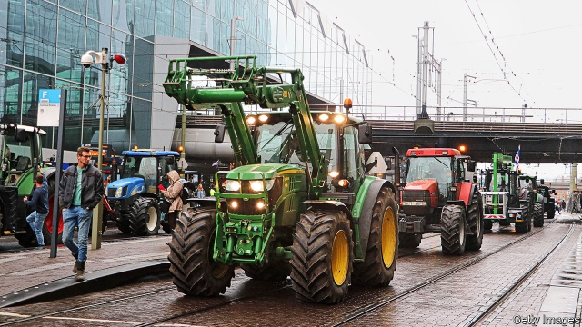

###### Nitro dissidents

# A tiny environmental group wins a huge victory 

 

> print-edition iconPrint edition | Europe | Oct 26th 2019 

THE FRENCH are accustomed to angry farmers paralysing traffic. In the Netherlands, which prides itself on consensual government, such agricultural aggression used to be rare. Yet over the past month Dutch farmers have turned stubborn. On October 1st and again on October 16th, thousands of them parked their tractors on The Hague’s main parade grounds, clamouring that proposed environmental regulations would put them out of business. “The Netherlands without farmers would be like Amsterdam without whores,” one banner proclaimed. (It rhymes in Dutch.) 

The source of the conflict is nitrogen pollution, which comes in two forms: nitric oxides (NOx), mainly from combustion engines, and ammonia, mostly from fertiliser and animal waste. These lead to smog, algae blooms and other problems. In May the Netherlands’ Council of State ruled that the government’s system for limiting such pollution was too lax for European law. 

Farmers, especially those with high-density cattle stalls, were thrown into chaos. They are not the only ones bellowing. Construction causes NOx emissions too, so up to €14bn worth of housing and infrastructure projects have been called into question until the government can come up with a new permit system. Business organisations and unions are incensed. 

The group that has brought the Dutch construction and agriculture sectors to a standstill is a tiny non-profit, Mobilisation for the Environment (MOB), that operates on a shoestring budget with seven staff. In 2017 it went to the European Court of Justice (ECJ) to challenge a system which the Dutch had introduced two years earlier. Under the European Habitats Directive, all EU members must limit nitrogen pollution to protect a network of wildlife reserves known as Natura 2000. Unlike other countries, the Netherlands allowed farmers and industry to take measures they hoped would reduce nitrogen levels (such as experimental air-scrubbers), and count the expected reductions against new emissions—even before gathering evidence that they worked. The ECJ found that this was not good enough. The Council of State agreed, scrapping the permit system. Fully 18,000 projects with recent or pending permits are up in the air. Hundreds of sites lie idle: roadworks in Gelderland, a residential district of 470 houses in Roermond, expansion of an airport east of Amsterdam. 

Polls at first showed that the Dutch overwhelmingly sympathised with the farmers, and four provincial governments have backed down, abandoning the plans they had drawn up to meet the government’s new recommendation. On October 14th, though, the farmers crossed a line. In a protest in the provincial capital of Groningen, one drove a tractor through a barrier into a bicycle-jammed street, while another used his to smash open the doors of the provincial legislature. Many Dutch politicians worry that the farmers’ actions are undermining the country’s tradition of compromise by showing that extreme gestures work. Looser regulations on agriculture would mean tighter ones on the construction industry, which is planning its own demonstration in The Hague on October 30th. Any new system for limiting nitrogen emissions will have to involve more than airy promises. ■ 

