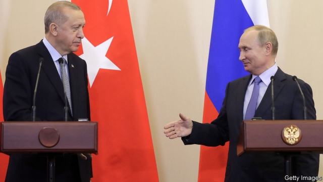

###### The spy who came in from the cold

# The West should learn some lessons from Vladimir Putin’s success 

 

> print-edition iconPrint edition | Leaders | Oct 26th 2019 

WHEN VLADIMIR PUTIN arrived in Brisbane for the G20 meeting five years ago, he cut an isolated figure, frozen out of the civilised world by the annexation of Crimea, the invasion of eastern Ukraine and the shooting down of a passenger airliner with Dutch and Australian families on board. Western leaders kicked Russia out of the G7 and imposed sanctions. Some refused to greet Mr Putin. He left early, snubbed and humiliated. 

Five years later he has swaggered back onto the world stage, presiding over the conflict in the Middle East, building a strategic alliance with China and driving a wedge between NATO allies. It was his residence in Sochi, not President Donald Trump’s Mar a Lago estate in Florida, that Recep Tayyip Erdogan, the president of Turkey, visited on October 22nd to seal the fate of Syria, and some 40 African leaders flew to on October 23rd in search of weapons and money (see article). 

The meeting with Mr Erdogan cemented Russia’s dominant position in the Middle East with a deal establishing joint military control over what used to be Kurdish territory. Earlier this month Mr Putin was welcomed in Saudi Arabia, the world’s third-largest oil producer, by Crown Prince Mohammed bin Salman. Saudi Arabia’s military band played Russia’s national anthem while its jets let off a trail of smoke the colour of the Russian flag. Russia, the world’s second-largest oil producer, is now in a better position to influence output and prices. 

Mr Putin has also forged close relations with China, whose leader Xi Jinping regards his Russian counterpart as an asset who helps China project its growing influence. Mr Putin has pledged to help China build its early-nuclear-warning system, a deal which will help tip the global balance of power in China’s favour. 

Europe’s attitude towards Russia is changing, thanks to Mr Putin’s growing hold over the Middle East and his closer ties to China. Emmanuel Macron, the French president, argues that Russia is too important to be frozen out and needs to be included in the European security architecture. And Ukraine, which has lost 13,000 people in the war in Donbas, is now under pressure from both America and Europe to settle its conflict with Russia, allowing for the lifting of sanctions. 

How did a country with an economy the size of Spain, corruption on a par with Papua New Guinea and life expectancy below Libya achieve all this? Military modernisation played a crucial part. In 20 years, Mr Putin has turned Russia’s armed forces from an ill-managed bunch of poorly equipped conscripts into a well-armed, largely professional fighting force. But he has also been politically more astute than the West, both in swiftly seizing opportunities and in sticking by his allies. 

Barack Obama set down red lines against the use of chemical weapons in Syria, but was not prepared to use force to back them up. Mr Trump abandoned America’s Kurdish allies earlier this month, pulling out his troops when Turkey threatened to invade northern Syria. Mr Putin has spotted that the West’s reluctance to use arms has created a power vacuum. He could invade Ukraine and send in forces to occupy former American positions and bomb civilian and military targets in Syria, confident that the West would not risk retaliation. When he has stood by Bashar al-Assad, the Syrian president and a bloody dictator, other actors in the Middle East, including Saudi Arabia, America’s traditional ally, have concluded that their own abuses of human rights would not shake his support of them. In their eyes, by contrast, the West appears fickle and preachy. 

Faced with Russian aggression, the West is inclined to back down. That is a mistake—and not one that Mr Putin would make were he in Mr Trump’s or Mr Macron’s position. He would hold his ground and look for weaknesses to exploit. 

Mr Putin’s success masks vulnerabilities. Abroad, he increasingly faces the difficulty of being the junior partner to China. At home, disposable incomes have fallen for the sixth year in a row, the pension age is rising and people are fed up with corruption. Mr Putin’s expensive military adventures used to generate enthusiasm, but they have become a source of irritation. 

He wants the West to lift sanctions and to acquiesce in his plan to stay in power indefinitely. But the West should not encourage his adventurism. It would do better to learn—selectively—from Mr Putin: support your allies, play to your strengths, do not buckle under pressure and do not create a vacuum that can be filled by a rival power. The West needs a muscular foreign policy to face down the world’s new strongman. ■ 

