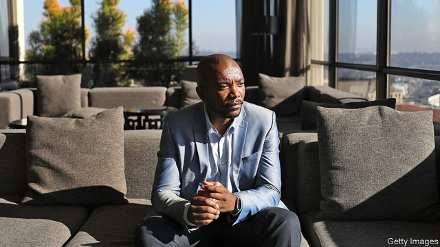

###### The limits of liberalism?

# South Africa’s main opposition party implodes 

 

> print-edition iconPrint edition | Middle East and Africa | Oct 26th 2019 

IN SOUTH AFRICAN politics it is a feat to make the African National Congress (ANC) look harmonious. Yet over the past week the Democratic Alliance (DA), the country’s main opposition party, has done just that. On October 20th Helen Zille, its outspoken former leader, was elected to chair the DA’s federal council, a key party post. That decision prompted the DA’s Herman Mashaba to resign as the mayor of Johannesburg. Two days later Mmusi Maimane, the party leader, also said he was stepping down. 

The resignations of the DA’s two most prominent black politicians ultimately reflect the party’s failure to resolve its position on the most emotive of South African issues: race. In the 1990s the Democratic Party (DP), the forerunner of the DA, was an avowedly liberal movement. In the view of its then leader, Tony Leon, the best way to tackle the poverty and inequality left by apartheid was through economic growth and education reform, not, for example, affirmative action. “Race is a red herring,” stated the manifesto of the DP in 1999. 

Whatever the merits of that stance, it gave the DP a clear brand. It became the main repository for white and mixed-race voters, increasing its share of the national vote from 2% in 1994 to 10% in 1999. In the early 2000s, after evolving into the DA, it took power in Cape Town, then became the kingmaker in the Western Cape, which remains its power base. 

Yet if the DA was to challenge the ANC’s hold on national politics it had to win over black South Africans, who make up 81% of the population. Ms Zille, who took over from Mr Leon in 2007, groomed Mr Maimane to succeed her in 2015. The party shifted its position on affirmative action. In 2019 the DA’s manifesto stated that the party “supports a programme of race-based redress”. 

So long as the DA kept increasing its vote share at elections, the tension between its mostly white liberal core and its newer members was kept subdued. It won 27% of the vote in local elections in 2016, its best ever performance. But that success was aided by widespread contempt for Jacob Zuma, South Africa’s former president. 

After Cyril Ramaphosa took over as president in February 2018 fractures began to multiply within the DA. It was harder for Mr Maimane to distinguish his party from an ANC led by the moderate Mr Ramaphosa. He was soon accused of leading an “ANC lite” party. This was the worst of both worlds. Many black voters still viewed the DA as a “white party”, an impression not helped by Ms Zille’s tweets about the legacy of colonialism being not “only negative”. At the same time many white voters were turning away from the party because of its race-based policies. 

The result was its dismal performance in elections in May 2019. The DA lost a few hundred thousand white votes to the Freedom Front Plus, a conservative outfit, while failing to attract the sort of black middle-class voters Mr Maimane was supposed to pull in. Since then his days have been numbered. Now those of the DA itself might be, too.■ 

