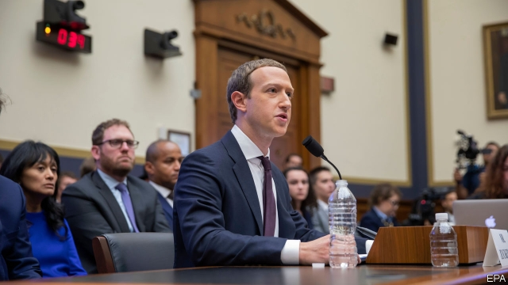
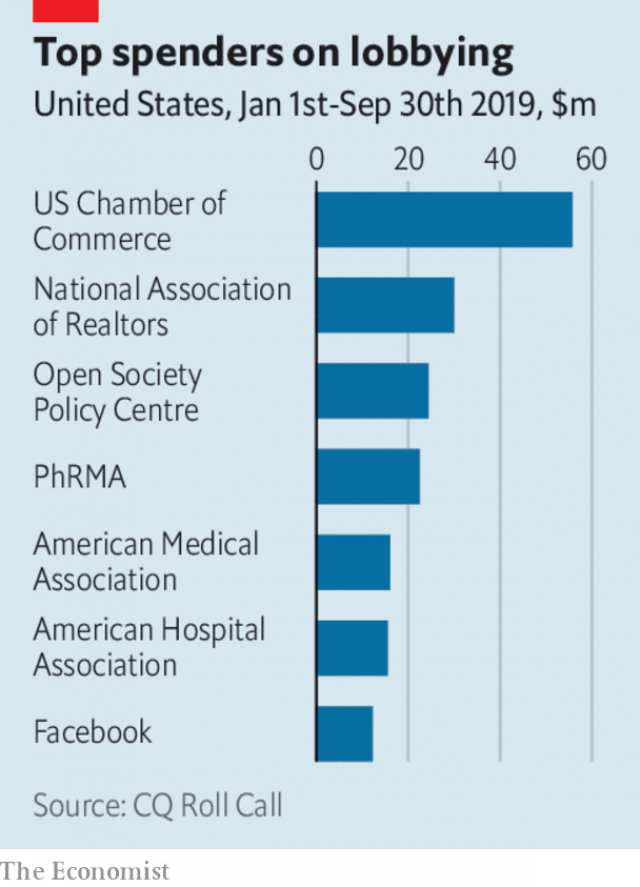

###### A woman with a plan

# Business this week 

 

> Oct 26th 2019 

Mark Zuckerberg was grilled in Congress about Libra, a global digital currency that Facebook hopes to launch next year but which faces mounting regulatory hurdles, causing some of its biggest backers to walk away. Mr Zuckerberg argued that Libra will advance financial innovation, and extend America’s “democratic values”. But with Democrats calling for the break up of big tech companies, Facebook has spent the most of any firm this year on lobbying Capitol Hill, just ahead of Amazon. See article. 

 

SoftBank proposed a rescue deal for WeWork, an office-rental startup that delayed its IPO amid investor concerns about its true worth. The offer from the Japanese tech conglomerate increases its stake and values WeWork at around $8bn, a long way from an estimate of $47bn earlier this year. Adam Neumann, WeWork’s boss, who has been blamed for the firm’s spectacular reversal of fortunes, could gain up to $1.7bn from the deal, including a $185m “consulting fee”. That will rankle staff who are left holding cut-rate share options. 

Four American state attorneys-general outlined a $48bn proposal to settle thousands of claims against five companies involved in the opioid crisis and urged their fellow litigants to accept the deal. As part of the agreement two drugmakers and three drug distributors would pay out $22bn in cash and $26bn in kind for treating opioid addiction over the next decade. Separately, drug companies reached a settlement worth $260m to avoid what would have been the first opioid trial in a federal court. 

Biogen’s share price soared by 25% when it reversed course and said it would now seek regulatory approval for a new treatment for Alzheimer’s disease that it had stopped testing. The biotech company said the results from a wider analysis of tests showed that patients “experienced significant benefits on measures of cognition and function”. See article. 

China’s economy expanded by 6% in the third quarter compared with the same three months in 2018, the slowest rate of growth in 30 years. 

A lawsuit brought by New York state’s attorney-general claiming that ExxonMobil engaged in dodgy climate-change accounting opened in court. The suit accuses the oil company of defrauding investors by disclosing a public proxy cost for carbon emissions to account for the possibility of climate regulations, while using a separate, lower estimate for carbon costs in its internal planning. The attorney-general maintains this meant investors could not properly account for the risk posed by climate regulations. The company denies wrongdoing. 

Saudi Aramco was said to have delayed the launch of its long-awaited IPO because of unfavourable market conditions and lower expectations among investors of its stockmarket value. Its third-quarter earnings may shed more light. 

An annual survey of global wealth from Credit Suisse found that the bottom half of adults account for less than 1% of total wealth, while the top 1% own 45%. However, that figure has dipped a bit from 2000. The report suggests that global wealth inequality may have peaked in 2016. See article. 

Just Eat, a British food-delivery company, rejected a $6.3bn takeover bid from Naspers, a South African tech conglomerate. Just Eat is sticking to its merger with Takeaway.com, which operates mostly in Germany and eastern Europe. 

Tesla delighted investors with a positive quarterly earnings report. It is on track to launch its Model Y sport-utility vehicle next year, it has tested production at its new factory in Shanghai, and it actually turned a net profit, of $143m. The electric-car maker racked up $1.1bn in losses in the first six months of the year. 

Boeing’s profits tumbled in the third quarter, and revenues were down by a fifth, as it continued to grapple with the worldwide grounding of its 737 MAX jetliner following two crashes. It did not book any further accounting charges because of the grounding, and said it would continue making the plane, though slower production cost it almost another $1bn. Boeing also appointed a new head of its commercial aviation business. 

Climate-change activists want people to fly less, but the New York-to-Sydney route that had its maiden voyage this week would keep travellers in the skies for longer. The Qantas direct flight, the world’s longest at 16,200km (10,100 miles), took 20 hours and carried volunteers who were tested for endurance. The key, apparently, was to limit alcohol intake and eat the breakfast of avocado purée, halloumi cheese and herb salad. If enough passengers can stomach that, Qantas hopes to start flying the route commercially in 2022. 

