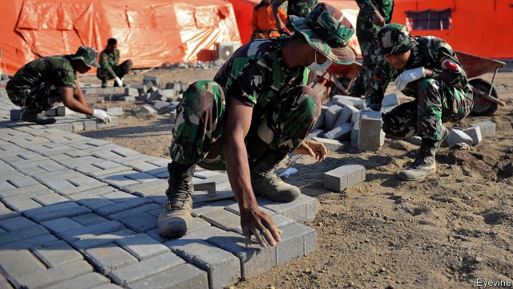

###### About turn!

# Indonesian politicians are giving the armed forces a big role in government 

 

> print-edition iconPrint edition | Asia | Oct 31st 2019 

ALONG A DIRT track bordered by rice paddies and studded with potholes, soldiers and villagers labour side by side. They are levelling the rutted surface so that it can be paved over with concrete. The road they are building will make it much easier for farmers to transport their crops to market. But this is not what really brings the soldiers to Sukawangi, a sprawling village in western Java. Their primary purpose is to forge friendships with the locals or, as Lieutenant-Colonel Yogi Nugroho puts it, to “build the chemistry between the military and the people”. Such efforts are paying off. A poll conducted in 2015 showed that 90% of Indonesians trust Tentara Nasional Indonesia (TNI), the armed forces, making it the most respected institution in the country. Mission accomplished. 

For most of Indonesia’s history, the army has been deeply involved in civilian life. Since its founding in 1945 as a guerrilla force to overthrow Dutch colonial rule, it has seen itself as the breastplate of the people. This narrative bolstered an ideology known as dwifungsi, or “dual function”, which held that the armed forces should be responsible for maintaining Indonesia’s political and social order as well as its territorial cohesion. Suharto, a strongman who held power from 1966 to 1998, reserved a fifth of the seats in parliament for the armed forces and appointed officers to important positions in government. Over his three-decade regime, he made use of the “territorial system”, under which soldiers were stationed in almost every village across the archipelago, to control and repress the population. So when Suharto resigned in 1998, ushering in an age of democracy, lawmakers abolished military representation in parliament and dramatically narrowed the armed forces’ responsibilities, obliging them to end all business activity, for example, and hiving off the police as a separate force. TNI was permitted to conduct “military operations other than war”, but only in cases such as disaster relief and humanitarian assistance. 

Twenty years later these reforms not only remain incomplete, but are being eroded. Under Joko Widodo, popularly known as Jokowi, who has been president since 2014, the political influence of TNI has grown. Jokowi has installed retired generals in powerful civilian posts such as presidential chief of staff and head of the state intelligence agency, and in April agreed to assign several hundred active-duty generals and colonels to civilian agencies and ministries. With Jokowi’s blessing, TNI has also regained a role in internal security, to help fight terrorism, and has set up a special counter-terrorism unit. On October 23rd Jokowi appointed as his minister of defence Prabowo Subianto, a retired general whose party would like to erase the distinction between external defence and internal security. 

TNI is also expanding the definition of military operations other than war. Between 2014 and 2017, it or the defence ministry signed 133 deals with dozens of ministries, civil-society organisations and universities, promising, among other things, to help the national population agency provide family planning, the National Logistics Agency to monitor food prices, prisons to educate inmates, the ministry of agriculture to identify suitable land for farming and farmers to organise the harvest. Activists and scholars worry that, taken together, these developments constitute a resurrection of dwifungsi. TNI’s persistent belief that it is at one with the people—the outgoing minister of defence, also a retired general, describes his philosophy of warfare as “total people’s defence”—only stokes their fears. 

TNI has successfully agitated to roll back the reform that prevented serving officers from taking civilian jobs. But Evan Laksmana of the Centre for Strategic and International Studies, a think-tank in Jakarta, argues that this is motivated not so much by a lust for power as by TNI’s poor personnel-management, which has produced more officers than there are suitable positions. In fact it is the politicians who are luring soldiers back out of the barracks, argues a recent paper by Leonard Sebastian, Emirza Syailendra and Keoni Marzuki of the S. Rajaratnam School of International Studies in Singapore. When Jokowi was first elected president in 2014, he was new to national politics and lacked allies. To counter the hostile forces arrayed against him, he turned to TNI. 

Politicians need TNI’s help to implement their policies. Both the central and local bureaucracies are hobbled by corruption, inertia and conflicting regulations. TNI, by contrast, is a disciplined organisation that can mobilise personnel across the country at short notice. Mr Sebastian and his colleagues examined a number of deals struck by civilian institutions and TNI between 2013 and 2018. They found that these arrangements were initiated at the behest of civilian leaders, “often due to a lack of confidence in their own abilities”. 

Though politicians are usually pleased with the work TNI does on their behalf, overseeing it is difficult. An incident in a village on the island of Sumatra in 2015 illustrates how badly wrong non-military missions can go. When the local army command, charged with implementing the government’s programme of “food self-sufficiency”, attempted to acquire land for cultivation, villagers protested. Soldiers proceeded to intimidate them. The conflict escalated, with soldiers beating up disgruntled farmers on several occasions. Members of the armed forces cannot be tried in civilian courts, however, so no one was ever punished. 

In the years following Suharto’s downfall, politicians vowed to subordinate the armed forces to civilian authority. Today they seem to regard TNI as a partner in government. As Mr Sebastian and his colleagues write: “The ongoing reliance on military solutions for civilian problems is symptomatic of a weak democracy.” Tell that to the villagers of Sukawangi, who cannot wait to use their TNI-built road. ■ 

