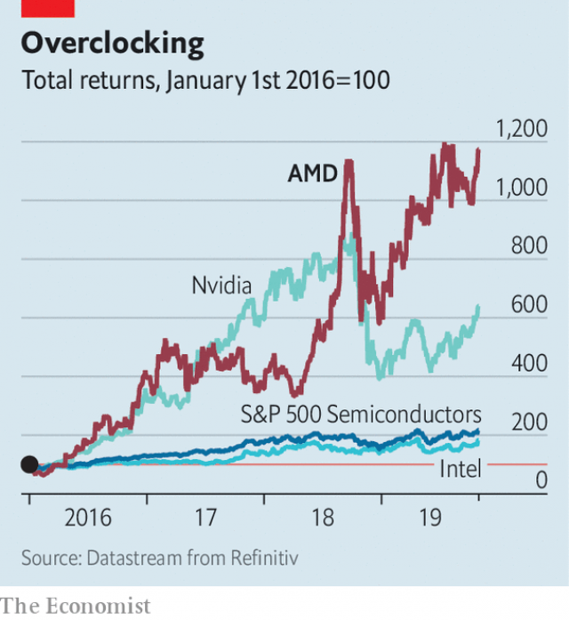

###### The Zen masters

# AMD, a chipmaking underdog, is having its day 

 

> print-edition iconPrint edition | Business | Nov 2nd 2019 

DAVID, HE OF the spat with Goliath, is an overused corporate analogy. But it is hard to think of a more appropriate one for Advanced Micro Devices (AMD). On October 29th the American chipmaking tiddler reported its third-quarter results. Lisa Su, its boss, declared herself “extremely pleased”. No wonder. At $1.8bn, revenue was the highest since 2005. AMD predicted that next quarter’s figures would be equally perky, up 48% on the previous year to $2.1bn. Its share price has risen 15-fold since 2015 (see chart). 

AMD is more important to the chip business than its diminutive stature suggests. It provides the only meaningful competition to not one but two Goliaths in two important parts of the semiconductor industry. Its CPUs—the general-purpose chips at the heart of modern laptops, desktops and data centres—compete with those from Intel, whose $71bn of revenue in 2018 made it the world’s second-biggest chipmaker. Its GPUs—which provide 3D graphics for video games and, increasingly, the computational grunt for trendy machine-learning algorithms—go up against those from Nvidia, whose revenues last year of $11.7bn were nearly twice those of AMD. 

 

AMD’s purple patch comes mostly from its battles with Intel. Until recently, Intel virtually monopolised the CPU market. Analysts at Mercury Research reckon that in 2015 its chips accounted for 92.4% of desktop and laptop computers, and 99.2% of the more lucrative market in server chips. Mercury’s most recent numbers put AMD’s share at 14.7% for desktops and laptops. For servers it is a more modest 3.1%—but still five times what it was two years ago. 

Two things explain the firm’s resurgence. One is a better product. In 2012 AMD rehired Jim Keller, a well-regarded chip designer who had been at Apple. AMD had long been competing on price—its chips were slower than Intel’s but much cheaper. Mr Keller’s “Zen” chips, unveiled in 2017, are still cheap. But they are now as zippy as Intel’s, or even zippier: AMD’s top-end server chip, for instance, is faster than its Intel counterpart in many tasks, and costs half as much. Zen chips have won a string of contracts with Microsoft and Sony (for new games consoles), Google (data centres) and Cray (supercomputers), among others. 

The second reason is that, while AMD has improved, Intel has stumbled. The firm makes its own chips. Its latest and greatest manufacturing process, which should have delivered a big performance boost, is years late, leaving the firm to rehash existing designs. AMD contracts most of its manufacturing to the Taiwan Semiconductor Manufacturing Company, which has now caught up with Intel’s technology. 

Can AMD’s good fortune last? Intel eventually put paid to similarly competitive spells at the turn of the century and in the mid-2000s. It is trying again. In 2018 it hired Mr Keller, this time from Tesla (he had left AMD in 2015). It plans to launch an advanced new manufacturing process in 2021. A planned move into GPUs could squeeze AMD from another direction. 

For now, AMD’s resurgence is good news for consumers, IT departments, cloud-computing firms and anybody who uses software. Like any good monopolist, Intel charges a steep price for its products—unless AMD is doing well. Sure enough, Intel’s newest set of desktop chips, due in November, are some of its thriftiest in years. ■ 

