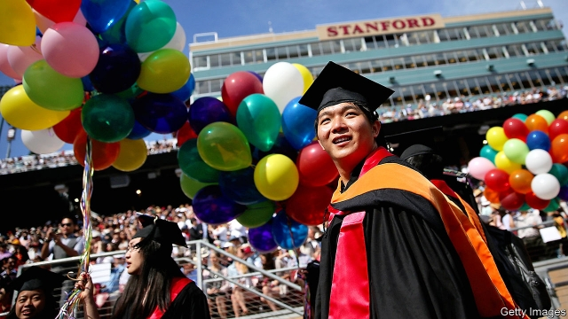

###### Egghead-hunting

# How Silicon Valley woos Stanford students 

 

> print-edition iconPrint edition | Business | Nov 2nd 2019 

 CONGRATULATIONS, YOU got into Stanford University. You beat 22 other candidates vying for each coveted place. For you, competition doesn’t quite stop there: being best in class boosts your prospects. But the real fighting now will be over 7,100 undergraduates and 9,400 graduate students, not between them. Technology giants and sexy startups all want this brainpower. So do venture capital (VC) funds. All go to sometimes absurd lengths to get it. 

Accelerator programmes, such as StartX or Alchemist Accelerator, court budding entrepreneurs with burritos, desk space and thousands of dollars in earliest-stage funding. They hope to ferret out the next HP, Cisco, Google, PayPal, Netflix or other tech success story that can trace its roots to Stanford’s campus in sleepy Palo Alto, Silicon Valley’s spiritual epicentre. 

To beat others to top talent, some deep-pocketed investors take on teaching appointments. Venture capitalists from Floodgate teach a course in how to evaluate startups. Many wannabe founders attend—and are evaluated in turn. Those who sparkle in final exams, which look a lot like startup pitch days, are invited to meet investors. Many such meetings turn into funding rounds (see Buttonwood). One student recounts how a Silicon Valley luminary who sometimes teaches at Stanford’s Graduate School of Business has funded students on the spot. 

Partners from VC firms like Accel, Threshold Ventures and Mayfield sponsor fellowships for entrepreneurial students—and host regular soirées and annual weekend getaways to Lake Tahoe. With such opportunities about, gushes Patty Sakunkoo, a PhD-student-turned-entrepreneur who has created multiple photo and video apps, “you can’t help but catch the startup bug while at Stanford.” 

Some VCs hope at least some students can resist—and come to work for them instead. They hang out with other company recruiters—from technology giants and small startups alike—at one of Palo Alto’s half-dozen Coupa Cafés, a local coffee-shop chain. They treat prospective hires to lattes—and promises of a rich career. 

Now that stock options are falling out of favour as one tech initial public offering after another fizzles, for smaller startups the richness relies more on the emotional appeal of founders’ missions. Either that, or they offer dibs on their product: Josh Wolff, a computer-science and bioengineering undergraduate, recalls being repeatedly approached by someone on LinkedIn who wanted to contract him as a consultant—and pay with his own cryptocurrency (Mr Wolff wisely declined). In the end, though, “it is so hard to compete with Big Tech,” sighs one founder. 

The giants, many with headquarters nearby, rule the roost at Stanford. They, too, play up their mission and the importance of each job. But mostly, they shower students with goodies. The annual job fair in October is an “insane arms race of free corporate swag”, says Ashwin Siripurapu, a computer-science graduate. Students exchange résumés for trinkets (USB sticks, Rubik’s cubes) or, occasionally, heftier gifts (bluetooth speakers, tablets). Within days offers start flooding in, including from firms that students never approached. 

Once they identify a keeper, cash-rich firms—be they listed behemoths or multibillion-dollar unicorns—spare no expense. They wine and dine students at glitzy Palo Alto restaurants like Reposado or Il Fornaio and put them up in five-star hotels on visits to offices in places like New York. One Stanford graduate recalls a big unicorn paying for an Uber Copter to fly him from Manhattan to JFK airport. 

When all is said and done, it is hard to resist a starting salary of $150,000-200,000, great health insurance, wellness reimbursements and unlimited vacation time (including at company retreats)—and a signing bonus of $10,000-20,000, for good measure. A job at today’s conglomerates—Alphabet, Apple, Amazon or Facebook—increasingly resembles one at General Electric in the 1980s: making up in perks what it lacks in sizzle.  

