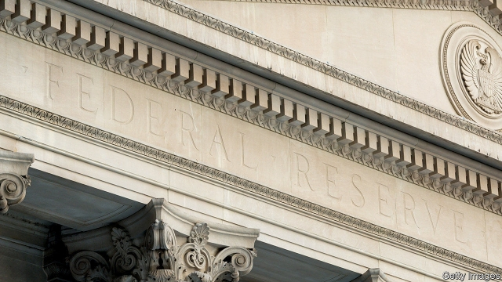
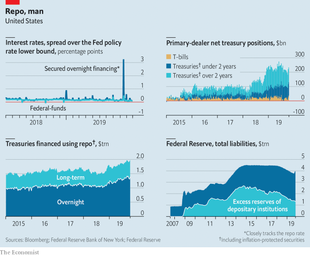

###### Follow the money

# Why the repo market went awry… 

 

> print-edition iconPrint edition | Finance and economics | Nov 2nd 2019 

ON SEPTEMBER 17TH, for the first time in a decade, the Federal Reserve intervened in the overnight repurchase, or “repo” market, where banks and hedge funds get short-term funding by swapping $1trn-2trn of Treasuries for cash each day. After the repo rate rose to 10%, the federal-funds rate, at which banks can borrow from each other, climbed above the Fed’s target (see chart). The Fed swooped in, offering $75bn-worth of overnight funding, and both rates came back down. But it has had to keep lending to stop them rising again. During October it said it would lend for longer periods, increased its limit on overnight repo operations to at least $120bn and started buying short-dated Treasuries directly, at a pace of $60bn per month. 

The turmoil indicated an unexpected shortage of liquidity in the financial system. Before the financial crisis the Fed had controlled the federal-funds rate using a “corridor”, with a ceiling and floor. Banks could borrow at the ceiling rate, but the floor rate was zero, meaning cash held at the Fed earned nothing. To keep interest rates on-target the Fed used “open-market” operations, swapping Treasuries and cash. 

 

The crisis changed everything. The Fed added investment funds and securities dealers to the list of approved borrowers in the repo market and, using quantitative easing (QE), bought vast quantities of long-dated Treasury bonds. Its balance-sheet ballooned to $4.5trn. Holders of Treasuries, mostly banks, ended up with cash mountains. To keep market interest rates on target, the Fed raised the floor rate. The ceiling became redundant, as did repo-market operations. Regulations intended to avoid another bail-out forced banks to hold more cash and safe liquid assets, such as Treasuries.  

Under the old system, if commercial banks were short of cash the quantity they sought on the repo market would rise. When cash became superabundant the Fed lost any insight into banks’ thinking about how much cash they needed to hold. Now the repo-market turmoil has given an answer—and it is far higher than the Fed expected. Collectively, America’s commercial banks now hold $1.3trn of cash. 

Even that does not seem to be enough. Demand for cash grows with the economy. And demand from the government is growing particularly fast because of the fiscal deficit, which will reach $1trn next year, 4.7% of GDP. The Treasury is therefore issuing lots more bills and bonds, which financial firms and investors purchase with cash. But buyers are becoming scarcer, especially foreign ones. High policy rates in America have pushed up hedging costs, deterring European and Japanese pension funds from buying Treasuries. Since 2017 the share of Treasuries held by foreigners has fallen from 40% to 35%.  

That has left more for American buyers to mop up. “Primary dealers”—banks authorised to deal Treasuries directly with the government—bear the brunt of these market forces. Their holdings of Treasuries have ballooned. In 2017 they held $200bn-worth of Treasuries outright, and financed positions worth an additional $1.5trn in the repo market. By September this year these figures had risen to $250bn and $2trn respectively. When repo rates spiked in September it was because primary dealers could not borrow enough cash to cover their positions. Commercial banks will usually lend as much cash as primary dealers need, but as their cash piles dwindled they grew more reluctant to do so. 

Three ways to avert another repo-market meltdown are being discussed. Post-crisis regulations concerning banks’ cash holdings could be tweaked. The Fed could commit to continuing repo operations. Or it could buy short-dated Treasuries outright. All are politically contentious. 

Some bankers say they hold more cash than legally required because they fear that miscalculating and having to borrow from the Fed would damage their reputations. Steven Mnuchin, the treasury secretary, has said it might be possible to change the rules in such a way as to increase liquidity without increasing risk. But any change would draw heavy political crossfire. On October 18th Elizabeth Warren, a leading contender for the 2020 Democratic presidential nomination, wrote to Mr Mnuchin urging him not to relax the rules. 

Before the crisis, large-scale lending by the Fed in the repo market caused little concern. But now that more lightly regulated institutions, such as investment funds, can borrow too, repo-market operations are bound to attract more scrutiny. For this reason, among others, the Fed wants them to be the exception, not the rule. It has already accepted that it will have to start increasing its balance-sheet again, by buying $60bn-worth of short-dated Treasuries per month. Critics (wrongly) claim this is QE by stealth. But the Fed had hoped to see the balance-sheet shrink further, to give it room for manoeuvre in any future crisis. 

The repo market’s wobbles have revealed not only banks’ huge appetite for cash, but the unforeseen consequences of post-crisis prudential regulation. Those wobbles, and the Fed’s reaction, do not necessarily indicate that America’s financial system is imperilled. That the Fed was blindsided is far more worrying. ■ 

