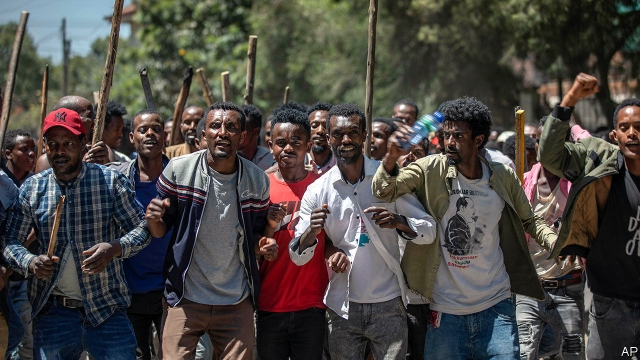

###### Can the centre hold?

# Ethnic violence threatens to tear Ethiopia apart 

 

> print-edition iconPrint edition | Middle East and Africa | Nov 2nd 2019 

EVERY WINDOW of the factory on the outskirts of Adama is smashed. On the side of the road are the scorched remains of a bus and lorries torched by angry young men last week. This scene of mob violence, just 75km from Addis Ababa, the capital, is one that is becoming wearily familiar to many Ethiopians. 

The democratic revolution kick-started by Abiy Ahmed, the prime minister, last year has long been bittersweet. The government released tens of thousands of political prisoners, welcomed back exiled opponents and promised free and fair elections in 2020. Last month Abiy won a Nobel peace prize, for helping end a decades-long conflict with neighbouring Eritrea. But his efforts to put his own country on a more liberal path have been marred by rising violence and ethnic tensions. The latest killings suggest it is the transition’s darker side that is ascendant. 

The violence started on October 23rd after hundreds of young men gathered outside the residence of Jawar Mohammed, a controversial activist who returned to Ethiopia last year at Abiy’s invitation. Both men are Oromos, Ethiopia’s largest ethnic group, and are popular in the region. But Jawar’s supporters, a youth group known as the “Qeerroo”, took to the streets of Addis Ababa and other towns after their leader said he faced a state-orchestrated attempt on his life. In a post shared with his 1.75m Facebook followers he said police had tried to remove his government security detail in the dead of night. They had resisted. 

What followed was reminiscent of protests in Oromia that helped to propel Abiy to power. Groups of Qeerroo burned tyres and blocked roads into the capital. They marched, carrying sticks and chanting in support of Jawar. Shops and businesses shut. Copies of Abiy’s new book, which preaches national unity, were set alight. 

It soon took a nastier turn. In Adama, groups of mostly Amhara men (the second largest ethnicity) confronted the Qeerroo. Clashes broke out. Vehicles, shops and businesses were burned. At least 16 people died. Most were stoned to death. Near Addis Ababa non-Oromo were killed in unprovoked attacks. 

Spreading violence may now have claimed as many as 80 lives, says Ethiopia’s human rights commissioner. Some died in attacks on churches and mosques, in a worrying sign that ethnic conflicts risk turning into religious ones, too. 

 

Underlying the unrest are two trends. The first is an intra-Oromo power struggle embodied in the rivalry between Jawar and Abiy. Jawar, who says he may run in next year’s election, has loudly criticised the prime minister’s plan to form a national party to replace Ethiopia’s ruling multi-ethnic coalition. On October 22nd Abiy implicitly threatened his younger rival, saying he would “take measures” against media owners with foreign passports (Jawar is an American citizen) if they fan instability. Many Oromos are also angry that Abiy has not met their demands, which include making Afan Oromo an official language of the federal government. “The government hasn’t done anything for the Qeerroo,” complains a young man in Adama. 

The second cause is competition between Oromos and Amharas. Since 1995, when the current constitution established nine ethnically based regions, politics has been a battleground between rival nationalisms. For much of the past three decades the Tigrayans, who are about 6% of the population, ran the show. 

Now Oromos are in charge, which has triggered a backlash among Amharic-speakers and some minorities who fear that the Oromo nationalism espoused by Jawar and his followers could lead to marginalisation. Towns in Oromia with large Amharic-speaking populations including Adama and Addis Ababa are especially volatile. Even officials there use dog-whistle terms such as neftegna (“gun-carrier”) when talking about Amharic-speakers. In Adama both sides say that they are arming themselves in self-defence. 

For several days Abiy was silent in the face of chaos. Since then he has promised to “weed out” perpetrators. Ending impunity for killers is essential. But so, too, are talks to defuse tensions, both within Oromo politics and between the ethnic regions. Jawar says he has asked Abiy to organise a “national convention” to forge a compromise. With elections fast approaching it is a request the prime minister would be wise to answer. ■ 

