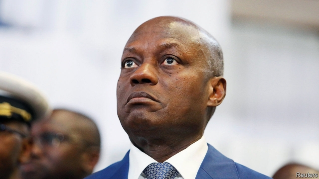

###### Breaking Bissau

# Guinea-Bissau, Africa’s most famous narco-state, goes to the polls 

 

> print-edition iconPrint edition | Middle East and Africa | Nov 2nd 2019 

NEAR THE port of Bissau, the capital of Guinea-Bissau, one of Africa’s smallest states, is a neglected monument to past rebellion. A giant fist of black steel commemorates striking dockers gunned down by Portuguese soldiers in 1959. The strike—and subsequent massacre—helped start a war for independence led by the African Party for the Independence of Guinea and Cape Verde (PAIGC), a Soviet-sponsored guerrilla movement. It took power in 1974 when Portugal’s dictatorship fell. 

For much of the nearly 50 years since, the main problem in Guinea-Bissau has been the PAIGC. Presidential elections are due on November 24th. On October 29th the president, José Mário Vaz, sacked his government and appointed a new prime minister, though the dismissed one, Aristides Gomes, refused to leave office. If he does, it will bring to eight the number of prime ministers since Mr Vaz won the presidential election in 2014. Despite huge amounts of support, including a sizeable UN mission, Guinea-Bissau, a country of 1.8m people dependent mostly on the export of cashew nuts for foreign exchange, cannot seem to produce even a vaguely capable government. It is a lesson in the difficulty of changing deep-rooted systems of corrupt politics in weak states. 

PAIGC resembles less a political party than an extended family fighting over a shrinking inheritance. In the past coups were incredibly common—the country has had at least a dozen attempts, with the latest successful one in 2012. Another one seems less likely now, thanks to the presence of peacekeepers from other West African countries. But political strife continues nonetheless. For the past four years Mr Vaz, a member of PAIGC, has refused to accept the prime minister appointed by PAIGC members in parliament, instead preferring to rule on his own. In the presidential election Mr Vaz will face off against Domingos Simões Pereira, one of the thwarted prime ministers, as well as against another former PAIGC prime minister, Carlos Domingos Gomes Júnior, and nine other independent candidates. 

The PAIGC’s infighting has been compounded by a reliance on corruption to fund politics. Most prominently that has involved state complicity in cocaine trafficking from South America through to Europe. More than a decade ago Guinea-Bissau was named a “narco state” by UN officials because of how deeply drugs traffickers had penetrated its government. João Bernardo “Nino” Vieira, the longest serving president, was assassinated in 2009 in a feud seemingly linked to drugs trafficking. In September almost two tonnes of cocaine were seized by the judiciary police. That followed a seizure of around 800kg in March, just before legislative elections. It is all but certain that the shipments were being protected by a local political faction. It is also plausible that the traffickers were betrayed by a rival one. 

The presidential election seems unlikely to fix the crisis. Indeed, it may be making things worse. On October 26th a protester was killed by police during a demonstration against the election roll, which non-PAIGC candidates say has been manipulated to benefit the party. What little money the state has is being looted to buy influence in the power struggle within the PAIGC. Government salaries go unpaid, says Amadu Djamanca, who runs the Observatory of Democracy and Governance, a local NGO. The cashew industry is being crushed by an export tax that is intended to fund investment in infrastructure—though the money raised has gone missing. Whatever happens, ordinary citizens seem sure to suffer.■ 

