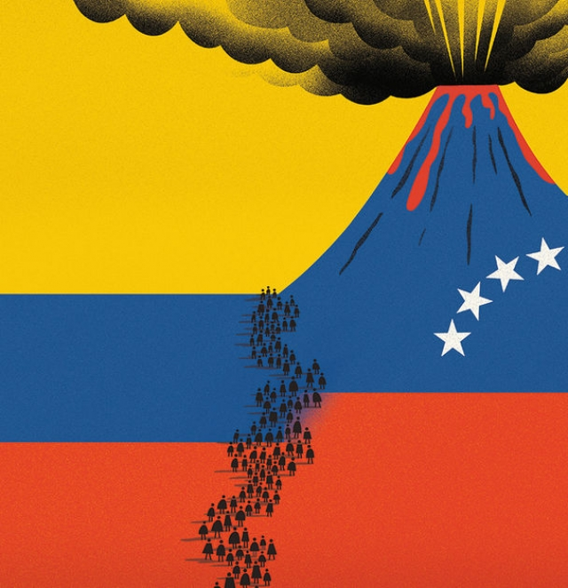

###### Bello

# Along with refugees, Venezuela is exporting criminals 

 

> print-edition iconPrint edition | The Americas | Nov 2nd 2019 

UNDER A PITILESS sun, the river of humanity crosses the Simón Bolívar bridge without cease, its flow more powerful than the muddy stream beneath. Each day at least 40,000 people cross from Venezuela to Villa del Rosario in Colombia. Most cross back again, laden with bulging sacks and suitcases containing fresh food, clothing and medicines. Each day, some 1,500 do not return, joining the 4.6m Venezuelans who have left their country in search of work, safety and a better life. 

This is a humanitarian crisis, but one that Colombia is coping with admirably. In Villa del Rosario hundreds of people line up for lunch at a communal kitchen operated by the local bishop. Many still live in Venezuela, but are malnourished. Others are heading on. Nearby, there is a health post for migrants. More than 1.5m have been vaccinated. A shelter provides temporary accommodation for those who are ill, who have come to give birth or who need to rest. Although the UN and NGOs are helping, foreign aid covers less than a fifth of the additional costs Colombia is incurring, mainly in health care and education. 

That is not the only price of living next to Nicolás Maduro’s dictatorship in Venezuela. At police headquarters outside the nearby city of Cúcuta, Colonel José Palomino has a colour-coded map of the 143km (89 miles) of border in his charge. Each colour corresponds to a criminal outfit, ranging from the ELN, a Colombian guerrilla group, to several Colombian and Venezuelan drug, extortion and smuggling gangs. “Each group has a slice of the border,” he says. 

Until now, they have stayed there. The murder rate in Cúcuta, a city of 800,000 people, is similar to the national average. But for how much longer? The first wave of Venezuelan migrants consisted largely of businessmen, professionals and workers. Now, says Colonel Palomino, “bandits and delinquents” are starting to come “because there’s nothing left to rob there”. 

The government of President Iván Duque bet on Mr Maduro’s downfall. In February Venezuela broke diplomatic ties after Colombia tried to send humanitarian aid across the border in partnership with Juan Guaidó, the opposition leader whom it recognises as interim president. Mr Maduro shelters the ELN, which runs illegal mining in southern Venezuela. He welcomed dissidents from the FARC, a much larger guerrilla army which signed a peace agreement in 2016. In September Venezuela carried out a military exercise near the border. “Misunderstandings or deliberate provocations by…armed groups could easily drag the two countries” into a fight, worries Crisis Group, an NGO. 

Mr Duque says he has undertaken no aggressive actions. “We’ve placed no troops on the border, or flights close to it,” he told Bello. The problem is that there is no sign that sanctions by the United States will dislodge Mr Maduro. Political change in Latin America, including the election of Alberto Fernández, a left-of-centre Peronist, as Argentina’s president, is weakening the diplomatic front against the Maduro regime. “The only way to change the migratory flow is to end the dictatorship,” insists Carlos Trujillo, Colombia’s foreign minister. The flow may even increase as conditions deteriorate. 

This comes when the internal situation in Colombia is delicate. Álvaro Uribe, the leader of Mr Duque’s party, campaigned against the FARC peace agreement. In office, Mr Duque has implemented it. It is working, albeit imperfectly. More than 11,000 former guerrillas have entered civilian life. The government is moving ahead with development plans in the areas where they operated. But its critics claim that under the influence of Mr Uribe it is dragging its feet on promised land reform. 

Colombia is failing to collect a full peace dividend. The murder rate has remained broadly stable since 2016, despite the end of the war. The security forces are “strategically confused on priorities”, says a retired general. Mr Duque’s defence minister, who is close to Mr Uribe, is criticised for having politicised the army. In an unprecedented move in August, a group of retired officers published a letter complaining that corruption and poor leadership were damaging the army’s public standing. 

Even the government’s critics admit that the situation is not disastrous. But it is worrying. Colombia has made huge strides in this century. Because of the threat posed by Venezuela, the consolidation of internal peace has become even more urgent. Mr Duque, once a sceptic of the peace deal, must now achieve that. 

