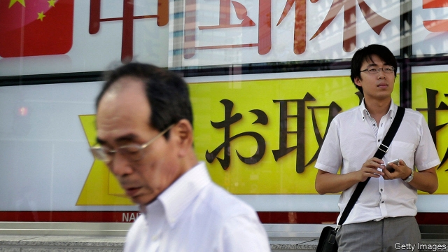
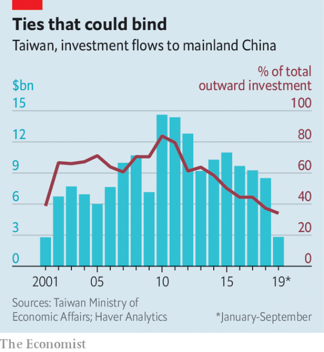

###### Honey trap

# China tries to deepen economic ties with Taiwan yet more 

 

> print-edition iconPrint edition | Asia | Nov 9th 2019 

EARLY THIS year China’s leader, Xi Jinping, grandly repeated his country’s longstanding vow to bring the democratic island of Taiwan back into the Chinese fold, if necessary by force. But force has never been China’s preferred option: it has long sought to integrate the Taiwanese economy with its own, in part in the hope that independence might come to seem an impossible or even undesirable goal. At times China also tries to harm the Taiwanese economy, usually to discredit governments led by the Democratic Progressive Party (DPP), which would like to abandon the official pretence that Taiwan is part of China. But all the while, the effort to bind the island to the mainland continues. 

When Tsai Ing-wen of the DPP became president in 2016, the Chinese government abruptly cut the flow of tourists from the mainland and called off all high-level contacts with Taiwanese authorities—a boycott it has maintained ever since. But on November 4th China announced 26 measures intended to strengthen economic ties, permitting Taiwanese businesses to invest in 5G mobile networks and airlines, for instance, and to issue bonds in China. There were also fillips for ordinary Taiwanese, such as allowing them to seek help from Chinese consulates when travelling—something that has happened on occasion in the past but has now been formalised. Last year the Chinese government unveiled a list of 31 measures in the same vein, intended to make life easier for the 400,000-odd Taiwanese living in China. 

Taiwan’s Mainland Affairs Council, which handles policy to do with China, accused the mainland of trying to influence elections on January 11th, in which Ms Tsai is seeking a second term. The Chinese authorities probably did want to present a friendlier face, having appalled many Taiwanese with their intransigent response to pro-democracy protests in Hong Kong and with their ongoing efforts to win over the few remaining countries that have diplomatic relations with Taiwan. But they are also conscious that China is not quite as alluring a destination for Taiwanese firms as it used to be. 

 

Although Taiwanese firms still invest more in China than anywhere else, the sums involved have fallen sharply in recent years (see chart). China accounted for 84% of Taiwan’s foreign investment in 2010. In the first nine months of this year, that had fallen to 34%. The rising cost of labour in China had already led Taiwanese manufacturers of mundane goods like umbrellas and shoes to move their factories to South-East Asia. Now the trade war between America and China has prompted tech firms to reconsider their investment strategy. Taiwanese officials say that 151 Taiwanese companies operating in China have returned home this year, with plans to invest $20.5bn. Jay Chen of Academia Sinica, a state research institute in Taiwan, doubts the 26 sweeteners will reverse the trend. 

The Mainland Affairs Council argues that last year’s 31 measures and related follow-ups were badly implemented. For instance, although Taiwanese were theoretically granted the same access to services as mainlanders if they had lived in China for six months, many still found it difficult to obtain a local credit card. Taiwanese often remark that living in China tends to make their compatriots more patriotic. ■ 

