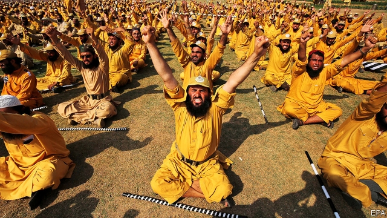

###### Container democracy

# Religious protesters have put Pakistan’s government on the defensive 

 

> print-edition iconPrint edition | Asia | Nov 9th 2019 

RIZWAN AHMAD says he has everything he needs for the long haul. The 20-year-old has swapped his austere madrasa in Sukkur, a city in Sindh province, for a makeshift camp beside a motorway outside Islamabad, the capital, nearly 1,000km (620 miles) to the north. He has bedding, warm clothes, food and shelter. Anything else, God will provide. Tents, tarpaulins, food stalls and solar panels to charge mobile phones are laid out among rows of men bent in prayer. 

Mr Ahmad is one of around 50,000 protesters who, led by a veteran Islamist called Maulana Fazlur Rehman, descended on Islamabad late last month. The orange-turbaned leader of the Jamiat Ulema-e-Islam (JUI-F) party stirred up religious students to demand the resignation of the prime minister, Imran Khan. “If the maulana says ‘Go home tomorrow’, we will go home tomorrow,” explains Mr Ahmad. “If he says ‘Stay a year’, we will stay a year.” 

The maulana’s “freedom march” is not an uprising like the mass tumults shaking Iraq and Lebanon, but a disciplined display of partisan street power. As the event reached the end of its first week, it had become the first concerted opposition challenge to Mr Khan since he won a general election in July last year. It has also become a test for the broader opposition, as bigger parties ponder how far to push Mr Khan and how strongly to back the JUI-F. 

Every evening the maulana has railed against the former cricketer from the top of a shipping container, complaining that his election victory was rigged and that he was “selected” as prime minister by the army. The maulana also says Mr Khan is ruining the economy. On the night the protesters arrived in Islamabad, he told the crowd that he was giving Mr Khan 48 hours to quit. The protesters then threatened to occupy a bigger crossroads in striking distance of parliament. Mr Khan is still in office and the crowd has not closed in. But it has refused to disperse and the sit-in has been dominating the life of the capital. Thousands of police and soldiers have been drafted in to keep watch on the crowd and guard against further incursions. 

Every day the maulana holds talks with both the government and the opposition. His supporters, who hail mainly from rural backwaters in the provinces of Khyber Pakhtunkhwa, Balochistan and Sindh, spend the day sightseeing before returning to hear his nightly speeches. Uniformed volunteers in khaki tunics keep order. 

Mr Khan has mocked the protest, saying that the maulana is bitter because he lost his seat in the election. The cleric once supported the Afghan Taliban and called for the imposition of Islamic law, but has recently tried to look more moderate. However, he still complains that Mr Khan is too friendly with Ahmadis, a Muslim sect he considers heretical, and has not allowed women to take part in the march. 

Despite belittling the protesters, Mr Khan has felt obliged to negotiate with them. He has offered an inquiry into the fairness of last year’s election, and even sent officials to find ways to shelter the crowds from driving rain. He knows the pressure that “container politics” can exert. His own Pakistan Tehreek-e-Insaf conducted a four-month sit-in in 2014, calling for the prime minister of the day, Nawaz Sharif, to resign. That protest and other recent displays of street power by religious parties were widely thought to have had military backing. This week’s appears not to. At any rate, the top brass have issued a statement saying they will “continue to support national institutions as and when asked, as per the constitution.” 

The army’s support for Mr Khan seems to have deterred the bigger opposition parties from giving wholehearted backing to the JUI-F. Mr Sharif’s Pakistan Muslim League and the Pakistan Peoples Party have lent moral support, but little else. Many voters, although dismayed by rising prices and a slumping economy, think Mr Khan deserves more time to put things right. But even if the maulana’s protest is unlikely to bring down the government, it has invigorated the opposition. It is Mr Khan who is on the back foot these days. ■ 

