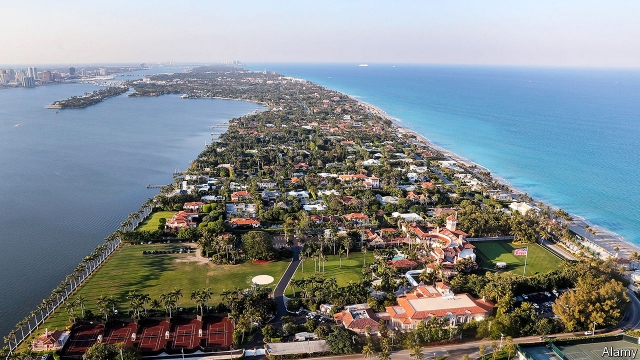

###### The lap of luxury

# Palm Beach and the rise of American celebrity 

 

> print-edition iconPrint edition | Books and arts | Nov 9th 2019 

Palm Beach, Mar-a-Lago and the Rise of America’s Xanadu. By Les Standiford.Atlantic Monthly Press; 288 pages; $27. 

“THE RICH are different from you and me, we all know that even if some of the people in Palm Beach don’t,” the writer Nora Ephron said of the town in south Florida where society is the local industry. In “Palm Beach, Mar-a-Lago and the Rise of America’s Xanadu”, Les Standiford, author of a book about Andrew Carnegie and Henry Clay Frick, traces the history of a sandbar lifted from swamp and scrub to gilded glory by the Florida East Coast Railway line. 

Lapped by the Atlantic to the east and Lake Worth to the west, Palm Beach has been home to an epic cast of characters. Henry Flagler, who laid the railway at the turn of the 20th century, also built a string of majestic hotels—including the Ponce de Leon in St Augustine and the Royal Poinciana and the Breakers in Palm Beach itself. Marjorie Merriweather Post, a cereal heiress and philanthropist, built the 115-room Mar-a-Lago (dismissed by a local as “early Bastardian Spanish”) and took four husbands. The architect Addison Mizner set the town’s Mediterranean-Moorish tone (“Ali Baba Comes to Florida,” judges Mr Standiford). Among the newest arrivals are iguanas inadvertently introduced from South America. 

Palm Beach, Mr Standiford observes in a book that will appeal to nose-pressed-against-the-glass readers, helped redefine class in America. Once upon a time, status was predicated on lineage and ancestors who had arrived on the Mayflower. That was before celebrity “became the new imprimatur of consequence”. Newport, Rhode Island? Stale upper crust. Saratoga Springs? That crème de la crème had curdled. For social cachet without the prerequisite of pedigree, up-and-coming Americans looked to Palm Beach, which has welcomed the Duke and Duchess of Windsor, King Hussein of Jordan and the pornographer Larry Flynt. 

It was also where, in 2005, Melania Knauss, a model, married reality-show host, future president and latter-day lord of Mar-a-Lago Donald Trump, with Elton John and Hillary and Bill Clinton among the big names and net worths in attendance. Buying Mar-a-Lago and its furnishings for $8m in 1985 was Mr Trump’s ticket to Palm Beach—now his permanent residence after he and New York fell out of love. Post had bequeathed the property to the National Park Service in 1973, for use as a winter White House, but in 1981 Congress returned it to the Post Foundation as too expensive to maintain. It was put on the market and Mr Trump snapped it up. 

Now it is a private club, with a portrait of Post on a wall in the former library, across from a younger version of the current proprietor in tennis gear. The announcement, when the club opened, that Prince Charles and Lady Diana had bought memberships was “rubbish”, said Buckingham Palace; but Mr Trump was undeterred. “Even people who hate me are joining the club,” he crowed. The initiation fee is now said to be $200,000. One day, probably, rising seas will sink Palm Beach and leave behind a level, if soggy, playing field.■ 

