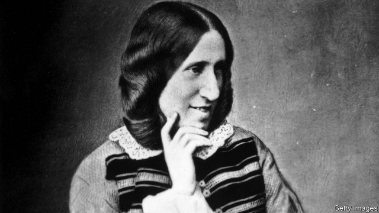

###### Death in Venice

# The art and loves of George Eliot 

 

> print-edition iconPrint edition | Books and arts | Nov 9th 2019 

In Love with George Eliot. By Kathy O’Shaughnessy.Scribe; 400 pages; £16.99. 

THIS MONTH marks the 200th anniversary of the birth of George Eliot—author of one of the greatest novels of the Victorian or any age, “Middlemarch”, a social panorama set in a provincial English town in the years before the Reform Act of 1832 and the transformative arrival of the railway. “One of the few English novels written for grown-up people,” according to Virginia Woolf, “Middlemarch” was probably based on Coventry, where Eliot—real name Marian Evans—had partly grown up. 

She reluctantly revealed her true identity after the publication of her first novel, “Adam Bede”, in 1859, and was almost as well known for her scandalous private life as for her books. A respected scholar and the first female supremo of the Westminster Review, she lived openly with a married man, George Henry Lewes; her writing supported not only their household but that of his wife, Agnes, their children and Agnes’s by another man. Less than two years after Lewes’s death in 1878, the author caused more outrage by marrying John Walter Cross, a family friend 20 years her junior, who in a fit of mania attempted suicide on their honeymoon in Venice. In December 1880, seven months after their wedding—and just after her 61st birthday—she died. 

“In Love with George Eliot”, Kathy O’Shaughnessy’s sensitive, impeccably researched and deeply pleasurable debut novel, charts Eliot’s development as a writer and growing celebrity, her sincere happiness with Lewes, terrible grief at his death and unexpected joy at her new (and finally respectable) married status. As the best historical novels do, it absorbs the reader to such an extent that, even if they know the outline of the story, each page is a revelation. Quoting from original letters and other documents, it shimmers with the refracted light of another age; the account of a modern-day love triangle between three Eliot experts, which Ms O’Shaughnessy intercuts with chapters on the novelist and her circle, enhances the main picture. 

Eliot’s own unconventional looks, lifestyle and opinions are rendered compellingly. To many—including some well-drawn, fervent female acolytes—her combination of sincerity, neediness, ambition and sympathy were alluring. These qualities found a natural outlet in her writing. “It seems to me we can never give up longing and wishing while we are thoroughly alive,” remarks a character in “The Mill on the Floss”. In her own novel, Ms O’Shaughnessy brings this mix of intensity and playfulness winningly to life. ■ 

