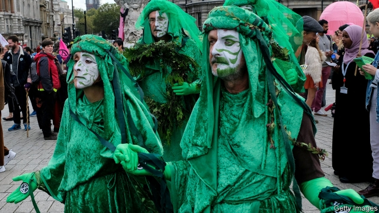

###### A warmer climate

# Climate change looms larger than in any past British election 

 

> print-edition iconPrint edition | Britain | Nov 9th 2019 

THIS YEAR’S electioneering already has a greener tinge than 2017’s. A summer heatwave and Extinction Rebellion’s activism have given environmental issues a fillip. Polls by YouGov find that around a quarter of the public list the environment among the top three problems facing Britain, up from closer to one in ten at the time of the last election. The level of interest is well below that shown in Brexit or the health service, but comparable to that in political staples such as the economy. 

Leo Barasi, a pollster, says green policies play different roles for the two big parties. For Labour they are a “motivating issue”, encouraging voters who might be tempted to drift to the Greens or Liberal Democrats to stick with them. For the Conservatives they have the potential to be a “toxifying” problem, pushing voters away. The parties appear to agree, with Labour making early announcements trumpeting its plans while the Tories seem more focused on shutting down lines of attack. 

Within days of the election being announced, the government called a moratorium on fracking, a technique to extract shale gas. Six years ago the then Tory chancellor, George Osborne, promised “the most generous tax breaks in the world” to support the fledgling industry. But times have changed. Last month the National Audit Office, a spending watchdog, found that progress in the industry had been slow, that there was no evidence it would lower energy prices and that there was no plan to meet the clean-up costs if a firm went bust. 

The case for fracking has not been helped by three tremors that rattled homes near Britain’s only active extraction site in August. Most fracking licences are near Labour-held constituencies in the Midlands and north-west, which the Tories did not consider target seats in Mr Osborne’s day but which they now covet. The moratorium might be aimed not so much at the “green vote” as the “anti-local-earthquakes vote”. 

Despite its defensive stance, the government has a decent story to tell on climate policy. Greenhouse-gas emissions have fallen by a quarter since 2010, mostly because of changes in electricity generation, with coal-fired power stations almost entirely phased out. One of the last acts of Theresa May’s government, in June, was to put into law a target to reach net-zero carbon emissions by 2050. 

Yet Labour has gone further, promising decarbonisation by 2030, a target so ambitious even many supporters doubt it can be hit. A “Green Industrial Revolution” links climate change, jobs and state activism in much the same way that the Green New Deal does for left-wing Democrats in America. Labour’s approach to climate change is now much more radical than that of the Lib Dems and almost indistinguishable from that of the Greens. 

This week Labour announced a plan to insulate, double-glaze and environmentally retrofit almost all of Britain’s 27m homes by 2030. It says doing so would create 450,000 jobs and cost £250bn ($322bn), or 18% of GDP. The state would pay for a quarter of that and households the rest, though they would recoup the cost through savings on their energy bills, Labour argues, and would get a government-sponsored interest-free loan in the meantime. 

Even spread over a decade, that is a lot of money, especially when combined with Labour’s other promises. The calculations behind the 450,000 jobs—supposedly 250,000 in construction and 200,000 in the supply chain—remain somewhat opaque. Given that construction employs 2.4m workers, it would mean a big expansion of an industry that is already complaining of skills shortages. 

Alongside this John McDonnell, the shadow chancellor, says he will “go after the banks and hedge funds financing climate change”. A report commissioned by the party argued that banks could be forced to hold more capital against loans made to polluters, and recommended a steeper rate of tax on trading the shares of companies deemed to be especially carbon-intensive. The plans aim to lower the cost of raising cash for environmentally friendly firms, while increasing it for others. Yet unless other countries followed suit, polluters might simply borrow abroad. No wonder some in the City are turning green. ■ 

