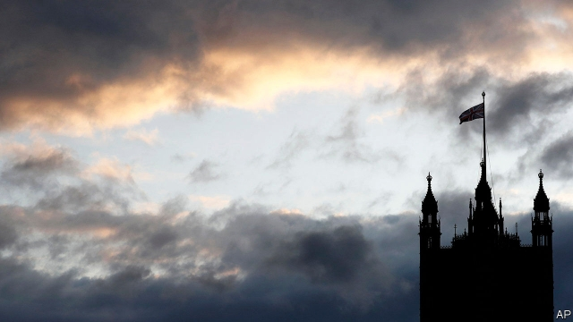

###### Stirring the tea leaves

# How Britain’s pollsters have changed their methods 

 

> print-edition iconPrint edition | Britain | Nov 9th 2019 

BRITAIN’S FIRST pollster, Henry Durant, quipped that his was the “stupidest of professions”. For who would make a claim one day only to be contradicted on election night? Undeterred, beginning with their accurate forecast that Clement Attlee would beat Winston Churchill in 1945, polling firms gained a hard-won respectability. 

Lately that reputation has been eroded. In 2015 pollsters suggested Labour and the Conservatives were neck-and-neck. In the end the Tories finished six percentage points ahead. A year later none of the final polls predicted the Brexit vote. Methods were duly tweaked ahead of the 2017 election, in which the Tories were expected to win a commanding victory. Instead they lost their majority. These misses prompted talk of a crisis. Now, December’s election promises to be especially tricky. 

Errors may creep in from three main places. The first is sampling. Just as a chef who fails to stir the soup cannot judge its taste, pollsters who lack a representative sample of the electorate cannot read the national mood. A review after the 2015 flop concluded that the polls had been biased towards Labour. The shift to online, opt-in surveys undercounts the elderly and politically disengaged. 

More mistakes can arise as pollsters try to adjust for sample bias by weighting people’s responses according to the composition of the population. Yet there is no agreed method for doing this. Brexit has made occupational class redundant as a predictor of voting intention, as white-collar Remainers have fled the Tories and blue-collar Leavers ditched Labour. Pollsters now weight their samples by a combination of factors including age, education, newspaper readership and past voting. 

Lastly, pollsters must make heroic guesses about turnout. In 2017 most of them made assumptions based on 2015 voting patterns. In the event, turnout among young people was higher, meaning the polls underestimated Labour’s support. This year most pollsters will return to their old method of going by people’s self-reported likelihood to vote, something respondents tend to fib about. 

The adoption of different methods has resulted in widely diverging results. Last month one poll put the Tories four points ahead of Labour, as another gave them a 17-point lead. Even if pollsters correctly gauge the national vote, it is difficult to translate this into seats won at Westminster. Historically, “uniform national swing”—applying changes in national vote share to each constituency—has been a decent predictor of the final seat tally. Most doubt it will work this year, because of shifting voting patterns and the possibility of widespread tactical voting. 

To better predict seats, political scientists are borrowing from data science. The tongue-twisting “multi-level regression and post-stratification” (MRP) method combines polling results with demographic and past-voting data to estimate constituency-level results. In 2017 YouGov forecast a week before the election that the Conservatives would win 274-345 seats. Many thought this a big underestimate. But sure enough, the Tories got only 317. 

Doug Rivers of Stanford University, who developed YouGov’s MRP model, predicts that the precise election forecasting omnipresent in America will soon be common in Britain. Justin Ibbett of FocalData, which recently produced an MRP model for Best for Britain, a pro-Remain group, envisages a time when the technique can be used to estimate local attitudes towards fortnightly dustbin collection, or any other policy, using national-level surveys. 

Others are more cautious. Most pollsters now make clearer disclaimers about the uncertainty of their findings, and emphasise that they represent a snapshot of opinion at that moment rather than a forecast of the final result. The “stupid” polling profession can hardly afford another dent to its reputation, after all. Martin Baxter, a seasoned prognosticator, makes only one prediction he can be sure of: if on election night the Tories still have a ten-point lead, there will be a Conservative government. ■ 

