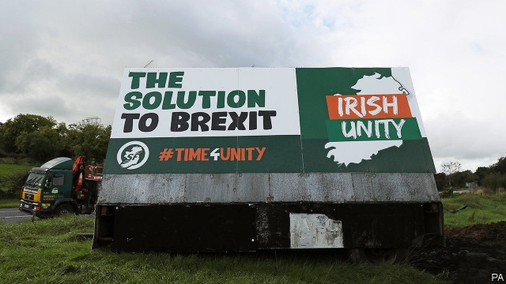
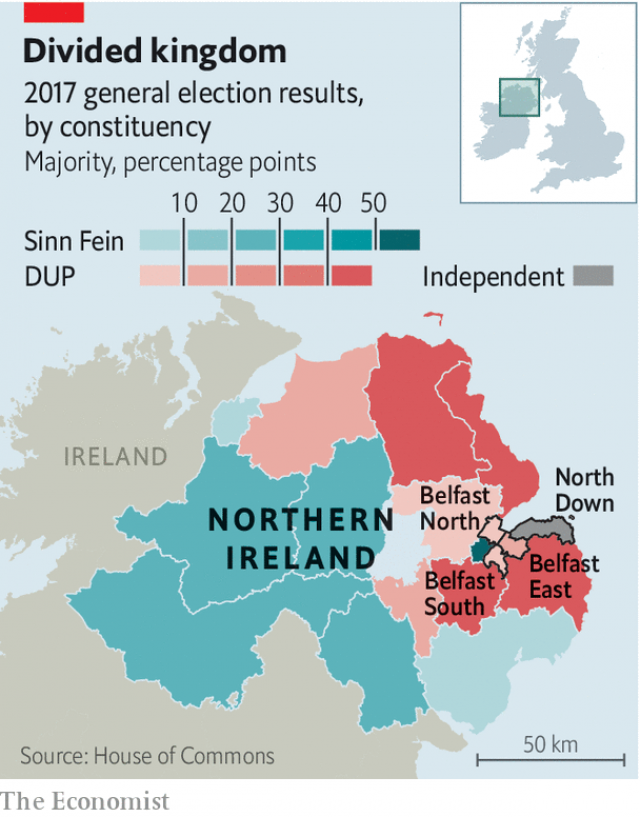

###### Joining forces

# Northern Irish parties form new pacts to unseat their enemies 

 

> print-edition iconPrint edition | Britain | Nov 9th 2019 

IN NORTHERN IRELAND Brexit has served mainly to harden already uncompromising attitudes. But in the election campaign there are surprising signs that it has inspired a new—though probably temporary—form of pragmatism. 

The most remarkable example came on November 4th when Sinn Fein, the largest and most hardline republican party, urged its supporters to vote for a unionist MP. “It sits very comfortably with me,” said Sinn Fein’s leader, Mary Lou McDonald, as she endorsed Lady Sylvia Hermon, the independent MP for North Down, whose late husband was head of Northern Ireland’s police. The Social Democratic and Labour Party (SDLP), a more moderate nationalist party, also said it would stand aside. 

Their tactical support for Lady Sylvia was due to her opposition to Brexit. Sinn Fein and the SDLP both backed Remain, whereas the Democratic Unionist Party (DUP), which until recently propped up Boris Johnson’s government, supported Leave. A vote for Lady Sylvia, Ms McDonald declared, was the best way to keep out the DUP. Two days later Lady Sylvia, who is 64, said she would not run, citing family reasons. The DUP is now expected to win the seat. But North Down is not the only constituency seeing such pacts—even if the parties prefer not to use that word. 

 

Sinn Fein and the SDLP are standing down in Belfast East, to help Naomi Long of the non-sectarian (and pro-Remain) Alliance party. She hopes to unseat Gavin Robinson, the low-profile DUP incumbent. Though she once held the seat and is a spirited campaigner, Ms Long faces an uphill struggle to overturn an 8,474 majority. Sinn Fein and the SDLP’s deal ought to help her, but not by much: in 2017 they won barely 1,000 votes between them. 

Pacts could have a bigger impact in two other seats. In Belfast South, Sinn Fein is sitting out the race to allow the SDLP a clear run. The local MP is the DUP’s Emma Little-Pengelly, another lacklustre presence in Westminster. Her majority is just 1,996. The SDLP’s candidate is Claire Hanna, a more dynamic politician and better TV performer. She also has the backing of the pro-Remain Greens, making her the narrow favourite to take the seat. 

In the sectarian cockpit of Belfast North, the SDLP is returning the favour, standing aside to give Sinn Fein a better chance of unseating the DUP’s leader in Westminster, Nigel Dodds. His majority has been eroded to 2,081 by a growing local Catholic population. Things looked especially dicey for the DUP when a smaller party, the Ulster Unionists (UUP), said it would break with tradition and contest all seats. Seething local Protestants objected that this would split the unionist vote, letting in Sinn Fein. After receiving calls “of a threatening nature” from loyalist paramilitaries, the UUP hastily pulled out. 

The campaign is likely to grow still more heated. In one example, the DUP claims that a convicted Irish Republican Army bomber, whose device killed nine Protestants 25 years ago, has been seen canvassing for Sinn Fein. ■ 

