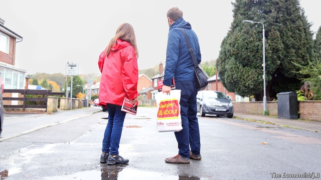
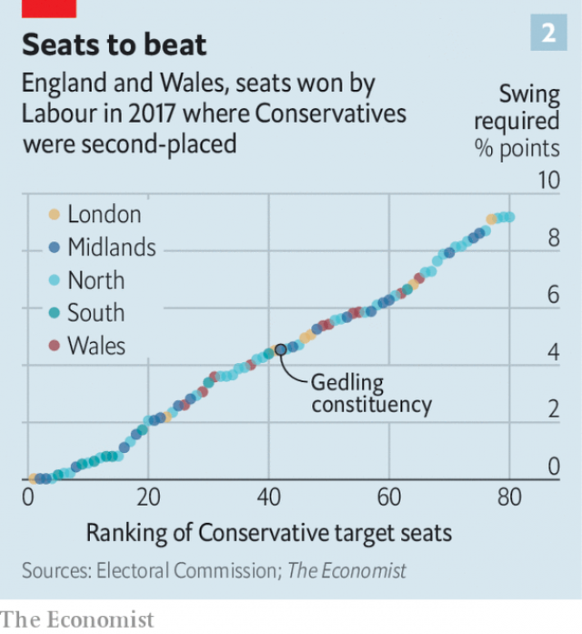

###### Swing seats: the Tory tipping point

# The Conservatives are struggling to win a crucial Midlands marginal 

 

> print-edition iconPrint edition | Britain | Nov 7th 2019 

VERNON COAKER, the Labour MP for Gedling, in the suburbs of Nottingham, proudly brandishes a leaflet put out by the Conservatives. On it, a grinning Mr Coaker is surrounded by the stars of the European Union’s flag, above a caption: “Last week, your Labour Member of Parliament voted against Brexit.” The leaflet seems to have backfired. “I get a lot of people coming up and saying thank you,” says Mr Coaker. “They think it’s me, rather than a Tory attack-leaflet.” 

There is a danger for the Conservatives that their broader campaign in Gedling, and places like it, could backfire in the same way. The seat—a marginal, Brexit-backing constituency in the Midlands—has been held by Mr Coaker for 22 years, during which it has been a perennial target for the Tories. It is the sort of place that the Conservatives ought to win in December if they are to get a comfortable majority in Parliament. Yet polling by Survation for The Economist suggests that they have some catching up to do. Discounting don’t-knows, Labour leads the Tories by 42% to 37% (see chart 1). 

Gedling is the first of five constituencies we plan to poll during the campaign. National surveys have become less useful since the Brexit vote, which has caused different parts of the country to swing in wildly different directions. At the last election, in 2017, the Tories gained ground in Leave-backing places, while slipping in Remainer areas. The old technique of applying a national poll to each seat no longer works. Our constituency surveys have a higher margin of error than national ones. But in this most unpredictable of contests they provide a guide to how different types of seat might play out. 

 

Gedling is a Tory tipping point. The Conservatives are expected to lose most of their 13 seats in Scotland, and could lose a dozen or more to the Liberal Democrats in England. That would leave them needing to win 40 or so from Labour in order to get a healthy Commons majority. That is roughly where Gedling lies (see chart 2). If it proves out of reach, it suggests the Tories may end up with only a small majority, or none at all. 

 

What kind of voters does that mean winning over? Gedling is “white, middle-class, middle-aged,” says one Labour canvasser, shoving one of 43,000 leaflets through doors around the constituency. Pick any metric and Gedling appears roughly in the middle. The benefit-claimant rate is a little lower than average, at 3.4%. The typical worker takes home about the same as in England as a whole. 

For the Conservatives, there is a more important statistic. About 56% of Gedling’s voters backed Leave. Brexit is the spine of the Tory pitch, says Tom Randall, the party’s candidate, who campaigned for Leave. By contrast, Mr Coaker supports a second referendum. Mr Randall reasons that those who voted Leave still want out, and that even those who backed Remain are receptive to Mr Johnson’s plea to just “get Brexit done”. Beyond that, Mr Randall’s message to voters is limited. Crime and the green belt are mentioned in his literature, but these play second fiddle. “TOM RANDALL WILL RESPECT GEDLING’S VOTE TO LEAVE,” booms one leaflet. 

Yet Leave voters are not in the bag for Mr Randall yet. About half intend to vote Conservative, according to our poll. The bulk of the rest go for the Brexit Party. In seats with only a narrowish majority for Brexit, the Conservatives will need the support of almost every Leave voter. In nearby Labour-held constituencies such as Ashfield, a former mining community where 70% backed Brexit, the Tories could afford to lose more Leave voters to other parties. But there are many more Gedlings than Ashfields. There are 46 Labour-held seats that the Conservatives could win with a 5% swing. Of those, 11 voted Remain. Another 21—including Gedling—had a Leave vote of between 50% and 60%. Only 14 backed Brexit by more than 60%. 

There is a reason Mr Coaker is happy to pose with propaganda painting him as a fan of the EU. About 70% of those who voted Labour in 2017 backed Remain in the referendum. Labour’s strategy in Gedling, and across the country, is to bank on Britain’s relationship with the EU sinking to its natural place in the political debate: a second-order issue for most voters. It believes that more workaday issues, such as schools, crime and hospitals, will win out. If “Labour Leavers” go anywhere, it will be to the Brexit Party, argues Mr Coaker. Straight Labour-to-Tory switchers will be few. 

If Brexit is not the main issue, other problems may hit Labour. Infighting is one. On November 6th the party’s deputy leader, Tom Watson, announced he was stepping down, after years of clashing with Jeremy Corbyn, his boss. The bigger problem is Mr Corbyn himself, the least popular opposition leader in history. In Gedling, only four out of ten Labour voters think he would make the best prime minister. By contrast, nearly all Tory voters there back Mr Johnson. A serious-looking prime minister finds his way onto Tory leaflets, whereas Mr Corbyn is nowhere to be seen on Labour’s, which feature large pictures of Mr Coaker. Mr Corbyn’s ratings improved dramatically in the 2017 election, but that particular soufflé may not rise twice. 

Still, the message from the Midlands is a warning to the government. And it comes in a week when the Conservatives’ national campaign got off to a dreadful start. Alun Cairns, the secretary of state for Wales, resigned from the cabinet following claims that he knew of a former aide’s role in the “sabotage” of a rape trial. The previous day Jacob Rees-Mogg, the leader of the House of Commons, had to apologise for implying that those who died in the Grenfell Tower fire lacked the “common sense” to run to safety. The Brexit Party’s announcement that it will run candidates in every seat will not help the Conservatives. 

Above all, it will take more than Brexit to win seats like Gedling when they are split down the middle on the topic. Until the Tories put together the rest of a programme, Labour will be bullish. “We’re always supposed to lose,” says Mr Coaker of his prospects. “But we never do.” ■ 

