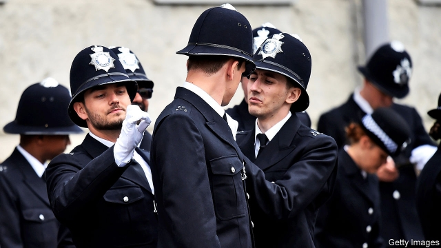

###### Ill-gotten gains

# Tories promise more police—having earlier cut their number 

 

> print-edition iconPrint edition | Britain | Nov 7th 2019 

LORRAINE BLISS is ready for the onslaught. “They’ll all be down here in the next few weeks,” she says, with a hint of resignation. The charity she runs, St Edmunds Society, which gives training to disadvantaged youngsters, sits just outside Norwich North, among the most marginal of Britain’s 650 constituencies. Chloe Smith, the incumbent Tory MP, won only 507 more votes than her Labour rival at the last election. Both parties are flooding the seat with activists. High on the agenda is crime, which has leapt in salience nationally since 2017, not least in Norwich. Ms Bliss, who spends much of her time weaning teenagers off the apparently easy money to be made from running drugs, expects plenty of warm words to come her way. 

Norwich sells itself as “a fine city”, and in many ways it is. Autumn leaves settle on cobbled streets with names like Ten Bell Lane and Pottergate. But it also has pockets of real deprivation, mainly clustered on estates in the north. As in any city, drugs are in demand. In recent years, though, kingpins from London have begun to displace small-fry local dealers, sometimes violently, in a phenomenon called county lines (a reference to the mobile numbers used by distant clients to place orders). Stabbings are growing more common. Knife crime in the county of Norfolk has tripled since 2013, albeit from a low base. Karen Davis, Labour’s candidate, blames cuts by successive Conservative governments. 

Crime was once solid ground for Tories, who mocked liberal opponents for their soft treatment of hoodlums. In 1993 Michael Howard, then home secretary, insisted simply: “Prison works.” But the Conservatives began to lose their edge on crime in 2010, by not sparing the Home Office from austerity. In the next eight years the number of police officers fell by 15%. As home secretary, Theresa May narked cops by lecturing them in public and cutting back on their powers to stop and search passers-by. 

This might not have troubled voters much had crime rates continued a long decline that began in the mid-1990s. Yet, whereas overall rates have stayed stable, violent crime has jumped. Newspapers talk excitably of “Wild West Britain”. There are many explanations for the surge, including the emergence of the county-lines model. But police and opposition MPs have blamed the budget cuts. And voters have clocked that overstretched cops are falling behind. Only 8% of offences led to a charge in the year to March, down from a recent peak of 17% five years ago. After a terrorist attack during the 2017 election, Labour claimed the law-and-order mantle. 

Boris Johnson is trying to change that. Launching the Conservatives’ campaign in Birmingham on November 6th, the prime minister trumpeted his plans to hire 20,000 new police officers and beef up their powers. He first announced that plan in the summer in front of a phalanx of bobbies, one of whom fainted in the heat. Norfolk will get 67 of these new cops, a fact Ms Smith intends to make much of. 

Mr Johnson chose as his warm-up act Priti Patel, the home secretary, whose speeches sometimes read like tabloid editorials. Activists cheered as she pledged the Tories would take their “rightful place” as the party of law and order. Harvey Redgrave of Crest Advisory, a criminal-justice consultancy, says Mr Johnson has spotted that police cuts were one of the least popular aspects of austerity. “It makes a whole lot of sense politically.” 

As recently as early 2016, only 8% of those polled by Ipsos MORI said that crime was a hot topic, the lowest score since 1991. Now 22% say so, making it the third-most important theme, behind Brexit and health care. In talking so much about it, Mr Johnson is gambling that voters will credit him for his tough stance while forgiving or forgetting the cuts made by his predecessors. 

That might prove a stretch. Headlines focus on stabbings and murders in London, which has by far the highest number of such crimes. But some of the biggest recent rises have been in leafy places like Warwickshire, Hampshire and Norfolk. Norfolk is still one of the safest corners of England, but violence has risen steeply under the watch of Tory governments and the county’s mainly Tory MPS. 

Ms Davis says relatively harmless local weed-dealers have been replaced by county-lines operations flogging £10 ($13) bags of crack cocaine, with free samples of heroin thrown in. Adjusted for population, heroin now kills more people in Norwich than in London or Manchester. One secondary-school teacher regrets that most of his 13-year-old pupils know all about drugs paraphernalia and slang for weapons. 

Nor is crime a worry only in seats affected by county lines. As with immigration, voters hold strong opinions on crime even in places that experience little of it. Take Farnham, a Georgian market town in well-heeled Surrey, which has among the lowest incidence of knife crime in the country. Even here, headlines about stabbings have had an impact. “Here, touch wood, it’s not too bad,” says a shopper in pearls and a silk scarf. “But my son lives in London and every day I pray he gets home.” She, too, is miffed about police cuts. “We never see them. You miss the bobby on the beat.” 

Farnham’s police station closed seven years ago. Only 21 people a week used to visit it, but whenever there is a crime in town, locals mention the closure. Here, as in much of Britain, Mr Johnson’s focus on crime has touched a nerve. But if Labour manages to link the issue to austerity, it could end—like his speech in front of those coppers—in an embarrassing flop. ■ 

