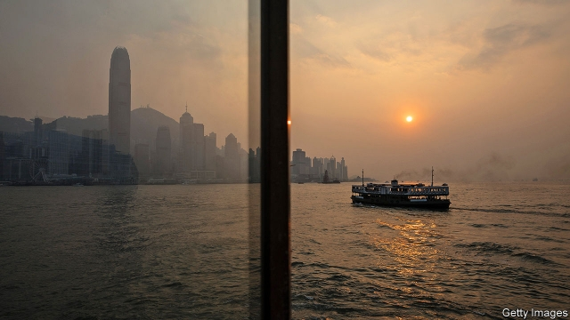
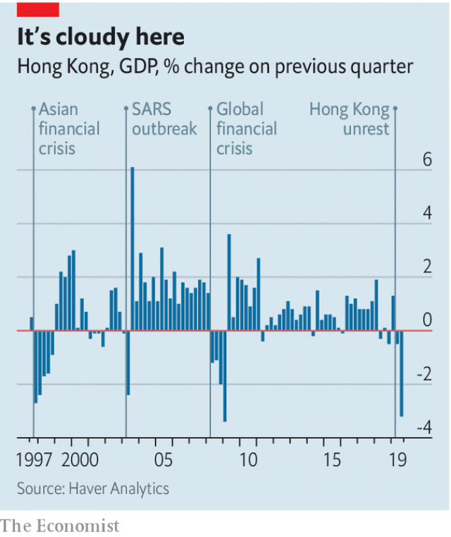

###### On edge

# A postcard from Hong Kong 

 

> print-edition iconPrint edition | Business | Nov 9th 2019 

TO A VISITOR from messy Mumbai, on the surface Hong Kong seems, despite months of anti-government protests, in order. Busy shops, clean streets, trains that run on time—or at all. CLP, the 118-year-old electric utility, has just moved from its old headquarters in Kowloon to a new one over a shopping mall (inevitably). Both digs are (inevitably) to be redeveloped. Business as usual, then? 

Not quite. Two French bakeries that popped up after your correspondent left in 2011, to ride Hong Kong’s surge as Europe flailed, have shut. The owners felt the tide had turned. A recent graduate from Canada, who grew up in the territory, notes how hard it is to get a job. Hong Kong is in recession (see chart). Hiring has slowed, particularly by confused multinationals. People, he says, are leaving. Millennials with work offers elsewhere are not returning. It is, many reckon, worse than the SARS epidemic in 2003. Back then Hong Kongers were united. Now they seem deeply divided. Arguments flare up far from the riots. 

A bartender in Wanchai, a busy commercial district, says business is slow. Watering holes lose money (except during events that draw out the fearless, such as televised matches during the recent Rugby World Cup). Protests, or the expectation of them, can scotch anything involving crowds—cultural dos, parties—that once evinced Hong Kong’s vitality. People stay at home. Cops in riot-gear guard MTR stations. The public-transport company’s share price is down by 18% since July. 

 

The upheaval appears to have narrowed Hong Kong’s intellectual bandwidth, too. A decade ago business and finance types would talk about all of Asia. Now they speak of little besides Hong Kong and mainland China. This is not wholly irrational. At one investment bank half of equity trading still involves American shares, but one-third is now China—more than Japan, South Korea, Australia, Taiwan and India combined. 

A Hong Kong tycoon of Indian descent says that if he were young, he might move back to his ancestral land. His children are now at the age (early 30s) when in years past the Sassoons, an Asian trading dynasty, would dispatch them to entrepots to advance the family concern. They are choosing to stay put—because India, the obvious destination, has disappointed too much. Hong Kong’s disappointments have not made it unlivable. The Hang Seng stockmarket index swooned over the summer, but has since recovered some of the decline. Hope of a return to normal lingers on. For now.■ 

