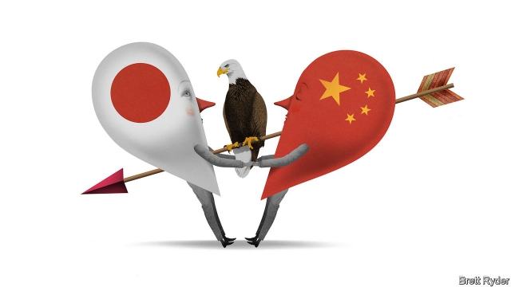

###### Neighbourly love-in

# Japan Inc has thrived in China of late 

 

> print-edition iconPrint edition | Business | Nov 9th 2019 

IN 1977, FIVE years after China and Japan re-established diplomatic relations, Miyakoshi, an electronics manufacturer, became the first Japanese firm to receive a business permit from the Communist Party, to make cassette-tape recorders. In 2017 around 32,000 Japanese companies had investments worth $117bn on the mainland, one of the biggest foreign corporate footprints. Last year they poured close to $11bn into China, up by half since 2010 and not far off America’s long-stagnating tally. Big listed Japanese firms derived 17% of their overseas profits from China, according to calculations by Jesper Koll, a fund manager in Tokyo. 

The rapport between the world’s second- and third-biggest economies has never been better. Last year Chinese officials paid a visit to Panasonic, Canon and Toyota in Japan to meet executives and lure their firms to new free-trade zones. A year ago Shinzo Abe, Japan’s prime minister, travelled to China, to a forum attended by 1,000 businesspeople. During the trip the two countries announced 500 deals worth more than $18bn. Yet for all the bonhomie, it is also an unusually delicate time for Japanese businesses in the People’s Republic. 

The first reason is the changing nature of commercial relations between an enriched China and the world. Japan’s firms have navigated this shift well, displaying none of the overconfidence which bedevilled their gung-ho American misadventure in the 1980s. As Chinese labour has grown pricier, many have moved manufacturing to cheaper places in the region.UNIQLO, a Japanese garment-maker, is one of a clutch to decamp to South-East Asia. 

At the same time, many of the same companies have successfully turned themselves into desirable brands in China. Chinese shoppers covetUNIQLO’Swell-made clothes. Fed up with safety scandals at local producers, they prefer Japanese-branded snacks and beverages from Asahi or Yoshinoya or medical products made by Kobayashi. Kao, a Japanese consumer-goods firm, recently started making a premium version of its Merries nappies for the Chinese market only. This summer Toyota invested $600m in Didi Chuxing, a Chinese ride-hailing giant. Miyakoshi, which now sells property rather than cassette-players, generates all of its sales in China. Chinese consumption has gone “beyond the point of no return”, says Takeshi Niinami, the boss of Suntory, a giant Japanese distiller. 

Japanese wares appeal not only to China’s consumers but also to its corporations. In April Toyota agreed to sell electric-car technology to Singulato, a Chinese builder of low-emissions vehicles. In June it announced partnerships to build batteries with China’sCATL, a technology company,andBYD, a carmaker. When in 2015JD.com decided to erect China’s largest hydroponics factory on the outskirts of Beijing, the Chinese e-commerce giant looked as far afield as Israel and the Netherlands for the right technology to regulate the temperature of its seedling rooms and soil-free vegetable beds. In the end, it settled for Mitsubishi Chemical. The Japanese firm has already helped build close to 20 factories likeJD.com’s in China and aims to break ground on ten a year. 

Japanese firms run into the same hurdles as others trying to do business in China. Bosses in Tokyo echo Western gripes about woolly, haphazardly enforced rules, a tax system skewed towards Chinese companies, unreliable courts and theft of intellectual property. But Japan’s government and industry groups may be doing more to help them than America’s or Europe’s do for theirs. Its embassy in Beijing and the Japan External Trade Organisation, an independent government agency, have employedIPexperts to assist firms. Japanese advertisers have set up shop in China to help compatriots market to local tastes. Having had its fingers burned in China a few years ago, in May Rakuten, a Japanese e-commerce giant, opened an office in Dalian, a Chinese coastal city now home to some 1,500 Japanese companies. 

For all its recent success in China, Japan Inc must still tread carefully there. One reason is ghosts of the past. In 2005 a controversial change to Japanese history textbooks, seen to whitewash Imperial Japan’s sins, led to riots in China and boycotts of Japanese businesses. In 2012, during a political row over the disputed Senkaku Islands, which Japan controls but China claims (and calls the Diaoyu), Toyota and Honda dealerships, as well as a Panasonic plant, were set on fire. 

Japanese firms have got better at dealing with Chinese grievances over Japan’s failure to atone for its wartime occupation of parts of China, when firms such as Mitsubishi Materials forced Chinese labourers to toil in Japanese mines. Three years ago Mitsubishi even issued a rare formal apology and has been setting up a compensation fund. But resentment simmers—and could easily boil over if China’s self-confidence continues to find expression in an assertive nationalism. 

Between the eagle and the dragon 

Then there is the spectre of Sino-American rivalry. Japanese firms have long benefited from geopolitical proximity to America and geographical closeness to China. The two are the most important markets for many Japanese companies, whose supply chains criss-cross both. As the superpowers jostle over everything from trade to technology, this blessing looks ever more like a curse. Because Japan’s firms are more exposed to China than American ones are—China is Japan’s largest trading partner—they would find it harder to give up on the Chinese market. It would be “a nightmare” to have to choose between Japan’s biggest neighbour and its chief strategic ally, says Ichiro Hara of Keidanren, a Japanese business lobby. As geopolitics impinges on globalised commerce, the choice may become inevitable.■ 

