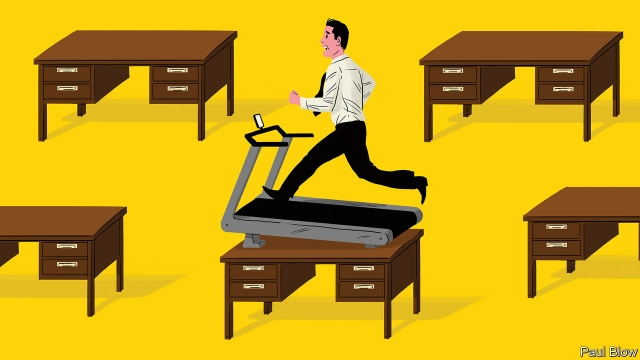

###### Bartleby

# Take the money and run 

 

> print-edition iconPrint edition | Business | Nov 9th 2019 

A  LATIN PHRASE beloved by every old-fashioned British schoolmaster was mens sana in corpore sano—a healthy mind in a healthy body. With that, the pedagogue would dispatch some shivering schoolchild in vest and shorts on a three-mile cross-country run. 

It turns out that those tutors were on to something. Greater physical activity is associated with better mental, as well as physical, health. And it might also be linked to greater worker productivity, and thus faster economic growth. That is the conclusion of a new report from RAND Europe, a think-tank, that was commissioned by Vitality, a British health insurer. 

It is reasonably well established that physical activity reduces the risks of heart disease, type 2 diabetes, strokes and some cancers. And a report by Britain’s Physical Activity Guidelines Advisory Committee in 2018 found that engaging in around 30 minutes of exercise a day could lower the likelihood of depression by more than 40%. RAND conducted a workplace survey across seven countries, and it found that those who reported higher levels of activity (equating to 150 minutes a week of moderate exercise, or 75 minutes of vigorous workout) had better mental health on average. 

Does this make them better workers? Previous studies have suggested that those who exercise more tend to earn 5-10% more on average. A number of factors could explain this, however. Those who participate in team sports may make contacts in the locker room that help them in their careers. Or it could simply be that higher earners can afford to take advantage of sports facilities, such as gym memberships. 

The RAND study looks at different measures: absenteeism (when workers take time off for illness) and presenteeism (when they turn up for work but are less productive because of sickness). The latter measure was self-reported by employees, who were asked whether their work was adversely affected by health issues. The survey suggests that between 3 and 4.5 working days each year are lost as a consequence of workers being physically inactive. This is between 1.3% and 2% of annual working time. The bulk of this was down to presenteeism. 

Another potential gain from improved fitness is reduced health-care costs. In many countries, these would accrue to the public sector. But in America, where health care is often provided through employment-based schemes, firms could benefit. It is hard to know what proportion of these costs could be trimmed, but RAND estimates that total American health savings could be $6bn a year by 2025 (using the same targets for moderate or vigorous exercise as before). 

That is a rounding error in America’s annual health-care bill of $3.5trn. But, with the help of fancy econometrics, the study’s authors conclude that if people met these exercise targets, global GDP could be around 0.17-0.24% higher by 2050. Nothing to sniff at in a world of slowing growth—though the uncertainties involved in forecasting over such long periods mean such estimates should be treated with extreme caution. 

How to encourage workers to become more active? Incentives are useful but only if they have conditions; giving all employees subsidised gym membership does not seem to work. Another RAND Europe study examined an experiment in which workers were given an Apple watch, payable in instalments at a discounted price—but only to those who agreed to have their physical activity monitored. Monthly repayments depended on how much exercise they took. If they met the targets they ended up paying 10% of the watch’s list price; those who took no exercise paid the full whack. 

This approach takes advantage of a behavioural bias known as loss aversion—people are eager to avoid paying more. On average, participants in the scheme undertook 30% more exercise than before. 

The problem is that many people are too optimistic about their health, underestimating the risks they face. This means that participation in workplace exercise schemes tends to be low, around 7% in the sample studied by RAND. 

Firms are not the only ones that can encourage a healthier lifestyle; friends and families are likely to be more important. But businesses can play a bigger role. If RAND is right, this may bring them financial benefits. Company taskmasters may yet grow fond of an adapted adage: mens sana in corporate sano. 

