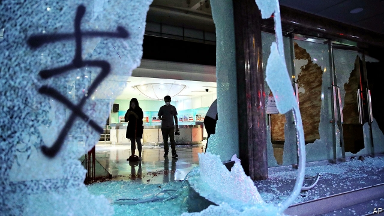

###### Black terror

# Mainland Chinese are being attacked in Hong Kong 

 

> print-edition iconPrint edition | China | Nov 9th 2019 

A  FEW DAYS ago, Huang Qixuan, a 21-year-old from mainland China who is studying accountancy in Hong Kong, was walking through his campus, talking to his father by phone. He passed a black-clad local student who was holding a placard in support of the pro-democracy unrest that has racked the city for nearly five months. “It’s chaotic,” he said to his father in Mandarin, the mainland’s common tongue. Incensed, the local shouted into Mr Huang’s face in Cantonese, the language of most Hong Kongers. “Liberate Hong Kong!” the protester kept on yelling as he followed Mr Huang. “Revolution of our times!” chanted passers-by, encouraging the pursuer. 

Communist Party-controlled newspapers in Hong Kong say the city is in the grip of a “black terror”, a reference to the protesters’ adopted colour. Mr Huang agrees, and has plenty of evidence to confirm his anxiety. On WeChat, a messaging app used by many mainlanders in Hong Kong, who include around 12,000 university students, videos have gone viral of attacks on people from China’s interior. One such incident, on November 2nd, involved a woman who was accosted by protesters in a touristy part of the city after she allegedly took close-up shots of people in masks (the government recently banned the wearing of them by demonstrators). During the encounter the woman’s face was splattered with a sticky black substance. On the next day a mainlander shouted “We are all Chinese, long live China!” inside a shopping mall. He then fled to escape an angry crowd, who swore and threw objects at a fireman trying to shield him. 

During the past few weeks, such assaults have become more common. The protest movement, meanwhile, has increasingly taken aim at property connected with the mainland. On November 2nd protesters vandalised the office building of Xinhua, the mainland’s state-run news agency, smashing its glass doors, spraying graffiti on it and starting a small fire in the lobby (the damage is pictured). Other mainland premises that have recently been vandalised include a branch of Tong Ren Tang, a pharmacy; an outlet of Xiaomi, an electronics company; and Chung Hwa, a bookshop, on which protesters sprayed the words “Chinazi income source”. Some mainland-related shops have erected metal barricades as shields against attacks. 

Such incidents have contributed to a dramatic fall in the number of mainland tourists. In the first week of October, a national holiday, there were 56% fewer of them than a year earlier. At one tourist magnet, a large sculpture of a Bauhinia flower that was presented to Hong Kong by the central government, a mainlander who has lived in Hong Kong for two years and earns money photographing tourists says that on a recent Sunday only about ten coaches stopped to let mainlanders off nearby. Before the unrest around 100 of them would have pulled up, he says. 

Students from the mainland feel particularly vulnerable because many of those at the forefront of the unrest are people with whom they share their classes: locals who have daubed the pavements of campuses with slogans and filled whole corridors with political messages. In the West, Chinese students can flaunt their nationalism with strong support from their Chinese Students and Scholars Associations and a thumbs-up from Chinese diplomats. In Hong Kong, mainland student groups keep a low profile, probably to avoid accusations by Hong Kongers that they are undermining the “high degree of autonomy” that China has promised the territory. Unlike Chinese students in the West, some of whom have demonstrated against Hong Kong’s protest movement and torn down bulletin-board messages in support of it, mainland students in Hong Kong have usually been more restrained. Some avoid speaking Mandarin in public places, fearing a hostile response. 

The mainlanders rub shoulders with a local student body that is far more staunchly anti-Communist than domestic students tend to be on Western campuses. On October 1st, China’s national day, Mr Huang was among a few dozen mainland students who gathered to sing the Chinese anthem on the campus of the University of Hong Kong. The group was quickly surrounded by local students. Tensions escalated as the Hongkongers began yelling, in Cantonese, “Vindicate June 4th!” They were referring to the Tiananmen Square protests in 1989 which were bloodily crushed on that date. 

Local students often regard their mainland counterparts as upholders of the Communist Party line. One of those who confronted Mr Huang and his group says locals sometimes ask mainlanders why they study in Hong Kong if they do not embrace freedom and democracy. “None of them ever answers,” he says dismissively, asking not to be named because of his involvement in the recent protests. 

It is true that few mainland students show much interest in the pro-democracy cause. Many regard politics as a sideshow to the much more pressing need of landing a good job on the mainland. But Hong Kong’s liberal culture does rub off on some of them. Julie Li (not her real name), who this year gained a master’s degree from the Chinese University of Hong Kong, describes her own political transformation since she arrived in the territory in 2018. By reading Hong Kong’s media, the 23-year-old discovered that a high-school classmate who had been arrested on the mainland for supporting a campaign for workers’ rights had not, as the mainland’s media claimed, “conspired against the country”. Ms Li began paying closer attention to other human-rights abuses on the mainland and enjoying political debate with local classmates. Eventually she all but ceased to use WeChat, put off by its heavy censorship of news relating to Hong Kong’s unrest. 

Now, however, Ms Li finds the violence and vandalism unbearable. She wants to leave and is looking for jobs across the border. “I think the protests have degenerated into something sinister now,” she says. ■ 

