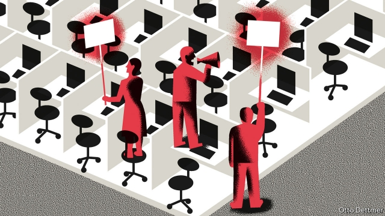

###### Free exchange

# Belligerent unions are a sign of economic health 

 

> print-edition iconPrint edition | Finance and economics | Nov 9th 2019 

THE DISSONANCE could hardly have been more apparent. America’s most recent employment figures captured a jobs market in fine fettle: firms added 128,000 new workers in October, while unemployment held near historically low levels and wages rose at a respectable clip. The data would probably have looked better, however, had they not been depressed by a costly labour dispute, only recently ended, at General Motors (GM). Workers around America are showing their restlessness; members of the Chicago Teachers’ Union returned to work on November 1st, after striking to demand higher pay and more investment per student. The unrest may seem odd given the robust state of the labour market. In fact it is neither a bad omen nor entirely unwelcome. 

In their book on organised labour, “What Do Unions Do?”, Richard Freeman and James Medoff argue that unions play two principal economic roles. They provide workers with a voice; through a union frustrated workers, who might otherwise simply quit, can communicate their dissatisfaction to the firm. Communication can raise efficiency by boosting morale, and by helping firms to retain workers and identify and fix problems. But unions also function as monopoly providers of labour. By controlling labour supply they are able to extract rents—and thus raise members’ compensation—reducing economic efficiency. 

The book was published in 1984, at a critical moment. Across the rich world the share of workers covered by unions had fallen steadily from their post-war peaks (outside a handful of northern European countries). Declines in the employment share of highly unionised industries, like manufacturing, bore some of the blame. But government policy also played a role. The mood turned against labour in the 1980s, first in America and Britain, then elsewhere; politicians seized on the moment. In 1981 President Ronald Reagan, who once led America’s actors’ union, summarily fired 11,000 striking air-traffic controllers. In the years since, labour has spoken softly and carried a twig. America experienced an average of 16 major work stoppages (affecting 1,000 workers or more) each year from 2001 to 2018, down from 52 per year between 1981 and 2000, and 300 per year from 1947 to 1980. 

Unions, though weakened, survive. In America they represent 37% of public-sector workers and 7% of private-sector ones. In 2018 nearly half a million American workers were involved in work stoppages, the most since 1986. That militancy owes something to labour-market conditions. One might expect periods of economic strength to be placid ones, because firms can be conciliatory. When profits are high, they can afford pay rises—whereas in times of economic stress, holding the line on pay may mean the difference between survival and failure. Moreover, the opportunity cost of a work stoppage is higher when demand is robust. When consumers are hoovering up new cars, lost production time is very costly. Reflecting this, GM suffered operating losses of nearly $2bn during the recent stoppage, according to one estimate, or nearly twice the sum of wages lost to workers. 

But strong labour markets lend more encouragement to frustrated workers than pause to firms. Striking workers face the loss of pay and, potentially, of employment—threats that frighten less when good jobs are plentiful. Workers can more credibly withhold their labour from firms when there are no long lines of unemployed workers waiting to replace them. A strong jobs market may also give workers more to bargain for. Fighting over a larger share of a firm’s earnings makes little sense when there are no earnings to fight over. GM filed for bankruptcy in 2009, but has since reorganised and begun turning a healthy profit. 

Strikes are more than arguments over profits gone wrong. They are also a way to elicit information, as John Kennan of the University of Wisconsin-Madison and Robert Wilson at Stanford University describe in a paper published in 1993. Unions often cannot tell if a firm’s claim that it cannot afford pay rises is credible or merely cheap talk. By holding its bargaining position as the losses from a strike mount, a firm can convey to a union that its arguments are rooted in reality. GM’s seemingly were. Striking workers failed to secure a larger pay rise than they had won in their previous contract negotiation, or to get the firm to reopen a plant in Ohio. They did win more profit-sharing—probably the best a profitable but vulnerable firm can do, given the risk of agreeing generous pay packages that cannot be amended in times of financial stress. 

The situation could be different in other parts of the economy, however. When economists argue that unions impose economic costs, they typically assume that markets are competitive. Across much of the American economy that is not always the case. Sometimes one or a few big employers dominate local labour markets, and can thus impose below-market wages on vulnerable workers, a condition economists call “monopsony”. In recent testimony in a congressional hearing on antitrust issues, Kate Bahn of the Washington Centre for Equitable Growth, a think-tank, noted that though wages in manufacturing industries are close to the level one would expect in competitive markets, those in some others, like health care, are not. For workers frustrated by stagnant pay, a work stoppage may be the only way to determine if an employer is constrained by competitive markets or abusing its market power. 

In the latter case, interventions by unions could prove economically useful. In a paper published last year, Mark Stelzner of Connecticut College and Mark Paul of the New College of Florida, argued that in the presence of monopsony power, collective bargaining can reduce the rents collected by dominant firms and increase economic efficiency. In practice, America’s diminished labour movement cannot on its own fix the problem of uncompetitive markets, or strike much fear into the hearts of employers. Nonetheless, workers are daring to try.■ 

