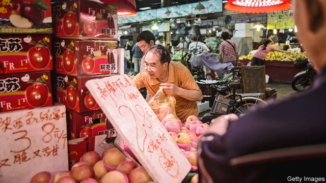

###### Phase one, scene two

# China tries to squeeze more out of a small trade deal with America 

 

> print-edition iconPrint edition | Finance and economics | Nov 9th 2019 

THE TRADE conflict between China and America has been a clash not just of giant economies but of utterly different public negotiating styles. In one corner are President Donald Trump’s tweets, in which he veers between heaping praise on China and declaring that he has pummelled it. In the other is a Chinese bureaucracy that has stuck doggedly to the same message: tariffs must be removed for the two countries to reach a trade agreement. A mini-deal, hashed out last month, is shaping up to be a mini-test of their contrasting approaches. 

The outline of the mini-deal—or, as Mr Trump put it, the “substantial phase-one deal”—seemed clear enough. China would buy American agricultural products, and America would hold back from slapping yet more tariffs on China. With this basic agreement under their belts, the two combatants would move onto weightier topics such as China’s support for its strategic industries. But two problems have since emerged: one predictable, one not. 

As was foreseeable at the time, the lack of detail about the mini-truce concealed big differences. Mr Trump said that trade talks had been “a love fest”, and that China would buy $40bn-50bn in farm goods from America, more than double the level before the trade war. But the more he gloated, the more China appears to have seen an opening to push for more. According to multiple reports, Chinese negotiators have demanded that to complete the mini-deal, America must remove some of its existing tariffs, not just refrain from new ones. 

China’s gambit might just pay off. On November 4th a Trump administration official reportedly said that a phase-one deal between America and China could roll back the 15% tariff imposed on September 1st, on $112bn of goods. China could be offering some sweeteners such as a purchase of liquefied natural gas, which Wilbur Ross, America’s commerce secretary, hinted at on November 5th. But the tariff reduction would be an American concession. The previous stance of Robert Lighthizer, America’s chief trade negotiator, was that tariffs should remain until China proves that it is honouring whatever deal is struck. 

The unpredictable complication was Chile’s big protests. Mr Trump and Xi Jinping, his Chinese counterpart, had hoped to seal their mini-deal on neutral ground at a summit of Asia-Pacific countries in Chile in mid-November. But the organisers have cancelled the summit. That poses the question of where and when the leaders should meet, itself a matter of negotiation. Given Mr Trump’s tendency to improvise, China wants to be sure there is a political win on the table before it agrees to meet. 

The Chinese may yet include more juicy titbits for American businesses as part of the mini-deal. But even if it is signed without a hitch, the trade war will be far from over. Hundreds of billions of dollars of Chinese exports would still be affected by tariffs and companies would still have to live with the uncertainty of the old ones coming back. Mr Trump would still have the final word, and another one after that too. ■ 

