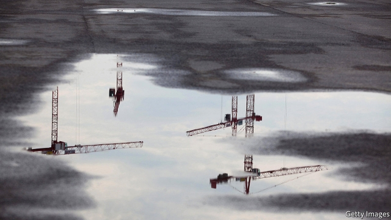

###### Vultures v zombies

# Distressed debt funds are waiting for a downturn 

 

> print-edition iconPrint edition | Finance and economics | Nov 9th 2019 

ON NOVEMBER 4TH the share price of Kier Group, a troubled British builder, fell by nearly 10% on reports that banks were trying to offload its debt at a steep discount. The rumour remains unconfirmed—sources close to the firm and one of its biggest lenders dispute the claim—but investors may have felt a sense of déjà vu all the same. After the sudden downfall of Carillion and Interserve, Kier is Britain’s third construction giant to face a battle for survival in less than two years. And each time the groups’ fortunes have worsened, hedge funds eager to snap up their debt at bargain prices have begun to circle. 

Funds that buy “distressed” debt, which typically yields ten percentage points or more over Treasuries, are becoming familiar villains. They pounced on Thomas Cook, a travel group, and PG&E, a Californian utility, shortly before they went bust this year. They tend to circle around ailing oil firms and shops disrupted by e-commerce, notes Christine Farquhar of Cambridge Associates, an investment firm. And they snap up portfolios of dud loans from banks. If their target ends up recovering, they pocket big profits. If it does not, they often gain regardless, as they are usually first in line for liquidation proceeds. 

Yet distressed specialists are frustrated. Convinced that a recession was just around the corner, they have raised $136bn since 2017, more than they did in the four years that followed the financial crisis, according to Private Debt Investor, a financial-information provider. But they have struggled to deploy the cash. Distressed-debt funds currently hold $62bn in “dry powder”—almost twice as much as they had in 2008 and close to the $75bn peak reached a year ago, reckons Preqin, a data firm. 

Two things are making their life difficult. First, despite choppy markets and a commodity bust, the global economic expansion is a decade old and counting. And just when funds think a downturn is finally coming, interest rates are cut, allowing weak borrowers to limp on for longer. Meanwhile plentiful liquidity has led to weakening covenants—clauses that require borrowers to keep overall debt levels under control—making it harder for funds to force floundering firms into bankruptcy. 

So distressed deals are few and far between. And when they come up, competition is fierce. That is buoying prices, which hurts returns. Weaker contractual protections make this worse: creditors often recover less from restructurings, says Fraser Lundie of Hermes Investment Management. Distressed debt is also becoming less liquid, and harder to trade, because passive funds that track fixed-income indices focus on larger and safer companies. After returning more than private equity for years, the asset class has lagged behind it each quarter since 2016, according to eFront, a data firm. Internal rates of return are just 8.5%, net of fees, compared with 12% two years ago. 

The famine is “wiping out an entire generation of distressed professionals”, notes a credit-fund manager. Trading desks have lost staff; flagship funds have folded. Nick Kraemer of s&P Global, a rating agency, says default rates on speculative-grade debt in America could top 10% in mid-2020, up from 2.4% in June 2019, providing a reason to hope. But more easing by the Federal Reserve could thwart that. And structural factors, like weak covenants and thin liquidity, will probably persist. Britain’s builders may flounder, but corporate debt seems based on firmer foundations.■ 

