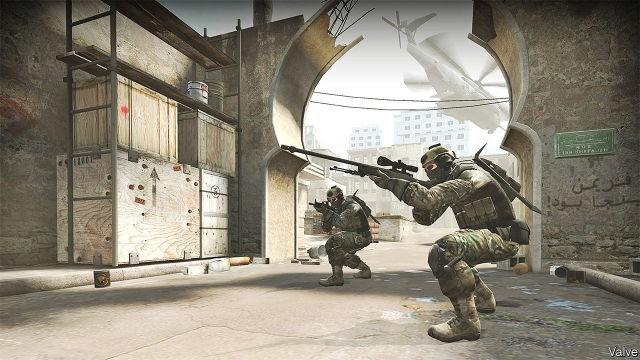

###### Counter-terrorists win

# Financial crime through video games is on the rise 

 

> print-edition iconPrint edition | Finance and economics | Nov 9th 2019 

FOR PEOPLE who enjoy being (virtually) shot in the head by foul-mouthed teenagers, Counter-Strike has long led the field. The game, developed by Valve Corporation, pits a team of terrorists against an anti-terrorist commando squad in a fight to the death. Its various iterations have helped make Steam, a digital marketplace for video games also run by Valve, among the most successful in the industry. But Counter-Strike has appealed to more than just twitchy young men of late. On October 28th Valve announced it was stopping the trading between players of “container keys”—an in-game gambling device that players can buy (with real money) to try to win (virtual) rewards such as special weapons or clothing. The firm says “nearly all” of the trades of such keys were “believed to be fraud-sourced”. It is a rare admission of the growing problem of using video games to facilitate financial crime. 

The company has released no further details, and did not reply to a request for information from The Economist. But it seems likely that the keys, which were bought with stolen credit cards, were then traded between accounts on Steam’s marketplace. Players cannot withdraw real money from their accounts, but in-game credit can be used to buy new virtual rewards or games. There is a burgeoning market (on third-party websites) for accounts already loaded up with virtual cash. Criminals can cash out by selling to gamers keen to acquire games or virtual items cheaply. 

Valve is not the first to be affected by such dodgy trading. In 2007 eBay, an online marketplace, banned the sale of virtual gamer goods, such as gold in World of Warcraft, another game. But the problem seems to have worsened, probably because developers now earn more from in-game items. In 2016 Electronic Arts, a developer, revealed that it made 30% of its digital revenue from “loot boxes”, much like Counter-Strike’s container keys. Such online items “function like virtual currencies”, notes Anton Moiseienko, of the Royal United Services Institute, a British think-tank. They can move value between countries and people, out of regulators’ sight. 

Valve’s admission that fraudsters exploited its platform is striking, says Mr Moiseienko; others have ignored the problem. But at least one firm has gone further. In July Linden Labs, a gamesmaker, announced that players wanting to trade on its platform must provide proof of identity. Its subsidiary also registered as a money-service business. That is one way to counter-strike.■ 

