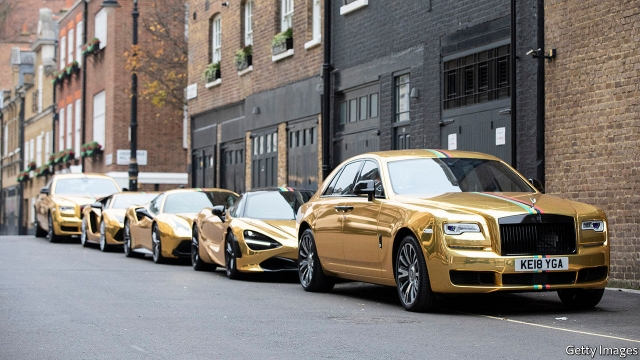
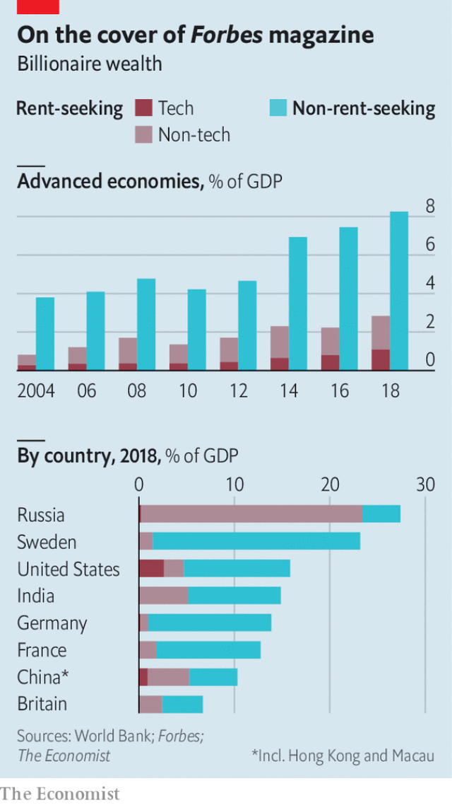

###### The lives of the 0.0001%

# Have billionaires accumulated their wealth illegitimately? 

 

> print-edition iconPrint edition | Finance and economics | Nov 9th 2019 

BILLIONAIRES HAVE never exactly been popular with the radical left. But with a member of the nine-zero club sitting in the White House, and a decade of slow growth in living standards, some Democrats have taken to attacking billionaires to draw attention to their argument for root-and-branch economic reform. “Billionaires should not exist,” says Bernie Sanders, a presidential candidate. Plutocrat-bashing has become part of the debate in Britain, too, where an election will be held on December 12th. At the Labour Party’s campaign opener Jeremy Corbyn, its far-left leader, attacked the Duke of Westminster, one of Britain’s wealthiest landowners, and Rupert Murdoch, a media mogul. 

Socialists argue that anyone who has become fantastically rich has profited from a rigged system. “Every billionaire is a policy failure,” goes the memorable phrase. To assess this claim The Economist has drawn on data from Forbes, a business magazine, on billionaires in the rich world, updating an index of crony capitalism that we first put together in 2014 (see chart). 

In the past decade the wealth of the world’s 2,200-odd plutocrats (which puts them inside the world’s top 0.0001%) has risen much faster than global GDP. Still, most of the world’s billionaire wealth has been earned fair and square. Oprah Winfrey, for instance, has a fortune of about $3bn. It is one thing to feel that having so much money is distasteful. It is quite another to argue that these people have accumulated their wealth illegitimately and should be stripped of it. 

 

But some billionaires are less upstanding, indulging in what economists call “rent-seeking”. This takes place when the owners of an input of production—labour, machines, intellectual property, capital—extract more profit than they would get in a competitive market. Such activity may or may not be illegal, and often involves cartels and lobbying for rules that benefit a firm at the expense of competitors and customers. Our analysis identifies industries where rent-seeking is common, including mining, defence, construction and casinos. This time it also includes the largest tech companies, since many of them have engaged in anticompetitive practices. 

Three-quarters of billionaires’ wealth in advanced economies was fairly acquired. Still, rentier wealth has risen relative to GDP. Some countries are more cronyfied than others. Sweden and Germany less so. But in America rent-seeking industries made one in five billionaires and explain a third of total billionaire wealth. 

What should be done? Governments could do more to expose oligopolies to competition. Another option would be higher taxes on wealth transfers (according to a separate analysis, one-third of global billionaire wealth is inherited). Making the economy more competitive would do more for ordinary folk than tarring all plutocrats with the same brush. ■ 

