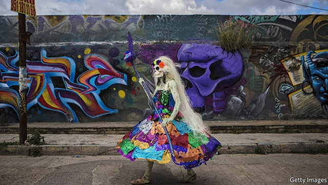
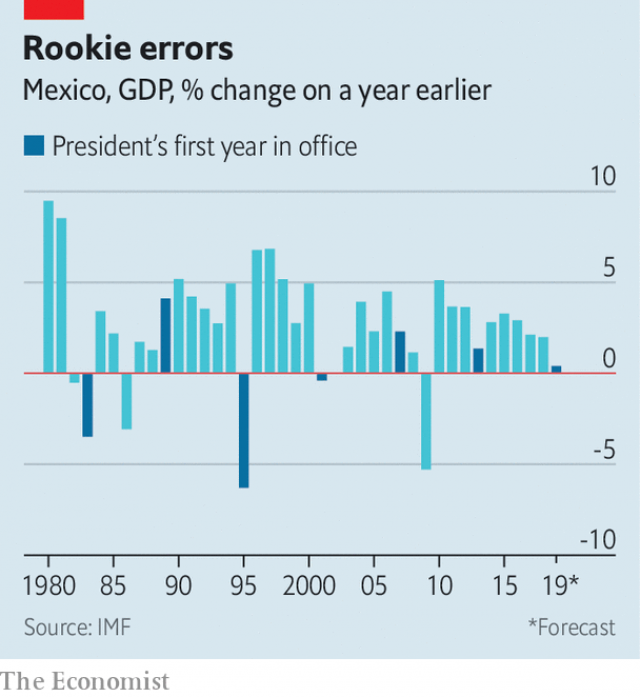

###### Life after neoliberalism

# Mexico’s radical president serves up economic mediocrity 

 

> print-edition iconPrint edition | Finance and economics | Nov 9th 2019 

MEXICAN PRESIDENTS tend not to get the economy off to a flying start when they first take office. The past six leaders saw the economy shrink by an average of 0.4% during their first year, but went on to enjoy growth of 3.5% in their sixth and final one (see chart). So likely are governments to enrich their allies at the expense of everyone else that each transfer of power causes investors to hang back until they know where they stand. So it may not be a shock that Mexico will barely grow in 2019, the first year of Andrés Manuel López Obrador’s presidency. But economists worry that the malaise might linger this time. 

Mr López Obrador rode to power on the back of popular outrage against the status quo. The left-leaning populist wants to centralise power, boost the scope of the state and balance the books—all while hitting annual GDP growth of 4%, “double the growth achieved in the neoliberal period”. 

The list of headaches is long. Consumer confidence, which rocketed after Mr López Obrador’s inauguration, has slumped. Manufacturers are struggling: in the past year capital-goods imports are down by 16% in dollar terms, the biggest drop since the global financial crisis. The pace of formal job creation has decelerated over the past year. Economists have repeatedly slashed growth forecasts. 

 

Not all the gloom is homemade. Exports, once a bright spot, are growing more slowly, hit by sluggish demand in America. Threats from President Donald Trump, first to tear up the North American Free Trade Agreement and then to impose tariffs on Mexico to deter Central American migration, have added to the uncertainty. 

But businesses also complain of mixed messages from Mexico’s president. He bashes the private sector while his advisers hint that pro-business policies are just around the corner. He scrapped a $13bn airport that was already under construction because he deemed it too pricey; he ordered the renegotiation of a gas-pipeline contract that he thought too generous. In July Carlos Urzúa, the technocratic finance secretary, resigned, accusing the government of indulging in extremism over evidence when making decisions. 

The government’s fiscal commitments have trapped it in a negative feedback loop, says Gabriel Lozano of JPMorgan Chase, a bank. A budget-surplus target of 1% for 2019 was supported by slashing the pay of public-sector workers, starting with the president. But spending cuts have slowed the economy. Tax revenues have undershot expectations, partly because the budget’s forecast of GDP growth of 2% was rosy, and also owing to an exodus of seasoned bureaucrats from the tax-collection agency. 

The government has raided half of the 300bn pesos ($15bn) in its fiscal-stabilisation fund to make up the shortfall. Next year’s budget is also more optimistic on economic growth than most economists. The government’s commitment to budgetary prudence might also waver ahead of mid-term elections in 2021. Another year of fiscal disappointment seems likely, and could clean out the government’s rainy-day fund entirely. 

For his part, Mr López Obrador wants to splurge on pet projects, including an oil refinery in his home state of Tabasco and a “Maya train” through the Mexican jungle. With the economy ground to a halt, those plans are not sustainable. Nor, loyalists concede, is his sky-high approval rating. Already he has had to dial back on more generous old-age pensions. 

External forces may offer a way out of the mess. America’s trade war with China means that Mexico ought to be luring investors looking to hedge against China risk, says Luis de la Calle, an economist. The gap between the Bank of Mexico’s interest rates and those of America’s Federal Reserve is 6.25 percentage points, bigger than in other countries with an investment-grade credit rating. The government wants to privately finance up to 1,600 infrastructure projects, which the president hopes will “reactivate” the economy. 

A near-term economic boost should also come from a big rise in oil production next year, when private firms start pumping oil under contracts signed as part of the previous government’s energy reforms. (Mr López Obrador has not allowed further bidding rounds, though his advisers hint at an opening next year.) 

Pessimists fret that there is no opportunity that this government cannot waste. When taking office it could have tackled a fundamental problem: an economic system that enables crony capitalists and prevents small firms expanding. It could have dealt with worsening violence, or raised poor levels of education. Overcoming all this might have been worth a temporary hit to GDP. The risk is that even if this government gets through its first-year dip unscathed, no payoff awaits.■ 

