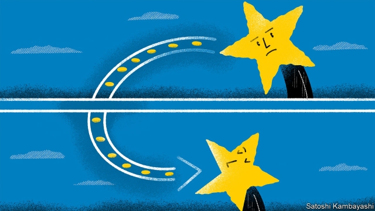
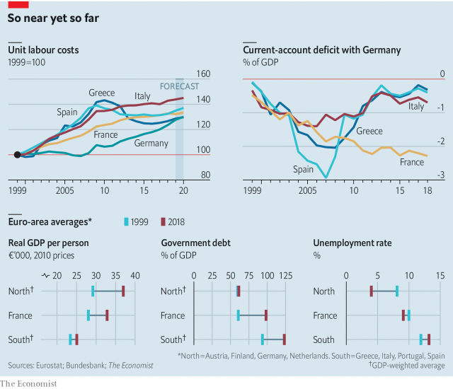

###### State of the union

# Revisiting the euro’s north-south rift 

 

> print-edition iconPrint edition | Finance and economics | Nov 9th 2019 

SINCE THE euro zone was first engulfed by a sovereign-debt crisis a decade ago, northern member states have dished out plenty of strictures. “Greece, but also Spain and Portugal, have to understand that hard work...comes before the siesta,” advised Bild, a German tabloid, in 2015. Two years later, even as the crisis receded, Jeroen Dijsselbloem, then the Dutch finance minister, told southerners: “You cannot spend all the money on drinks and women and then ask for help.” 

Northerners’ constant fear of underwriting southern irresponsibility has led politicians from Amsterdam to Helsinki to put the brake on banking reforms and fiscal integration across the zone. It has caused numerous fights over monetary policy, the latest of which is in full swing. On November 1st the European Central Bank (ECB) resumed quantitative easing (QE), the purchase of bonds using newly created money. The decision to do so, made in September, was roundly attacked by newspapers—and even former and current central bankers—in northern countries including Germany and the Netherlands. The complaints reflect savers’ dread of negative interest rates and a suspicion that easing lets indebted southern countries off the hook. Together this can make monetary policy seem like a source of transfers. 

In reality, the matter of whether north subsidises south is complicated. Gaps in living standards remain wide, but cross-border flows have become more balanced. And the north is partly responsible for the monetary policy about which it complains. 

When the euro first came into being it shackled together a disparate set of countries. GDP per person in Greece, Portugal and Spain was 30-40% lower than in Germany. But Germany, still feeling the aftereffects of reunification, was battling sluggish growth and high unemployment. It was rich, but others were richer. In Austria average income per head was a tenth, and in the Netherlands a fifth, higher than that in Germany. 

In the first decade of the currency union cross-border bank loans fuelled public and private overspending in the south, which pumped up wages and eroded competitiveness. Current-account deficits widened, to 12% of GDP in Portugal and 15% in Greece. When crisis hit, private financial flows dried up. In Greece, Ireland, Portugal and Spain they were replaced by bail-out funds. TARGET2, a payments system used to settle accounts between national central banks and the ECB, also acted as a buffer, enabling central banks in the crisis countries in effect to borrow from others. 

If you divide eight of the countries that joined the euro before 2001 (ie, excluding the mostly eastern late-joiners) into north and south, it is clear that economic dispersion has widened (see chart). The north—Austria, Finland, Germany and the Netherlands—has raced ahead, with Germany aided by labour-market reforms. The south—Greece, Italy, Portugal and Spain—has fallen behind. France sits between the two. In 1999 its income per head was nearly level with Germany’s. It ran a current-account surplus. Today, with still-high unemployment, debt and a current-account deficit, it seems more southern. 

 

However, southerners rely less on financial flows from the north. In many places balance has replaced imbalance (though stocks of debt are still large). Consider, for instance, the flow of funds between Germany and Spain. Spain’s current-account deficit with Germany has nearly closed. Mirroring that, net capital flows have shrunk. In 2006 German investors ploughed a net €50bn ($63bn) into Spain. Last year that fell to €3bn. The reversals partly reflect relative improvements in the south’s competitiveness. Between 2015 and 2018 German labour costs grew more than twice as fast as those in the south. 

Labour flows from south to north. Federico Fubini, an Italian journalist, computes that Germany received 2.7m migrants from other EU countries in 2008-17, up to a third of whom hail from the south. Countries such as Greece and Portugal have lost young and relatively highly educated workers. That means a large transfer of skills and investment in education. 

Northerners have other grievances. TARGET2 balances, for instance, are frequently deemed newsworthy in Germany. In 2018, as its credits in the system approached €1trn (30% of GDP), some economists claimed these represented “stealth bail-outs” of countries such as Italy and Spain, which had large debits. Central bankers responded that much of the increase reflected arcane accounting made necessary by QE. If a southern central bank buys a bond from an investor based outside the euro area, but with correspondent-banking links to Frankfurt, it adds to Germany’s TARGET2 credits. Daniel Gros of the Centre for European Policy Studies, a think-tank in Brussels, points out that these would need to be settled only if the currency union were to disband wholly. But the resumption of asset purchases means that Germany’s credits will probably rise further, causing more complaints. 

An abiding grumble concerns the effects of monetary stimulus. Spanish and Italian banks are by far the biggest users of the ECB’s cheap funding scheme for banks. QE depresses bond yields, meaning lower interest bills for more indebted governments. But monetary policy is not a zero-sum game between north and south, says Marcel Fratzscher of the German Institute for Economic Research. The German government also benefits from lower interest costs. Northern countries, which are more export-oriented, have gained the most from a weak euro. And less stimulus would have been needed in the first place had Germany and the Netherlands spent more at home, pushing up euro-zone demand and inflation, rather than building up huge current-account surpluses. 

All these divisions make reforming the currency union a tortuous process at best. On November 5th Olaf Scholz, Germany’s finance minister, said that he would back a common deposit-insurance scheme for the euro zone. But the catch—and a very big one—is that banks in the south would need to back their large holdings of national sovereign debt with more reserves. Northerners’ fears of transfers to the south are not going away. ■ 

