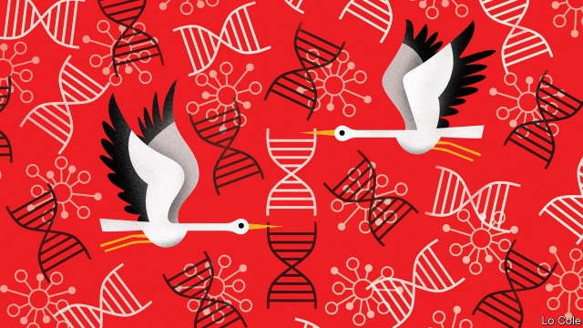

###### Designer babies by the back door

# A new type of genetic profiling promises cleverer, better-looking children. 

 

> print-edition iconPrint edition | Leaders | Nov 9th 2019 

DEBATE ABOUT using science to create “bespoke” human beings of one sort or another usually revolves around the ideas of genetic engineering and cloning. People worry about these for two reasons. One is practical. The tinkering involved could end up harming the resulting individual. The other is a more visceral dislike of interfering with the process of reproduction, perhaps best encapsulated in the phrase “playing God”. 

There is, however, a third way that the genetic dice which are thrown at the beginning of human life might be loaded—and it does not involve any risky tinkering. It is a twist on the well-established procedure of in vitro fertilisation (IVF). The twist would be to decide, on the basis of their DNA, which of a group of available embryos should be implanted and brought to term. 

The result would be a child optimised with the best-available genetic profile for a long and healthy life. And this is not science fiction. Two American firms have been working on the idea for some time, and one of them is now implementing it (see article). 

Single-nucleotide polymorphism (SNP, or “snip”) profiling, as the technique is called, promises healthier offspring—a clear good. It may also provide a way to upgrade things only tangentially associated with health, such as height and, more controversially, intelligence. Moreover, it is a technique that could be applied generation on generation, to improve grandchildren and great-grandchildren still further. 

SNPs are the smallest possible differences between individuals’ DNA—single genetic letters. Individually, most have little consequence. But there are millions of them in every human genome and their combined effects can be big. SNP profiling looks for particular combinations of SNPs that research has shown are associated with the risks of developing illnesses such as cancer, diabetes and heart disease. This is important medical information for people now alive, and can be used to recommend screening programmes, changes of behaviour and prophylactic drugs. 

For those willing to undergo IVF, and with the money to pay for it, it may also be possible to SNP-profile an embryo and thus foretell its future. As well as disease risk, height and intelligence, SNP-profiling might eventually be capable of predicting (albeit imperfectly, for environment also plays a role) things as diverse as television-viewing habits, likelihood of being bullied at school and probability of getting divorced. 

At the moment, non-medical attributes are not on the menu offered by would-be embryo SNP-profilers. But if the technique works it is hard to believe that they will not be on someone’s menu in the future. And that does raise questions. 

What all this amounts to is, in essence, a supercharged version of an existing process known as assortative mating. It is already true that intelligent, successful (and therefore probably rich) people seek each other out as partners. In doing so, they bring to the table whatever genetic variations helped make them intelligent, successful and rich, which they then pass on to their children. SNP profiling—available, at least to start with, only to those who can afford it—will enhance that by letting parents pick tall, good-looking and above all clever offspring. 

For a single generation, that may not matter too much to the rest of society. It would be but one extra privilege that the rich enjoy. Piled generation on generation, however, it really might create a genetic elite. SNP-profiling is already used to enhance desired attributes in livestock, so it seems reasonable to assume it will work on people. 

Perhaps that is tomorrow’s problem. For the moment there seems no reason beyond envy to oppose embryo SNP-profiling. But, from H.G. Wells’s Eloi in “The Time Machine” to Aldous Huxley’s Alphas in “Brave New World”, science fiction is full of breeding programmes for elite humans that have gone wrong. Sci-fi always enjoys portraying dystopias, and mostly they do not come true. But it might be wise to debate the matter now, just in case this time people really are unknowingly playing God.■ 

