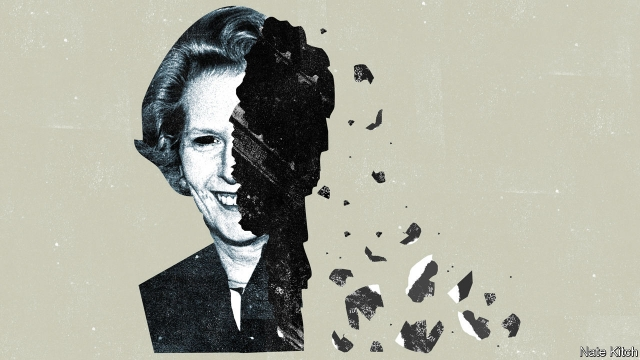

###### On the Bible, Greece, Congress, Chile, Syria, Canada, wind energy, Atlantic City, Thatcher

# Letters to the editor 

> Nov 9th 2019 

Your obituary for Harold Bloom noted that his list of great writers in “The Western Canon” was “almost all male” (October 26th). In that same book, Bloom also credited the earliest source of the Bible to a woman. “The Book of J”, which Bloom wrote before “The Western Canon”, embraced the documentary hypothesis, which holds that the Torah, the first five books of the Bible, were written primarily by four authors, conventionally referred to as J, E, P and D. Those works were later edited, probably by Ezra the Scribe around 444BC, into the single narrative we have today. 

Bloom had argued that J, the earliest of the four authors, was a woman, possibly a daughter or granddaughter of King David in the Jerusalem courts of David’s successors, Solomon and Rehoboam. But in “The Western Canon”, he endorsed a suggestion from a “shrewd reviewer” of his earlier work identifying J as Bathsheba, who was David’s wife and Solomon’s mother. 

STEPHEN SILVERSan Francisco 

 

It is true that tax amnesties on underreported income were once a regular feature of Greek tax administration (“To hell and back”, October 5th). However, in order to strengthen the tax-compliance culture, no tax amnesty has been put in effect for the financial years after 2009. The current scheme concerns only payments of already assessed tax obligations that are in arrears, which amount to a whopping €104bn ($116bn). Most of this is owed by bankrupt businesses. 

Greece’s tax administration improved by leaps and bounds during the country’s financial crisis. Most filing moved from paper forms to online systems. The establishment of the Independent Authority for Public Revenue modernised management and demonstrably reduced political interference in tax collection. This was apparent during the 2019 electoral cycle, which was not accompanied by a drop in tax revenue, thus breaking another regular pattern of the past. 

PROF. DIOMIDIS SPINELLISAthens University of Economics and Business 

 

“Wall of silence” (October 12th) discussed the options for Congress when dealing with those who won’t co-operate with the inquiry into impeaching Donald Trump. You raised the possibility of fining witnesses who are held in contempt as one solution. 

One concern about letting Congress fine individuals is the separation of powers and the assigned roles of the branches of government. The Supreme Court has never expressly endorsed the practice. Putting aside the thorny constitutional question, there are also practical problems. Assume that the contemnor is fined $25,000 for each day he doesn’t co-operate. What if he refuses to pay? Congress has no obvious mechanism to force the payment. Even if Congress were found to have the constitutional authority to impose a fine, it is not clear how Congress would collect the money. 

JOHN MINANProfessor of law emeritusUniversity of San Diego 

 

The Chilean economy, praised time and again by The Economist, should “not need reinvention”, says Bello (October 26th). That is an all too predictable conclusion from someone who once attended a cocktail party in Santiago with 60 other people representing “half of Chile’s GDP”. The adage that seven families have a stranglehold on the country is no joke. The middle classes are indebted up to their ears to almost anybody: their bank, supermarket, pharmacy, dentist, educational institutions and health-care providers. They also pay European-level prices, and sometimes more, for every imaginable basic commodity and service. A corrupt and kleptocratic political class colludes with multinational predators to privatise almost everything, and ruthlessly sack Chile’s natural bounties. 

The neoliberal model indeed works phenomenally well for Chile’s self-serving elitist few. But it is absolutely dysfunctional for the rest of the population and is in dire need of a general rethink. 

CARL HAASCopenhagen 

 

I agreed with your critical assessment of Donald Trump’s decision to withdraw from Syria (“No way to say goodbye”, October 19th). It is worth adding that this is only the latest example of the absence of any clear Western strategy in the Middle East and wider region after the attacks of September 11th 2001. Except for a brief period in Iraq between 2007 and 2010, the American-led Western alliance has never had a coherent idea of what political order it is attempting to create in Afghanistan, Iraq, Libya and Syria. 

I am no fan of his work but Sun Tzu’s aphorism that “tactics without strategy is the noise before defeat” seems apt. 

ANTHONY KINGChair of war studiesUniversity of WarwickCoventry 

 

Justin Trudeau’s new minority Liberal government in Canada will have to forge alliances with the New Democrats and Greens, parties that are hostile to the oil and gas industry (“The chastening of Justin Trudeau”, October 26th). A coalition under a left-wing tent will further exacerbate tensions with western Canada’s oil-producing provinces, which are big contributors to Canadian prosperity. 

I am a Canadian engineer and worked in an oil-sand mine for four years. Western Canadians will not surrender quietly. It is naive to think that populism cannot happen in Canada. If this new government does not reach out and give alienated workers a voice they will unite against what they perceive as elitist, detached and nepotistic politicians and will eventually find a leader they can rally around. 

CHRISTOPHER KISSELHouston 

 

As you said, Britain’s “offshore” carbon footprint is high (“Omissions”, October 19th). This is particularly so in respect of Britain’s enthusiastic development of offshore wind energy, which requires the development of a huge sub-sea infrastructure to support it. In use, wind energy has a small carbon footprint. However, the cradle-to-grave carbon footprint of a whole offshore wind farm is high and it is all “spent” before any of the “clean” electricity is generated. And at the end of its design life of 25 years (well before 2050) it is all derelict. Sustainable? Show me the numbers. 

JIM PLATTSCambridge, Cambridgeshire 

 

Your article on the “organic” nature of corruption and fraud in Atlantic City (“Fix your hair up pretty”, October 12th) passed by the fact that America’s president was once the largest casino operator and employer in the city. When he opened his Taj Mahal casino and hotel in 1990, financed in part by $675m in junk bonds, Donald Trump called it “the eighth wonder of the world” and boasted that it would make Atlantic City great again. 

The Taj Mahal filed for bankruptcy protection the next year and sold for four cents on the dollar in 2017. 

JAMES LILLIEFORSNaples, Florida 

 

Thatcher undecomposed* Bagehot argues (October 12th) that Margaret Thatcher’s legacy has “decomposed”. But he then writes that the use of market mechanisms in the state “has been adopted by so many different countries and parties that people forget its origins”. 

That is hardly “decomposition”, and we wonder whether Bagehot’s whole thesis relies on his simply not mentioning some big main lines of enduring change which Thatcher brought about. 

Bagehot ignores a significant list of such Thatcher changes because they have “become so mainstream [as to be] no longer distinctive”. Only by excluding some of these pretty large legacies, can Bagehot question whether the Thatcher “faithsurvives as anything more than empty incantations”. 

No mention, for instance, of the cathartic change in trade-union legislation which, after several years of traumatic street battles, brought about an explosion in job creation plus drastically reduced rates of strikes and shop floor discontent: a revolution, many businesses would say, in how uk business is practised to this day. In 1979, when Thatcher arrived in office, 29.5m working days were lost to strikes. In 1990, when she left office, 1.9m. 

No mention of the fiscal transformation of the government’s accounts from national debt to surplus—admittedly much frayed in the years since Thatcher’s time when debt has been multiplied anew. 

No mention of her so-called (at the time decried) “monetarist” switch to what has become today the conventional wisdom of controlling inflation through money supply and interest rates rather than fiscal policy. Nor of the ending of exchange controls in October 1979, an action which she would never have agreed to if, as Bagehot claims, she was a “nationalist”. 

Bagehot rightly brings up the falling rate of home ownership among the young. But not the post-Thatcher causes of it, notably the muddying by later governments of her clear-water Right to Buy policies; and the Blair era and beyond of soaring house prices inflicted by shortage of supply, quantitative easing supercharging of all asset prices, and the unmoderated lure of Britain’s south-east. Even today, when overall home ownership has indeed fallen from its peaks for those same reasons, it is still comfortably higher than when she came into Downing Street. 

Bagehot says that financial deregulation cannot be the answer to everything. Thatcher did not think it should be. As The Economist noted at the time, the prime cause of the 2008 meltdown (which Bagehot seems to imply was somehow her doing, 18 years after she left office), lay in deregulated lending in the United States that had been collateralised out of sight, rather than in the deregulated capital markets in London: these—more than the bank or mortgage lending which ultimately lit the fuse—were the prime focus of Thatcher’s Big Bang. 

Meanwhile Thatcher’s property-owning society thrives morphed, yes, but very much undecomposed. “The proportion of people who own individual shares has halved since the early 1980s”, says Bagehot. That’s true, but for a very healthy property-owning reason: it is a measure of how sophistication has grown among private individuals since Thatcher introduced them to the notion of stock ownership. They have, very sensibly, learnt to spread their risk: switching from individual shares into pension funds, open-ended investment companies, investor funds of every stripe good and bad, insurance companies and other financial institutions—not to mention, at the higher end, nominee accounts. The numbers for each of these have rocketed.Next, says Bagehot, Thatcher “poisoned the well of privatisation by selling off nationalised monopolies in ways that favour investors over customers”. Those of us old enough to remember regular hosepipe bans over many summers, expensive landline telephone calls, monopoly bus services, an at times shaming government-owned national airline, and no competitive downward pressure on household electricity and gas prices, will find that sweeping, unanalysed, opinion strange. 

What one looks for in Bagehot’s newspaper is analysis, rather than generalising replete with attitude. Leaving aside his protracted expression of dismay over Brexit and Euroscepticism (the “flames” of which Thatcher wickedly “fanned” with her Bruges speech), Bagehot’s overall conclusion is an odd (in your pages) mercantilist sally. His Little-Britain lunge is that Thatcher’s free-marketry has left Britain “the Wimbledon of global capitalism, more successful at hosting world-class players than producing them”. Thatcherites should celebrate that metaphor. Wimbledon: a great global tournament in the heart of British suburbia creating lots of jobs; lots of national prestige; lots of exciting visitors to the grass courts; lots of competition. Lots, in short, of the levelling out, the subsidy-less prosperity, the excitement, enjoyment and fun of the very sort she (and the original Walter Bagehot) would have relished. 

ANDREW KNIGHTA former editor-in-chief of The Economist 

CHARLES MOOREAuthor of the authorised biography of Margaret Thatcher London 

* Letters appear online only 

