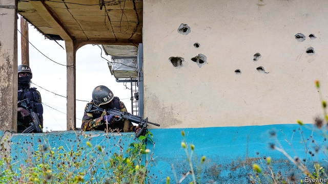
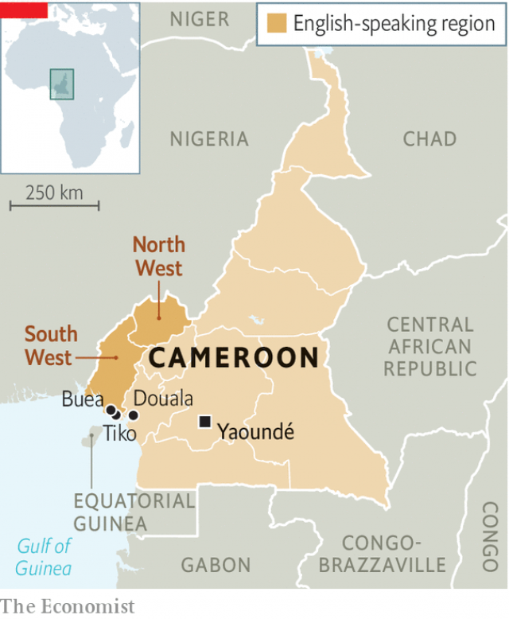

###### A war of words

# English-speaking villages are burning in Cameroon 

 

> print-edition iconPrint edition | Middle East and Africa | Nov 9th 2019 

ON A PLANTATION in Tiko, in south-west Cameroon, Adeline rubs the gap in her right hand where her index finger used to be. She arrived in the town in July 2018, having fled Ekona, 15 miles away. In that village soldiers terrified civilians by burning houses and shooting indiscriminately as part of a crackdown on militias that want the primarily English-speaking areas of Cameroon to secede from the predominantly Francophone country. Adeline hoped Tiko would prove a sanctuary. 

It was anything but. A year ago Adeline was tending to an oil palm in the plantation when about 20 members of a separatist militia grabbed her, stuffed leaves in her mouth and tied her to the tree. They whipped her and cut off her finger. Her apparent crime: working for the Cameroon Development Corporation (CDC), a state-run company. “As I close my eyes I see the boys coming to get me,” says Adeline. “The trauma is still there.” 

Cameroon was until recently a stable country in a fragile region. Today it is battling the jihadists of Boko Haram in the north, dealing with an influx of refugees from the Central African Republic in the east—and, most devastatingly, the “Anglophone crisis” in the west. Adeline’s is one of hundreds of thousands of lives ravaged by this conflict over the past three years. Paul Biya, the authoritarian who has ruled Cameroon for 37 years, had hoped that the crisis would prove short-lived. So did foreign powers, which have been largely quiet. Yet the conflict shows no sign of ending. 

The origins of the turmoil began a century ago. After the first world war Britain and France took over different parts of the German colony of Cameroon. Upon independence in 1960 and 1961 the larger French territory joined the southern part of the British one to make modern Cameroon. 

It quickly became one of the most centralised countries in Africa. Today just 1% of public spending is devolved to local governments, versus more than 50% in Nigeria. The country is officially bilingual, but the roughly 20% of people (4-5m in a country of 24m) who mainly speak English claim decades of marginalisation. Promises of devolution have been broken. 

In late 2016 frustrations boiled over. First lawyers went on strike against the erosion of the English-style common-law system. Teachers soon joined the protests, citing, among other things, the appointment of French-only speakers in classrooms. Protest groups organised “ghost towns”: weekly shutdowns of towns such as Buea, the capital of the south-west region, that continue to this day. 

 

The government hit back hard. The internet was shut off for four months. Groups organising the protests were banned and their leaders arrested. In October 2017 separatists responded by proclaiming the independent state of “Ambazonia”, named after Ambas bay in the south-west. 

This led to a massive, violent escalation. International NGOs estimate that 3,000 people have been killed during the crisis. But aid workers think the true figure is several times higher. Both separatist militias and security forces have committed atrocities, but the Cameroonian army is believed to be behind most of the bloodshed. 

Security forces have burned more than 220 villages in the Anglophone region, according to the Centre for Human Rights and Democracy in Africa (CHRDA) in Buea. One was Ekona. Formerly the site of a bustling market, today it is an eerie place, where the walls of charred houses are pockmarked with bullets. 

“It’s like ‘Full Metal Jacket’,” says one aid worker, in reference to trigger-happy soldiers in a film about the Vietnam war. Ayuk, who lived in Ekona for four years before fleeing in April, says he can recall hundreds of incidents where soldiers fired at villagers. In one case his neighbour and two others were shot in their car on their way back from sowing plantain. “We had to bury him quickly,” Ayuk recalls, in case the army shot them as well. 

Tah Mai, a journalist, lost two brothers in separate incidents involving the army. In November last year his brother and his wife were shot outside their house in Buea. A few months later his other brother was shot in the back in his home village in the north-west. “Mine is just like the many stories that you haven’t heard,” says Mr Tah. 

At least 500,000 people have been forced to leave their homes. Tens of thousands have fled to Nigeria, but most are in the bush, making it hard to count them. Even in the forests displaced people can be found by the army. Frida, who was also forced to flee Ekona, describes how she watched soldiers enter her bush camp. They shot two women accused of cooking for separatist fighters. Then they killed the informer who brought them. 

Mass displacement is having grave effects on public health. There are outbreaks of monkey pox and measles, partly because of plummeting vaccination rates. Before the crisis about 70% of women gave birth with medical help in the north-west region. Today 3% do so. The result is more women and babies dying in the course of childbirth. Cecilia Mah, the matron at Mount Mary Hospital in Buea, says that it is hard to run a hospital when soldiers threaten ambulance drivers and seize suspected separatists convalescing in the wards. 

The state is, however, not solely responsible for the chaos; separatists share some of the blame. Most of the separatist political groups, such as the Interim Government of the Federal Republic of Ambazonia, and the Ambazonia Governing Council, are based abroad. Their leaders and donors are in America, Germany, Norway and other rich countries. In Cameroon their armed wings control swathes of rural territory. This can lead to surreal moments for aid workers. They may, for example, have to negotiate access to villages not with commanders on the ground but with middle-aged men sitting in living rooms in Washington, Oslo or Dortmund. 

Many separatist attacks are aimed at the security forces. But some target Anglophone civilians. “If you disagree with them, they kill you,” says Cardinal Christian Tumi, the archbishop of Douala, Cameroon’s commercial capital. He says that a traditional chief from his home village was “slaughtered like a goat” for allegedly collaborating with the authorities. Like Adeline, many people employed by CDC have been maimed. 

Brutality by separatists is likely to increase as armed groups in the country seek their own sources of funding to break away from the patronage of leaders in the diaspora. So-called Amba boys are turning to kidnapping and extortion for funds; other groups are increasingly criminal entities, not political ones. In March the football team of the University of Buea was taken hostage; many parents paid ransoms. Most of the aid groups working on the ground have had workers kidnapped. “I fear we are creating a generation of warlords,” says Felix Agbor Balla, the president of CHRDA. 

While bandits raise cash by extorting, the economy is collapsing. The Anglophone regions contribute about 20% of the country’s GDP. CDC was the second-largest employer in Cameroon, after the state. But most of its rubber and palm-oil plantations, and all of its banana ones, have shut because of attacks. Most workers have lost their jobs. Revenue is 90% lower than before the crisis; CDC has not sold a banana since August 2018. Its leaders get death threats from separatists. Asked how he copes, Franklin Ngoni Njie, CDC’s general manager, says he follows a simple rule: “I pray more. I go out less.” 

And yet an even bigger social and economic crisis is looming. Almost 90% of children in the Anglophone regions have not gone to school for three years, a result of forced displacements and the enforcement of a boycott called by separatists who see schools as arms of the state. (According to this twisted logic a six-year-old keen to learn subtraction is a collaborator.) At home-schools set up by brave educators children arrive with homework hidden in their trouser legs, in case they are spotted by Amba boys. 

The sabotage of education is one reason why many Anglophones are growing angry at the separatists. Ernest Molua notes that people used to refer to them as “our boys”; now they say “those boys”. The professor at the University of Buea believes that most Anglophones want more autonomy, ideally within a federal Cameroon, not independence. “There remains a strong sense of ‘Cameroonianess’,” he says, emphasising that Anglophones’ grievances are with the government, not their French-speaking compatriots. But Mr Molua worries that “the space for moderates is shrinking”. 

Signs of compromise are scant. Separatist groups do not even have a common position among themselves, despite efforts by the Centre for Humanitarian Dialogue, a Swiss NGO, to help them find one. For his part, President Biya in September raised hopes by announcing a “National Dialogue”. Yet it was a sham. The meeting was not just about the crisis; it gave Cameroonian leaders from all regions a chance to air complaints (and collect per-diems). Many important Anglophones were either not invited or left in prison. “It was not a sincere effort,” says Alice Nkom, a lawyer. 

Mr Biya has been aided by a muted international response. Donors have provided just 18% of the funding requested by the UN for humanitarian operations in Cameroon’s Anglophone regions for 2019. (The only countries for which the UN receives lower shares of support are Venezuela and North Korea.) Diplomatic pressure has been meagre, too. Nigeria wants Mr Biya’s help with Boko Haram and does not want to encourage the hopes of Biafran separatists in its own south-east. China is focused on its economic interests. British diplomats have offered gentle criticism in private but do not want to slam Mr Biya in public. Most importantly of all, France has done little but urge cosmetic concessions. 

The only influential country willing to speak out is America. On October 31st it removed Cameroon from a list of African countries that get preferential trade terms, citing “gross violations” of human rights by the government. American diplomats hope the move will send a signal to Mr Biya that he needs to find a political solution. 

For now there is only a bloody equilibrium. Separatist militias cannot take the towns; the army cannot take the bush. In the middle are people like Adeline. She says that she feels trapped between the two warring parties. And without a job any more she has no means to escape. So she waits, too weary to talk much about politics. “I just need my peace,” she says. ■ 

