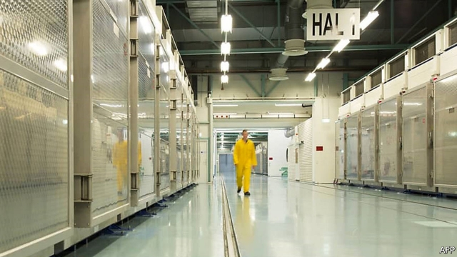

###### Undone deal

# Iran’s nuclear programme takes a dangerous step 

 

> print-edition iconPrint edition | Middle East and Africa | Nov 9th 2019 

THE FORDOW nuclear plant in northern Iran would make an ideal lair for a Bond villain. Russian-made surface-to-air missiles guard the skies around it. The facility itself is buried under a mountain. Several hundred feet down, in two cavernous halls, neat rows of centrifuges spin uranium gas to produce fissile isotopes, which could be used for nuclear energy—or, if concentrated enough, a nuclear bomb. 

Such activity is prohibited under the deal that Iran signed with six world powers in 2015. Iran agreed to cease enrichment at Fordow for 15 years, keeping only 1,044 centrifuges spinning for scientific purposes. But on November 6th it began injecting uranium gas into those centrifuges for the first time in four years. The move heralds a new, more dangerous phase in the crisis over Iran’s nuclear programme. 

The trouble started last year, when President Donald Trump removed America from the nuclear deal and reimposed sanctions on Iran. For a year Iran continued to abide by the agreement, hoping the other signatories—Britain, China, France, Germany and Russia—would provide economic relief. But it lost patience in April, when America ended waivers that allowed some countries to import Iranian oil. 

Since then Iran has been taking steps away from the nuclear deal. In June its stockpile of low-enriched uranium exceeded the limit set under the agreement. In July Iran breached a cap on the purity of that uranium, enriching it to levels slightly closer to weapons-grade. Last month Iran began using quicker-spinning centrifuges. (It has also cancelled the accreditation of an inspector with the International Atomic Energy Agency, which monitors Iranian compliance with the nuclear deal.) The idea is to put pressure on America to end its campaign of “maximum pressure”, which has crippled the Iranian economy. GDP is expected to drop by 9.5% this year. 

Each of Iran’s steps shortens its “breakout time”: how long it would take to produce a bomb’s worth of highly enriched uranium. They also make it increasingly hard to resuscitate the nuclear deal. The decision to restart work at Fordow is Iran’s most defiant gesture yet. “I think that for the first time, Iran has decided in an explicit and blunt manner to leave the [nuclear deal], which marks a profound shift,” said President Emmanuel Macron of France. 

The move is also rich in symbolism. Fordow was built to withstand Israeli and American air strikes. Referring to the deal’s signatories, President Hassan Rouhani of Iran said: “I understand their sensitivities toward Fordow and its centrifuges. But whenever they meet their promises, we will cut back gas injection.” 

Iran is raising hackles elsewhere for other reasons. Massive protests in Iraq and Lebanon have been directed at corrupt politicians and their foreign backers, above all Iran, which sponsors powerful militias in both countries. “Iran out, out!” chant protesters in Baghdad. In the holy city of Karbala they attacked the Iranian consulate. Qassem Soleimani, Iran’s most prominent commander, was dispatched to Baghdad to help quell the unrest. Iranian-backed militias have been accused of killing protesters. 

Iran’s nuclear and regional problems are connected. “Its way of countering the maximum-pressure campaign has been twofold: dial down compliance with the nuclear deal and dial up pressure on the regional front,” says Ariane Tabatabai of the RAND Corporation, a think-tank. She points to recent attacks, allegedly by Iran or its proxies, on commercial shipping, Saudi oil facilities and the area around America’s embassy in Baghdad. Such incidents will seem even more troubling the further Iran moves away from the nuclear deal. ■ 

