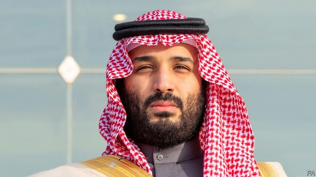

###### Thinking only positive thoughts

# Saudi Arabia should listen to critics of its reform programme 

 

> print-edition iconPrint edition | Middle East and Africa | Nov 9th 2019 

INSIDE AN ORNATE conference hall the boss of a $100bn tech fund spoke to rows of empty chairs. Then he briefly fell asleep. Outside the hall Anthony Scaramucci, the colourful financier who lasted ten days as Donald Trump’s communications director, dispensed questionable political analysis. An American company hawked jetpacks. A robot urged passers-by to tickle her head. “It will make you feel better,” she said. 

This was the third Future Investment Initiative (FII), Saudi Arabia’s flagship business conference. The event, which wrapped up in Riyadh on October 31st, attracted some 6,000 guests. That made Saudi officials feel better. The first FII, in 2017, was a coming-out party for the economic-reform programme of Muhammad bin Salman, the crown prince (pictured). But the second, last year, was overshadowed by the murder of Jamal Khashoggi, a journalist, by Saudi agents. Top executives stayed away. 

They had no qualms about attending this year’s event, where officials pushed a narrative of progress. Many guests argued that the kingdom had learned a lesson from the furore over Khashoggi. It is true that Saudi agents have not dismembered any journalists in the past 12 months. But this reflects conquest, not contrition: critics have been cowed into silence. On November 6th two employees of Twitter were charged in America with using their access to help Saudi Arabia spy on dissidents. Determined to stifle dissent at home and whitewash its image abroad, the kingdom has deprived itself of valuable input on a bold but flawed reform agenda. 

To be sure, there are positive signs. Non-oil growth has ticked up and unemployment down. Officials at the FII were eager to talk about the kingdom’s jump in the World Bank’s Ease of Doing Business Index (it rose 30 places, to 62nd). Riyadh, the dour capital, has loosened up in ways unthinkable five years ago. A cultural festival hosted performances of the “Wizard of Oz”, a remarkable sight in a place that long prosecuted people for “witchcraft”. In September Saudi Arabia began issuing tourist visas to citizens of dozens of countries. 

 

Saudi Arabia signed $20bn of deals at the FII. More than half of that, though, came from a single $11.5bn joint venture to build power plants and other infrastructure in the western city of Jizan. Such projects tend to create few jobs for Saudi nationals. Though inward foreign direct investment (FDI) more than doubled last year, to $3.2bn, it is still far below the levels of a decade ago (see chart). Many of the attendees at the FII were keen not to invest but to win state contracts. 

After a contraction in 2017, the Saudi economy is growing, with non-oil GDP up by 2.9% in the second quarter of this year (though weak oil revenue left overall growth at 0.5%). So the finance ministry says it will stop priming the pump and reduce spending by 3% in 2020. But it is hard to say what is “non-oil” growth in a country where even sectors such as construction rely on oil-funded government spending. 

On the kingdom’s most important priority, creating jobs for citizens, progress is both visible and slow. Young Saudis welcome guests to hotels and brew lattes in cafés, unimaginable sights in most Gulf countries. But unemployment among nationals remains above 12%. Executives grumble about ever-higher fees for employing foreign labour. In September the cabinet waived such fees for five years in the manufacturing sector, which employs 645,000 migrants, 10% of the total foreign workforce. The concession was a sign that many Saudi firms cannot turn a profit with costlier local labour. 

While inward FDI was modest, more than $21bn flowed out of Saudi Arabia last year, much of it through the Public Investment Fund (PIF), a sovereign-wealth vehicle controlled by an ally of Prince Muhammad. The PIF hopes to earn big returns abroad and use them to bankroll diversification at home. But it has made some bad bets, particularly its $45bn investment in SoftBank’s Vision Fund. On November 6th the firm announced an $8.9bn quarterly loss for the fund, much of it due to the troubles of WeWork, an office-rental startup. 

The PIF may soon receive a fresh infusion of capital from the initial public offering (IPO) of Aramco, the state oil giant. On November 3rd the Saudi market regulator approved the offering. Saudi Arabia is keen for local investors to buy a piece. It has encouraged banks to finance such purchases, despite concerns this will tie up liquidity and deter other lending. 

Many Saudis are eager to buy shares, seeing it as both a lucrative opportunity and a patriotic duty. Yet this could turn Aramco into a political problem for Prince Muhammad. He believes it should be valued at $2trn. Banks working on the IPO think it is worth much less. There could be a backlash if locals pile into an overpriced offering and get burned. But few Saudis dare raise such concerns in public. An economist who questioned the IPO was jailed last year. “You can’t do business here if you’re not seen as loyal,” says a businessman. “You can’t question the narrative.” ■ 

