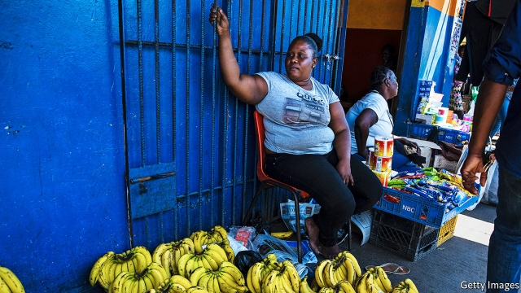
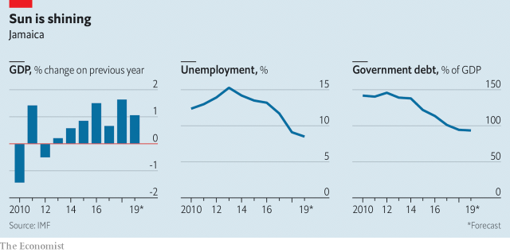

###### Redemption song

# Jamaica’s tumultuous relationship with the IMF has a happy ending 

 

> print-edition iconPrint edition | The Americas | Nov 9th 2019 

SOME 70 PEOPLE gathered under a tent on a balmy Monday evening recently in Trench Town, a stone’s throw from the housing project where Bob Marley grew up. Outside, three policemen armed with rifles patrolled in a four-wheel-drive vehicle. Trench Town is one of the roughest neighbourhoods of Kingston, Jamaica’s capital. But the mood in the tent is mellow. The air smells faintly of ganja. The Trench Townspeople have gathered not to talk about violence but about economic policy. 

One participant, Sarah, asks Mark Golding, an opposition MP sitting atop a bar stool, how “the man selling bag juice on the road” is benefiting from reforms mandated by the IMF. Barrington, another local, wants to know about the effects of raising sales tax. “When we go buy a pound of flour we pay tax,” he notes, “but where do our taxes go?” 

The Economic Programme Oversight Committee (EPOC), a motley group of officials, businessmen and civil-society representatives, has held such meetings across the island during the six years of Jamaica’s latest IMF programmes. The fund demanded tough austerity measures: a primary surplus (ie, before interest payments) of 7.5% of GDP, the highest ever required under an IMF programme; a three-year wage freeze for public-sector workers; and new taxes. On November 10th Jamaica is due to graduate from its current programme, having met its targets. This milestone does not mean that the country of 3m people, who have an average income of just $5,000, has solved its economic problems. Growth remains disappointing, in part because of the fiscal rigour Jamaica accepted as part of the IMF deal. But for the first time in decades its finances are stable enough that it can move beyond crisis management. 

Ordinary Jamaicans largely accepted the sacrifices they had to make to adhere to the IMF agreement. That makes Jamaica different from other countries in the Americas such as Ecuador, where riots in October forced the government to restore subsidies to fuel prices. In 2016 the opposition Jamaica Labour Party narrowly won an election by accusing the ruling People’s National Party of “passing the IMF’s tests, not the people’s test”. Once in power Labour realised the IMF’s tests were the people’s test. Uma Ramakrishnan, who led the IMF’s missions to Jamaica, says citizens’ interest in and understanding of the programme “has been a source of amazement for us”. 

The IMF is almost as familiar to Jamaicans as Marley or Usain Bolt. The country has spent 34 of the past 57 years under its tutelage. In 1980, after protests against an IMF agreement that mandated wage freezes and cuts to welfare, the then-prime minister, Michael Manley, broke it off. 

When Jamaica signed on to a new agreement in 2013 its economic reputation was in tatters. It had defaulted on its bonds four times and restructured foreign loans eight times since 1981. Public debt at the start of the programme was 147% of GDP, making it one of the most indebted countries in the world (see chart). Income from tourism and bauxite, the main earners of foreign exchange, had plunged in the aftermath of the global financial crisis. The unemployment rate was soaring. 

 

The IMF had ended Jamaica’s previous 27-month agreement, signed in 2010, because the government failed to meet its targets. In 2013 Jamaica was in desperate need of another. Capital was fleeing the country. In March the country’s foreign-exchange reserves were not sufficient to pay for two months’ worth of imports. The People’s National Party government, then recently elected, sent the finance minister, Peter Phillips, to Washington to plead with the IMF for one last chance. It agreed to lend Jamaica $958m over four years, perhaps only to avoid being accused of applying double standards. It had just extended a lifeline to similarly troubled Greece. 

In addition to the ambitious primary-surplus target and the wage freeze, Jamaica was obliged to seek relief from private-sector creditors in the form of longer maturities and a lower interest rate. This hurt Jamaican banks and businesses, which had replaced foreigners as the biggest lenders. Rather than resist, they and public-sector trade unions decided to make sure that the government would keep its promises to the IMF, in the hope that this would finally end recurring economic crises. 

That was the origin of EPOC, which acts as connective tissue between the government and citizens. The 11-member group has monthly meetings with top officials from the central bank and the finance ministry. It holds gatherings like the one in Trench Town, which give citizens an outlet to express their views besides protest. 

It helped, too, that Portia Simpson-Miller, the prime minister until 2016, advocated the agreement. “The poorer segments of society have a great deal of respect for her,” says Ralston Hyman, a trade unionist who is a member of EPOC. In 2018 the Bank of Jamaica drummed up support for inflation targeting by commissioning reggae stars to extol in song the blessing of low and stable inflation. “If it’s too high, the people have a cry/And if it’s too low, the country nah grow,” ran one lyric. 

Although it set tough targets, the IMF gave Jamaica flexibility in meeting them. It agreed to a “social-spending floor” that ring-fenced spending on such services as school meals and poverty relief. Austerity affected more the quality of services, especially health care. This summer the Jamaica Observer, a newspaper, reported that patients at Kingston Public Hospital had died because it lacks such equipment as MRI scanners and microscopes. 

The Labour Party exited the agreement in 2016, replacing it with a standby arrangement. Although this was similar to the previous agreement, it introduced a higher income-tax threshold (to help low earners) while increasing indirect tax (which is harder to evade) on alcohol, tobacco and fuel. Like the previous agreement, Jamaica’s graduation “is absolutely a bipartisan achievement”, says the finance minister, Nigel Clarke. 

Jamaica had good luck, too. In 2015 it offered a lump sum to repay debt to Venezuela, which it had incurred buying oil at a discount. Venezuela accepted to relieve its own economic problems, which cut Jamaica’s debt ratio by ten percentage points. Prices of alumina, which is extracted from bauxite, rose until 2018, reviving the mining industry. Tourism picked up, helped by stronger global growth. China financed infrastructure projects, which created jobs. 

Jamaica is leaving its IMF programme in better shape than when it entered. Its debt ratio has plunged. The country has $3.5bn of foreign-exchange reserves, about eight months’ worth of imports. Financial regulation has been strengthened. The tax base has been widened and the revenue-collection agency has been reformed. 

But graduating with good marks from the IMF is not the same thing as economic success. Growth is likely to be around 1% this year. The Jamaican dollar is weakening, which is hurting businesses that import many of their inputs. Underinvestment in infrastructure holds back future growth. Despite business-friendly rules, the recovery of foreign investment has been modest and, after a recent decline in alumina prices, may now falter. 

Corruption continues to sap confidence. Jamaica’s murder rate, the second-highest in the world, scares away investors and tourists. Reducing it to the world average would boost the economic growth rate by 0.5 percentage points, reckons the IMF. 

The economy remains vulnerable to external shocks. A global recession would reduce tourism and remittances from Jamaicans abroad, which accounted for around 16% of GDP in 2018. Good economic management cannot stave off hurricanes. 

Still, Jamaica is more resilient than it was in 2013. “The first responsibility of adulthood is paying your own bills,” muses Mr Phillips. The current government plans to replace EPOC with an independent “fiscal council”, which will monitor budget discipline. More than 50 years after independence, Jamaica is coming of age.■ 

