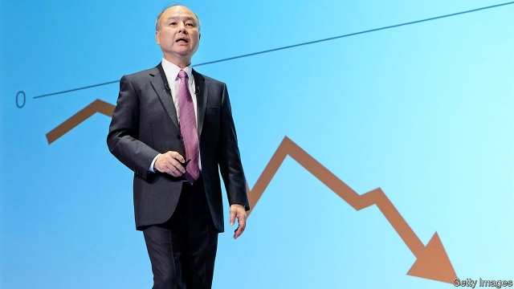

###### The future of the EU

# Business this week 

 

> Nov 9th 2019 

Masayoshi Son, the chief executive of SoftBank, acknowledged that he made a mistake by betting on WeWork, as his group revealed a $4.6bn write-down of its investment in the office-rental startup. Overall, SoftBank reported a quarterly net loss of ¥700bn ($6.4bn)—“red ink of the deepest red”, said an unusually contrite Mr Son. The Japanese conglomerate had to rescue WeWork after it abandoned an IPO amid questions about its valuation and a shortage of cash. Mr Son is now taking steps to beef up oversight of SoftBank’s many interests, such as demanding at least one seat on the board of any firm it sinks money into. See article. 

Part of SoftBank’s loss was also connected to its investment in Uber. The ride-hailing company reported another quarterly loss, of $1.2bn, and said it did not expect to turn an annual profit until 2021. Its share price tumbled to another record low, in part because of expectations that Uber’s shares will flood the market now that investors who were locked in to holding them after the company’s IPO in May are free to sell. 

The Federal Communications Commission formally approved the long-delayed merger of Sprint, which is owned by SoftBank, and T-Mobile, Deutsche Telekom’s American subsidiary. A lawsuit brought by a coalition of states attempting to block the deal on antitrust grounds is due to be heard in court next month. 

HP, one of the world’s biggest makers of personal computers and printers, confirmed that it had received a “proposal” from Xerox, a smaller company focused on office photocopiers, to combine their businesses. A deal would reportedly be valued at around $30bn. 

America and China were making progress in trade negotiations, with each considering a reduction in tariffs. The conclusion of “phase one” of a trade truce is uncertain because of civil unrest in Chile, which has cancelled the APEC meeting where the deal was to be signed. Meanwhile, the World Trade Organisation gave China official approval for the first time to impose tariffs on America, in a dispute over steel pre-dating their current spat. See article. 

Steve Easterbrook was sacked by McDonald’s as its chief executive for having a romance with an employee. Although the relationship was consensual, McDonald’s said it “violated company policy and demonstrated poor judgment”. Mr Easterbrook has been credited with revitalising the fast-food chain by spicing up its menu. Its share price has doubled since March 2015, when he became CEO. See article. 

International Airlines Group, the parent company of several carriers, including British Airways and Iberia, agreed to buy Air Europa, a smaller Spanish rival to Iberia. The deal will increase IAG’s share of the Europe-to-Latin America market from roughly a fifth to a quarter. Michael O’Leary, the boss of Ryanair, Europe’s biggest low-cost airline, was not happy. He claims the takeover will hurt competition and wants regulators to force IAG to sell off some assets. 

Concerns about data privacy were raised following the announcement that Google is to buy Fitbit, a wearable device that tracks a user’s exercise and healthy habits. Google and Fitbit stressed that the $2.1bn deal would not compromise their commitment to transparency on data use and that information would not be sold on to third parties. As well as recording a person’s heart rate, running pace, calorie burn and so on, Fitbit also retains personal information and location details. 

Saudi Aramco at last confirmed that it is to launch an IPO, the details of which will be provided in a prospectus scheduled to be published on November 9th. The state-owned Saudi oil firm will sell shares on the Tadawul stock exchange in Riyadh. In an effort to widen its appeal domestically, small investors will receive bonus shares if they keep the stock until at least 180 days after the flotation. 

Malaysia’s prime minister, Mahathir Mohamad, said he was prepared to take Goldman Sachs to court if it did not increase its offer of compensation for its role in the sprawling 1MDB-fund scandal. Mr Mahathir said recently that he had rejected an offer of $2bn from the bank. 

One of the pioneers of America’s shale-gas revolution, Chesapeake Energy, warned in a filing that it was in danger of failing as a “going concern” if cheap gas prices persist. The company has amassed almost $10bn in debt, five times its market value, amid a glut in American oil and gas output, which has driven prices down. 

The British government banned fracking in England, after an official report found that it was not possible to predict when and where earth tremors caused by the process for extracting shale gas might occur. Environmentalists were delighted. Others accused the government of pulling a pre-election stunt. See article. 

