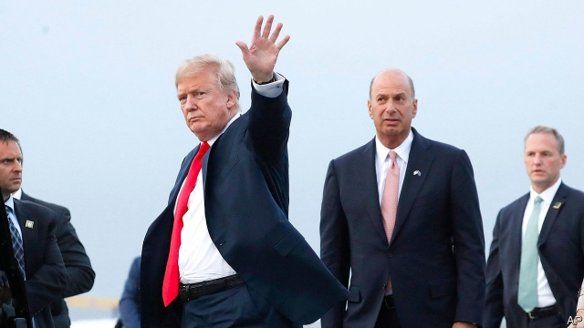

###### Impeach cobbler

# Gordon Sondland’s testimony forces Republicans to shift arguments 

 

> print-edition iconPrint edition | United States | Nov 7th 2019 

STEVE SCALISE, the House Minority Whip, brought a visual aid to the House floor in the run-up to a vote formalising the impeachment inquiry. It depicted the Red Square’s onion domes, and blasted the Democrats’ “37 Days of Soviet-Style Impeachment Proceedings”. Though the Soviet Union lacked a constitutional mechanism whereby freely elected legislators could censure and remove the country’s executive, following months of open hearings and a public trial, Mr Scalise’s point was that the impeachment process—which has so-far operated behind closed doors—is some kind of show trial. 

That is one of two main defences of President Donald Trump offered by congressional Republicans. The other is that there was no quid pro quo in withholding military aid to Ukraine, as Mr Trump himself has repeatedly asserted. This implies that asking for foreign help in an American election is perfectly fine; the impeachable conduct would be offering something in return. Both these lines are starting to fray. 

The first was always rather weak. Just as a criminal trial involves a grand jury gathering information to determine whether to indict, an impeachment inquiry involves the House doing the same. Closed-door hearings have long been a feature of congressional oversight. Nancy Pelosi, the House speaker, has given Republicans the full House vote that they long demanded. And next week public hearings begin. 

The second defence has grown difficult to sustain as witness after witness has testified, under oath, that there was in fact a quid pro quo. Gordon Sondland, America’s ambassador to the EU, is the newest member of this chorus line. Mr Sondland had previously testified that he never talked to Ukrainian officials about opening an investigation, that he never thought there was any precondition attached to the military aid, and that he “didn’t know why” it was delayed. 

In a revision released on November 5th, Mr Sondland wrote that testimony from William Taylor, America’s top diplomat in Ukraine, and Tim Morrison, until recently the National Security Council’s top adviser on Russia and Europe, had “refreshed my recollection”. Mr Sondland said he now recalls a conversation with Andriy Yermak, an adviser to Ukraine’s president, Volodymyr Zelensky, “where I said that resumption of US aid [to Ukraine] would likely not occur until” Mr Zelensky made the “public anti-corruption statement” demanded by Mr Trump. He said he had “no reason to question the substance” of Mr Morrison’s recollection that aid “might be conditioned on a public statement reopening” an investigation into the firm that employed Joe Biden’s son. 

Mr Trump’s defenders have consequently shifted, arguing that foreign policy routinely involves quid pro quos, and that even if Mr Trump engaged in one, it is not impeachable conduct. “Get over it,” as Mr Trump’s chief of staff, Mick Mulvaney, told reporters in October. That appears to be the argument that Republicans are carrying into the next, public phase of the impeachment process. Lindsey Graham, who chairs the Senate judiciary committee and therefore could play an important role in the trial of the president in the Senate, offered another approach—less a defence than a shrug. “I’ve written the whole process off,” he told CBS, a news network. “I think this is a bunch of BS.”■ 

