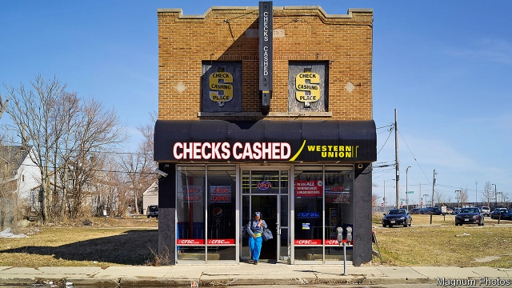

###### The silent minority

# Milwaukee’s north side remains deeply troubled 

 

> print-edition iconPrint edition | United States | Nov 9th 2019 

“MILWAUKEE IS RESILIENT, like this building,” says Mandela Barnes, a 32-year-old from Wisconsin’s largest city. He chats over ginger tea in Shindig Coffee, a lively spot inside the Sherman Phoenix, a complex of dozens of small shops, hair salons, yoga studios and galleries. It opened a year ago, renovated after arsonists attacked the building, a former bank, during anti-police riots in 2016. Its rise and the success of its black-owned businesses are symbols of optimism in a place that is short on it. 

Mr Barnes recalls how, last century, his grandfather moved into the area from Louisiana as big factories drew floods of migrants north. He worked for A.O. Smith, a firm that supplied frames to car producers for decades and at one point employed over 10,000 north-siders. But as its fortunes slid and it quit the car-supply business in 1997, those of its African-American workers, living near its giant industrial site, tumbled too. After a four-year spell as a state lawmaker, Mr Barnes was elected last year as Wisconsin’s lieutenant governor, the first African-American to hold the post. But he knows many of his generation are left behind. Problems linger for the 40% of Milwaukeeans who are black. “There is 50% black joblessness, very high rates of incarceration,” he says. “One in 19 students is homeless,” with black pupils most affected. Over half the children in one north-side area count as officially poor. 

Most black residents remained in areas like Sherman Park even after the jobs went. The Brookings Institution, a think-tank, rates Milwaukee as the most racially segregated of America’s 51 large metro areas. To become fully integrated, Brookings wonks reckon 80% of the city’s black residents would have to move to largely white districts. And though the downtown and lakeside areas boast new tall buildings, growing tourism and more white-collar jobs for the well-educated, the poorer neighbourhoods have gained little. 

Another study in March by the University of Wisconsin looked at one especially blighted zip code—53206—that abuts Sherman Park. It listed “cumulative disadvantages” and barely any improvement since recession struck just over a decade ago. The poverty rate, at 42% of households, is six-times higher than in the suburbs. Three-in-four high-school dropouts have no job. One-in-four housing units has been abandoned. Household incomes, adjusted for inflation, are down by a quarter between 2000 and 2017. Public schools, meanwhile, are especially dire and are losing students fast. In many, not even one-tenth of pupils reach levels of reading or maths expected for their age. 

Mr Barnes says the underlying problem is economic. Residents who rely on patchy public transport struggle to get to jobs. Absent fathers (some in prison) and gun violence also take a toll. On a walk in one neighbourhood, a teacher says bullets have struck both his home and a part of his school building nearby. 

Lena Taylor, a state senator who has lived in the same north-side block for 53 years, laments an ongoing “epidemic” of foreclosures and other housing woes. She also refers to a confrontational culture whereby residents “go from zero to a thousand, shooting people with no warning.” She hopes to become the first African-American elected as city mayor, next April, saying “it’s overdue. It’s not all peaches and cream, we need big changes.” 

Tom Barrett, the current mayor, is trying to lure investors to the north side. He hopes a new meatpacking plant there will create hundreds of jobs. A Spanish firm that refurbishes trains is to expand operations. He grumbles about narrowly missing out on a “positive atom bomb”, when Amazon recently shelved plans for a distribution centre, and 2,000 jobs, to be put on the old A.O. Smith factory site. 

The mayor has another card. The city last year opened a swanky arena for the Bucks basketball team that can attract grand non-sporting events, too. The biggest so far will be next July, when 50,000 people—including 15,000 media workers from around the world—will descend for the Democratic national convention. They will mostly be downtown. “A giant opportunity” exists to promote the city, says Mr Barnes. The challenge is to get as many Milwaukeeans as possible to benefit. ■ 

