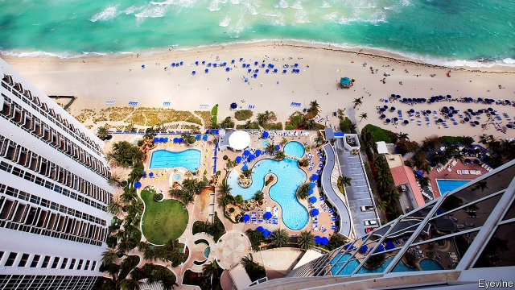

###### Odessa on the Intracoastal

# Russians have flocked to Donald Trump’s Florida 

 

> print-edition iconPrint edition | United States | Nov 9th 2019 

A ROUND a century ago, a furniture magnate from Rochester, New York named Harvey Baker Graves spent a day boating through the estuarine wilds of upper Biscayne Bay, along the southern Atlantic coast of Florida. What today is beach-front property was then a verdant, claustral jungle; in photographs the dinosaurs seem to be lurking just outside the frame. Graves was so enamoured of this landscape and its potential that he bought a large swathe of mangrove forest and tortuous waterways dotted with uninhabitable little islands. 

That swamp is now Sunny Isles Beach, a town on a barrier island, just across the Intracoastal Waterway from North Miami Beach. For much of the 20th century it was a modest redoubt far from Miami’s glamour and hustle, with larger hotels on the ocean and longer, lower ones on the inland blocks. Rundown by the 1980s, developers began snapping up properties. In 2001 the city’s first new hotel in more than 30 years opened. Today hotels and condominiums line Sunny Isles’ two-mile beach-front, including three Trump-branded high-rises. And while the previous incarnation of Sunny Isles attracted American snowbirds and the odd ageing celebrity, in its current form it is a magnet for Russians. 

They began arriving—according to Larisa Svechin, the town’s vice-mayor, who was born in Gomel, Belarus—in the late 1980s. Most of them were Jewish, and had left the Soviet Union in the mid-1970s. “Russians,” explains Ms Svechin, “especially Russian Jews, like to congregate by the water.” Some came directly from Russia, while others—like so many other retirees—moved south from New York (perhaps the only neighbourhood on the East Coast as deeply Russian as Sunny Isles Beach is Brighton Beach, on Brooklyn’s southern coast). Florida has no income tax, which makes it popular among seniors—including Mr Trump himself, who has recently changed his official residency from New York to Florida. 

Another wave came after the Soviet Union disintegrated; it included Russians, Moldovans, Ukrainians, Belarusians, Kazakhs, Tajiks, Azeris—and another wave of Ukrainians after protests ousted their pro-Russian president in 2014. Now many of the people coming are Russian second- (or third-, or fourth-) home owners rather than immigrants intending to settle. 

Birth tourism is also popular. A company called Miami Mama in Hallandale Beach charged expectant Russian women thousands of dollars for south Florida birth packages, though it was raided by the FBI a couple of years ago. These days, says Ms Svechin, “birth tourism is not as open, [but] you’ll see a lot of young ladies with strollers...they think this is prestige” to have a child with an American passport. 

Today, Ms Svechin estimates that more than 20% of Sunny Isles Beach’s population of roughly 20,000 is Russian or Russian-speaking. The nearby towns of Aventura, Bal Harbour, Hallandale Beach and Hollywood—all between Miami and Fort Lauderdale—also have sizeable Russian communities, though none of those is as prestigious as Sunny Isles. Igor Fruman, one of two associates of Rudy Giuliani’s recently arrested on campaign-finance charges, owns two units in a Sunny Isles high-rise. Lev Parnas, with whom he was arrested, is a longtime Florida resident. 

“Russians love brand names,” explains Ms Svechin. And Sunny Isles offers plenty: not just multiple Trump properties but also, just down the beach, the 60-storey Porsche Design Tower, with its car elevator that lets residents park outside their upper-floor units. There are Armani-branded apartments and a Karl Lagerfeld-designed lobby at the Acqualina. The town’s reputation is so well-known in Russia that many arrive knowing precisely which unit in which building they want to buy. 

Across from Mr Trump’s three towers sits the most Russian strip-mall in south Florida. Among its shops are a Russian café, a grocery store with an attached restaurant offering reassuringly and authentically mediocre cuisine, a bookstore, an insurance firm, a couple of beauty salons, a few cafés, a Russian restaurant/nightclub, a Kosher Azeri restaurant/nightclub, an Argentine steakhouse with a trellised awning that looks like something directly transplanted from Odessa, and a travel agent. 

Residents boast about their schools (florists know to stock up in late August, because so many students follow the Russian tradition of presenting flowers to the teacher on the first day). The streets are reasonably safe, though domestic violence remains a persistent problem. Russia has no domestic-violence law, and in 2017 decriminalised domestic violence that does not result in a hospital visit. 

Ms Svechin sighs that “a lot of people here, the older Americans especially, feel this has been a place for Russians to wash money. I don’t know how true that is.” A Reuters investigation in 2017 found that 63 people with Russian passports or addresses spent more than $98m buying apartments in Trump-branded properties in south Florida, and around one-third of all the owners of properties in Mr Trump’s branded towers were limited-liability companies that can conceal the owner’s identity (Reuters found no wrongdoing by Mr Trump or his organisation). 

Sanctions against Russia have slowed the high-end market. Many of the Ukrainians who arrived after the Maidan demonstrations in early 2014 have more modest means; they have flocked to more affordable inland cities such as Hallandale Beach. But south Florida generally—and Trump-branded properties specifically—remain popular with Russians. Your correspondent stayed at one of Mr Trump’s Sunny Isles properties for three days, and heard just one guest speaking any language other than Russian.■ 

