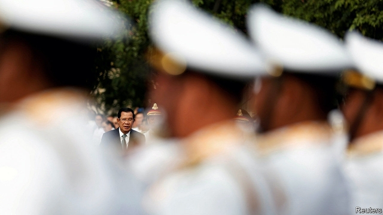

###### The opposition twitches

# Cambodia eases up on one dissident to distract attention from another 

 

> print-edition iconPrint edition | Asia | Nov 16th 2019 

ON THE DAY that Kem Sokha was released from 14 months of house arrest, he decided to stay at home. The Cambodian opposition leader did meet politely with foreign bigwigs who were at last free to call on him, but declined to address waiting reporters. He was still barred from participating in politics, he explained, and did not know what the courts might construe as a political act. He still awaits trial on trumped-up treason charges. The Cambodia National Rescue Party (CNRP), which he used to lead, remains banned. And despite a court’s decision on November 10th to ease other restrictions on him, he cannot leave the country. 

Ironically, the little breathing room Mr Kem Sokha has been afforded is probably thanks to the efforts of his predecessor as leader of the CNRP, Sam Rainsy, to enter Cambodia. In August the former finance minister announced that he would return to Cambodia on November 9th from self-imposed exile in France. (He fled four years ago after being convicted of defamation.) Ahead of his arrival, the government arrested more than 50 people aligned with the opposition. Military reinforcements were sent to the border with Thailand. 

The army need not have worried. On November 7th the Thai authorities announced that Mr Sam Rainsy would not be allowed to enter the country, much less cross it on his way to Cambodia. The same day Mu Sochua, deputy leader of the CNRP, was detained for hours upon arrival in Malaysia. The Malaysian and Thai governments said cravenly that they did not want to undermine relations with Cambodia. Eventually the Malaysian authorities relented, allowing Ms Mu Sochua and Mr Sam Rainsy into the country. The whole rigmarole afforded the opposition leaders lots of attention in the media and reminded the world of the ongoing subversion of democracy by Hun Sen, Cambodia’s strongman of 34 years. 

The CNRP used to frighten Mr Hun Sen. It won 45% of the vote in parliamentary elections in 2013, despite a huge institutional bias in favour of the ruling Cambodian People’s Party (CPP). It seemed likely to do even better in the following poll, in 2018. So the government persuaded the courts to ban the party before conducting a farcical election in which the CPP won every seat. 

Now the CNRP presents a different sort of problem. Its members’ mistreatment appals Western governments, which spent billions in the 1990s on a UN mission to restore Cambodia to democracy. The European Union, long disgusted with Mr Hun Sen’s repression, is considering whether or not to impose tariffs on Cambodian exports, threatening the country’s successful garment industry and its 700,000-odd workers. “Economic security in Cambodia is very fragile,” says Vannarith Chheang of the Asian Vision Institute, a Cambodian think-tank. 

Last year the EU bought about two-fifths of Cambodia’s exports, worth some $6bn. It is the country’s second-largest trading partner, after China. On November 12th it sent a confidential report to the Cambodian government with the results of a nine-month investigation into the country’s violations of human and workers’ rights. A final decision on the tariffs is expected in February. By improving the treatment of Mr Kem Sokha and directing the courts to release another 70 political prisoners, as it did on November 14th, the government doubtless hopes both to improve its standing in European eyes and to distract attention from Mr Sam Rainsy’s grandstanding. 

There is a possible ancillary benefit for the Cambodian authorities: Mr Kem Sokha’s release might revive a rivalry with Mr Sam Rainsy. “Their dream is of a cage fight,” reckons Sophal Ear of Occidental College in America. At any rate, the government suddenly sounds quite complimentary about the man it is trying for treason. “In terms of political courage and reputation, he has scored much higher than the populist and cowardly Sam Rainsy,” declared a recent editorial in the Khmer Times, a mouthpiece for the regime. ■ 

