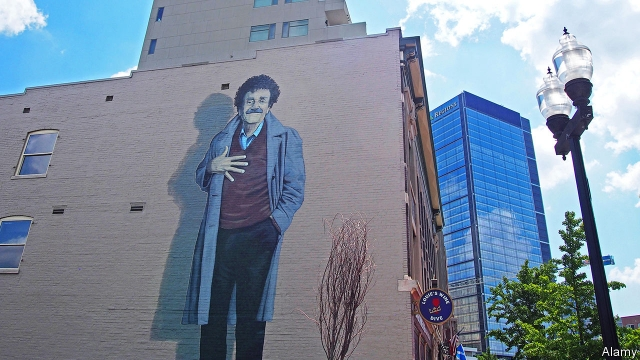

###### So it goes

# A Kurt Vonnegut museum opens in Indianapolis 

 

> print-edition iconPrint edition | Books and arts | Nov 14th 2019 

ON INDIANA AVENUE in Indianapolis, Indiana stands the new Kurt Vonnegut Museum and Library. Its repetitious address chimes with its subject’s views on geography and belonging. Vonnegut believed that a person should never forget where he came from. “All my jokes are Indianapolis,” he once said. “All my attitudes are Indianapolis. My adenoids are Indianapolis. If I ever severed myself from Indianapolis, I would be out of business. What people like about me is Indianapolis.” As much as he mocked the term—and those who used it—in his novel “Cat’s Cradle” (1963), Vonnegut was a bona fide Hoosier. 

Indianapolis is not known for its literature. It is overshadowed by America’s coastal cities and its bigger neighbour on Lake Michigan. Vonnegut himself is associated with other places: Cape Cod, where he ran a car dealership; upstate New York, where he was a PR man for General Electric; Chicago, where he learned to be a journalist and failed to earn a master’s degree. 

Nevertheless, the Vonnegut museum belongs in Indianapolis, where he was born and grew up, says Julia Whitehead, its founder and boss. “There’s a lack of arrogance here,” she reckons, “a humility” that is distilled in his prose. The opening of the museum coincides with the 50th anniversary of the publication of Vonnegut’s most famous novel, “Slaughterhouse-Five”, which propelled him to fame. Half a century on, the book—and the author—still feel contemporary. 

“Slaughterhouse-Five” was distinguished by its grim yet wildly imaginative portrayal of the second world war, which combines sci-fi motifs and a distorted chronology with moral clarity. The protagonist, Billy Pilgrim, is no Captain America. He trudges passively through Germany with his fellow prisoners of war wearing silver boots, a fur-collared coat many sizes too small, and a blue toga. Eventually, he decides to tell the world about his kidnap by aliens from the planet Tralfamadore. He is shot and killed soon afterwards by a fellow former captive. Experienced time-traveller that he is, Billy knew his death was coming. He had seen it many times. 

The book transmuted the trauma Vonnegut himself suffered while witnessing the firebombing of Dresden as a prisoner of war in 1945. When the museum opened on November 9th, many of the first visitors were veterans; several said their experiences of Vietnam, Korea or Afghanistan were reflected in Billy’s odyssey through time and space. There are no evil characters in his story, only ugly realities. When, towards the end, he is recuperating from a plane crash, his hospital bunk-mate, an air-force historian, mentions Dresden’s destruction. He asks Billy to “pity the men who had to do it”. Billy does. 

What explains Vonnegut’s enduring appeal to readers from other generations and backgrounds, who have never seen war first-hand? An unassuming candour that is native to the American Midwest, argues Ms Whitehead, a quality that disarms readers and forces them to confront eternal questions. His books are not simply criticisms of war; they are meditations on human nature and the meaning of life, wrapped up in zany plots and deadpan wit. 

Still, the idea of a Vonnegut museum may seem odd. The author was a slouchy hero of the 1960s and 1970s counterculture: an anti-establishment, anti-war, satirical pessimist with a self-professed penchant for late-night drunken phone calls and Pall Mall cigarettes. He was full of contradictions. “When vivisected”, he conceded, “the beliefs I have to defend…turn into bowls of undifferentiated mush.” He listed them wryly: “I am a pacifist, I am an anarchist, I am a planetary citizen, and so on.” 

Together, though, the museum’s collection of personal effects, rejection letters and art inspired by his writing attests to a set of steadfast beliefs, which continue to inspire readers. Vonnegut was an unyielding advocate for free speech and the arts. He wrote about the importance of community and family. He thought that everyone should be kind, goddammit, and that death was neither good nor bad, merely inevitable. Vonnegut himself died in 2007; humble as he was, says Ms Whitehead, “he might be a little bit embarrassed about a building with his name on it.” ■ 

