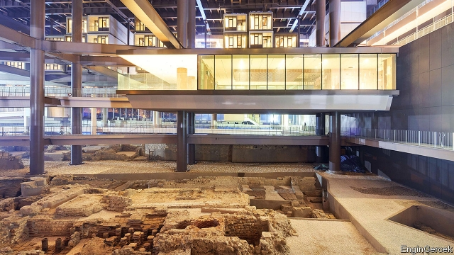

###### A night at the museum

# Some building works threaten Turkish antiquities. Others save them 

 

> print-edition iconPrint edition | Books and arts | Nov 14th 2019 

IT WAS 2009 and Antakya, a city in southern Turkey known in antiquity as Antioch, was thriving. Tourists were visiting it in record numbers. Trade with neighbouring Syria was booming. Sensing an opportunity, Necmi Asfuroglu, a local businessman, decided to build an upmarket hotel on land that he had owned since the 1990s. The plot was only a few hundred metres from the Grotto of St Peter, one of the world’s oldest churches. 

Before construction could start, a team of archaeologists was called in to examine the site. They excavated a broken amphora here, a statue there, and almost everywhere colourful mosaic pieces, spread across an area of some 17,000 square metres. By the time they had finished, they had unearthed parts of what had once been the heart of Antioch, one of the biggest cities of the Roman empire. The finds included a bathhouse, a huge marble-floored forum, thousands of artefacts and the world’s largest floor mosaic. 

With these discoveries, Mr Asfuroglu’s plans went up in smoke. “We had to rethink everything,” he says. Rather than walk away from the project, he asked an Istanbul architect, Emre Arolat, to design a structure that would accommodate both a modern hotel and an archaeological museum. Construction began in 2010, but stopped again for almost two years after workers came across another dazzling mosaic, depicting a winged Pegasus attended by three nymphs. It finally ended earlier this year. 

For Mr Arolat, the challenge was to find an architectural language that merged what he calls the “sacred” of an archaeological site and the “profane” of a business venture. For inspiration, he says, he looked to a museum showcasing the medieval ruins of a Norwegian town, designed by Sverre Fehn, and the paths around the Acropolis devised by Dimitris Pikionis. The result is a hybrid that exemplifies how conservation and commerce can profitably coexist. 

From the outside, the “museum hotel” that Mr Arolat designed resembles a steel and glass Jenga tower lying on its side and stacked with long rectangular blocks the size of shipping containers, each housing a hotel room. The interior is a vast open space criss-crossed by bridges and walkways that overlook the mosaics and ruins below. The whole structure rests on over 60 columns. One entrance serves the hotel, another the publicly accessible museum. 

In Turkey, where the earth teems with the relics of dozens of ancient civilisations—and where over the past couple of decades the economy has been powered by a construction frenzy—development regularly takes priority over heritage. This hierarchy applies to small and mega-projects alike. A few years ago, when the discovery of three dozen Byzantine shipwrecks and a Neolithic settlement from the sixth millennium BC delayed the opening of a tunnel under the Bosporus, Turkey’s president, Recep Tayyip Erdogan, scolded the researchers who caused “three to five pots and pans” to hold up progress. More recently, flooding from a hydroelectric dam on the Tigris river has begun to submerge one of the longest continuously inhabited places on Earth, a 12,000-year-old town in Turkey’s south-east. 

Yet for all the cultural depredations that they sometimes entail, development projects can help save ancient treasures, too. Indeed, reckons Gul Pulhan, an archaeologist at the British Institute at Ankara, a research centre, such ventures are becoming the only way that archaeology can be done. Bureaucracy partly explains that paradox: foreign and local researchers who apply for excavation permits in Turkey have to jump through countless hoops. (The memory of European archaeologists who plundered Ottoman lands in the 18th and 19th centuries might be to blame for this rigmarole.) Another reason is money. “Across the world, there is less and less money available for archaeological work,” says Ms Pulhan. Turkey is no exception. 

The outlook changes, however, when a commercial or infrastructure scheme is at stake. “The bureaucracy is lighter and friendlier because they want to support those projects,” Ms Pulhan says. Finance is also available more readily, since developers in Turkey and elsewhere are required by law to cover the costs of excavation (though frequently they shelve their plans to avoid the expense). In Antakya, a necropolis unearthed during previous construction eventually became a museum. In Istanbul a hotel project recently uncovered a Byzantine road. In London, meanwhile, Bloomberg’s new headquarters incorporates a Roman temple, which is open to the public. 

Bankrolling archaeology in this way is not an ideal solution. Excavation risks being rushed, because investors want to get on with the job. Archaeologists may be tempted or forced to cut corners. But improvisations like the museum hotel in Antakya might be the best available approach. “Had it not been for that project, probably none of those things would have been unearthed,” says Ms Pulhan. 

Seeing it through to the end was not easy. Soon after construction began, war broke out across the border in Syria, sending millions of refugees into Turkey and deterring tourism. The economy took a turn for the worse. Because of the excavations, the delays and the changes to the design, “we had to spend three times more than we planned,” recalls Mr Asfuroglu’s daughter, Sabiha Asfuroglu Abbasoglu, who oversaw the development. The final cost came to $120m. 

“We had to sell some of our other properties, but we never gave up,” Ms Abbasoglu says, standing next to the site’s centrepiece, a giant mosaic that seems to float above ground like a magic carpet, the effect of centuries of earthquakes and floods that caused some of its parts to rise and others to sink. Ms Abbasoglu says she hopes the outcome will be an example to others. The next developer who stumbles upon a few pots and pans might want to take note. ■ 

