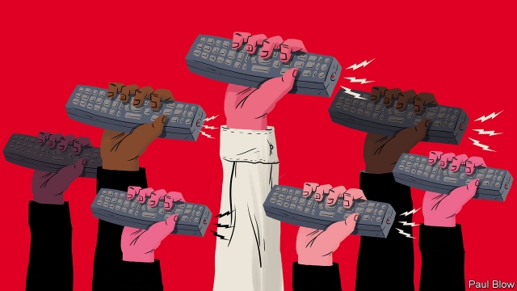
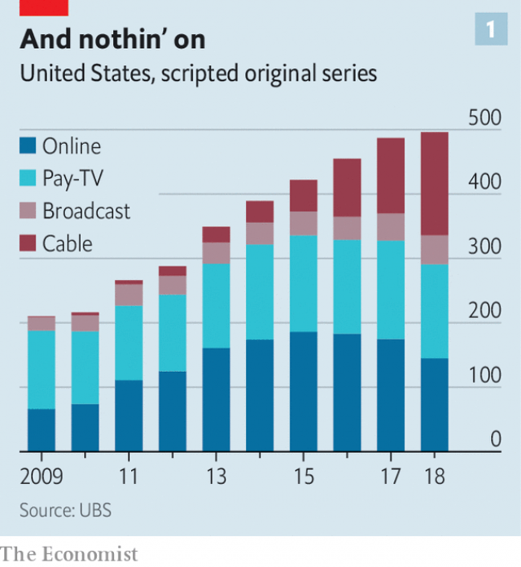

###### Power to the people

# The future of entertainment 

 

> print-edition iconPrint edition | Briefing | Nov 14th 2019 

IN HOLLYWOOD LINGO, Disney+ launched hot. On blitz day, as Disney called the eve of its television-streaming service’s debut on November 12th, a massive marketing campaign reached a climax. Buses in its theme parks were wrapped in ads, employees in Disney shops wore QR codes for people to sign up with smartphones and ABC’s “Dancing with the Stars” trailed the excitement to come. By the end of the first day, 10m people had signed up—beyond Disney’s highest expectations, it said. Its servers struggled to cope. The company rushed to fix the glitches, as viewers devoured “The Mandalorian”, a specially made live-action “Star Wars” spin-off. 

For $6.99 a month—slightly less than the cost of a cinema ticket—viewers in America, Canada and the Netherlands can now tap the world’s most valuable entertainment catalogue. As well as new original content, they can watch anything from “Snow White” to “Avengers: Endgame” and, thanks to Disney’s $71bn acquisition this year of 21st Century Fox, all 662 episodes of “The Simpsons” (America’s favourite cartoon family was also enlisted in the ad blitz). Behind the scenes, a new recommendation algorithm hoovered up enough user data in a few hours to start sending millions of personalised viewing suggestions, says Kevin Mayer, who runs Disney’s international and direct-to-consumer businesses, including Disney+. 

Going into on-demand streaming is an epochal shift for the 96-year-old company. Like its Hollywood rivals, it has built an empire on controlling access to films and TV shows, which were released in dribs and drabs—on cinema screens, broadcast networks and cable channels. That model, the entertainment industry has concluded, is no longer viable in the internet age. In October AT&T, which owns WarnerMedia, the former Time Warner, unveiled HBO Max. The new service will give viewers full online access to HBO programming, as well as to other valuable content including the libraries of Warner Bros, New Line Cinema and Japan’s Studio Ghibli, plus new original shows. NBCUniversal will parry with Peacock, a mainly ad-supported streaming platform also expected next year. Smaller services such as CBS All Access and Showtime have already piled in. On November 1st Apple, a tech giant with entertainment aspirations, launched Apple TV+, its own streaming service with several star-studded original shows. 

“We are surprised it took them all so long,” quips Ted Sarandos, chief content officer of Netflix, which began the streaming revolution in 2007. But now they are here. It is, in the words of Brian Roberts, chief executive of Comcast, a cable behemoth which owns NBCUniversal, “an important moment, as many parties across broad industries have entered the competition for content creation”. 

That competition should benefit consumers, who can expect a surfeit of high-quality fare. For media companies and their shareholders, it will be brutal. Billions of dollars will get torched. Some endings will be happier than others. 

The entertainment business’s original script was simple. People paid for cinema tickets (and later video rentals) to watch films, and advertisers paid networks for access to viewers of their TV shows. That began to change in the 1990s. Hit series like “The Sopranos” and “Sex and the City” on HBO, a cable channel then owned by Time Warner, proved that people would pay extra for compelling television. But HBO still relied on “sequential” releases of weekly episodes. It was also a wholesale proposition, sold in a bundle of pay-TV channels. “The big bang”, says Barry Diller, chairman of IAC, who in 1986 founded Fox Broadcasting as a rival to the three incumbent free-to-air networks, ABC, CBS and NBC, came in the mid-2000s with Netflix and, soon after, Amazon Prime Video, the e-commerce giant’s streaming service. 

The industry’s initial response to the challengers was to pawn its crown jewels. Netflix paid hundreds of millions of dollars for rights to stream beloved sitcoms like “Friends” or “The Office”. HBO struck deals with Amazon to supply it with programming such as “Six Feet Under”. This allowed the streaming upstarts to rack up subscribers and splurge on more content. In time, they began producing their own programmes, notably in 2013 with “House of Cards”. Netflix released the entire first season of its political drama at once, ushering in the age of “binge-watching”. 

Meanwhile, the rest of the business was being reshaped in other ways. Many media groups were folded into vertically integrated conglomerates that controlled both the production and distribution of content. In 2013 Comcast completed its purchase of NBCUniversal. In 2015 AT&T, a telecoms company, bought DirecTV, a satellite firm, and in 2018 paid $85bn for Time Warner, owner of HBO and the Warner Bros studio. Disney eschewed vertical integration but expanded horizontally. Its megadeal with 21st Century Fox was the fourth for its boss, Bob Iger, who had earlier snapped up Pixar (an animation studio), Lucasfilm (maker of “Star Wars”), and Marvel Entertainment, home of Marvel Comics. 

 

This flurry of consolidation created a handful of giant content owners, with massive back catalogues and a willingness to spend heavily on old shows and new programming (see chart 1). In October HBO Max reportedly agreed to pay over $500m for the American rights to air 23 old series and three new ones of “South Park”, a satirical cartoon owned by Viacom. It was one of the biggest on-demand-licensing deals of all time. The same rights went for $192m four years ago. As one media executive puts it, with more than a hint of admiration, “AT&T is not screwing around.” Since 2010 just three groups—WarnerMedia, Disney and Netflix—have ploughed a total of $250bn into programming (see chart 2). 

 

As content-related costs have surged, the lucrative old business model has receded. Netflix has made viewers less willing to pay over the odds for a big bundle of pay-TV channels, which generated margins of around 50% and accounted for as much as three-quarters of profits at media conglomerates like Time Warner, Disney, Viacom or News Corporation. Streaming as a stand-alone business either loses money or at best, breaks even. Netflix books accounting profits but has yet to turn free cashflow positive (though it expects to soon). It has accumulated $12bn of long-term debt despite making no acquisitions. Media firms moving into streaming have “swapped a quarter for a nickel and paid $5 for the privilege,” sums up one executive. 

There are three ways to make streaming pay. Firms can accumulate deep ranks of loyal subscribers at home and abroad. They can raise prices. Or they can spend less on programming. 

Winning over millions of subscribers is getting harder. Once consumers have paid for broadband and for a simple bundle of news and sports, it takes only three or four streaming services at current prices before the bill adds up to not much less than what they coughed up for old pay-TV. Companies are jumping into streaming in a peak-attention economy, notes Tim Mulligan of MIDiA Research. Consumers have no more spare leisure time for new TV apps. Reed Hastings, boss of Netflix, has named “Fortnite”, a hit video game, and sleep as his main competition. 

In practice, his and others’ streaming services will probably have to claw viewers away from each other. Even then, customers may not stay. Switching costs are low. People might sign up for Disney+ to see “The Mandalorian”, leave and then come back a year later for a new Marvel film. 

If building an enormous subscriber base looks hard, what about raising prices? Netflix did so in the spring, when its standard plan went up by $2. There is chatter that Disney may need to raise its price for Disney+ sooner rather than later. But that risks driving subscribers into rivals’ arms. 

Again, Netflix serves as a cautionary tale. In the third quarter it added just 500,000 American subscribers, 300,000 fewer than expected. Earlier this year it saw their number decline for the first time in 12 years. And that was before Disney, Apple and others entered the fray. Globally, Netflix now expects to add 26.7m subscribers this year, down from 28.6m in 2018; 90% of its subscriber growth comes from abroad, where it is potentially more expensive to win viewers because of the need to tailor content for each market. 

That leaves spending on programming as the last lever on profits. This, says Mr Roberts of Comcast, will need to be pulled back somewhat over time. There is no sign of that yet. According to Bloomberg Intelligence, a research firm, the average cost of producing a single episode of a scripted drama is close to $6m, twice the going rate of three to four years ago. This year 16 firms, from Disney to Quibi, a short-form mobile-video platform, will spend a total of $100bn on content, according to UBS, a bank. That is roughly equal to the sum invested in America’s oil industry this year. 

Disney expects its streaming service to break even by 2024, once it reaches 60m-90m subscribers. The plan is for two-thirds of these to come from overseas. Some on Wall Street worry that the firm could lose money on Disney+ for years to come. Streaming may encourage a faster rate of “cord-cutting”, as people cancel pricey pay-TV subscriptions, cannibalising the company’s mainstay cable profits. 

Mr Iger has as good as admitted that Disney is betting the farm. But, as he explained in his recently published autobiography, it has little choice. Its rivals appear to share the sentiment. AT&T expects to invest $2bn in year one of HBO Max and to earn no revenue at the start. Over time, the hope is, investment will go down and revenue will rise; the service is also expected to break even in five years. 

Still, a shake-out looks inevitable. There is much uncertainty about who will be left standing. The prevailing view in the industry is that Netflix will be hard to dislodge. It has amassed 158m global subscribers and created a brand that appeals to all ages and tastes. Its recent purchase of rights to “Seinfeld” will help make up for the loss of “Friends” and “The Office”, two of its most popular shows which AT&T and Comcast, respectively, plan to pull from Netflix. It has 47,000 TV episodes and 4,000 films in its American catalogue, according to Ampere Analysis, a research firm. That is far more than the 7,500 episodes and 500 films that Disney+ will offer in its first year. It will spend $15bn or so this year on original content. Mr Sarandos says there are no plans to adjust Netflix’s strategy in response to all the new competition. 

Disney, with its must-see shows and profits that are the envy of the industry, is also here to stay. So in all likelihood is HBO Max, which can tap its parent company’s 170m customer relationships. “We could not do this without AT&T,” says Bob Greenblatt, chairman of WarnerMedia Entertainment, who oversees the group’s direct-to-consumer business. “There is no way that we could so easily reach tens of millions of people on our own.” As with Comcast, whose Peacock service should find a nest in the new media landscape, entertainment is becoming an important source of revenue for AT&T. The phone giant will also use HBO Max to acquire and retain wireless customers. Smaller content players such as Discovery and Sony Entertainment will have to identify niches. CBS and Viacom (which are merging) are planning an arms-dealer strategy—of supplying content to anyone who wants to buy it. 

Over time, firms that can aggregate the various streaming services in bundles with simple interfaces will reap rewards. Consumers are overwhelmed by the volume of content coming their way. They are increasingly fed up with having to search for shows on various platforms. Internet service providers such as Comcast and Verizon can help curate this video onslaught. Comcast’s Xfinity Flex, a new service for broadband-only customers, for example, offers a seamless way to use more than 100 video and music services. A voice-controlled TV remote can search for, say, “the episode in ‘Seinfeld’ where George claims to be a marine biologist”. 

Then there are the technology giants. For them, producing entertainment is not an end in itself, says Matthew Ball, former head of strategy at Amazon Studios (and an occasional contributor to The Economist). In Amazon’s case, TV is a way to retain Prime subscribers and sell more shoes and loo roll. For Apple it is about selling hardware and expanding its range of services. 

Many media executives, particularly the veterans among them, worry about what this means for the future of high-quality content. In their view, much of the film and TV business is now run by clueless outsiders. They cite Apple’s “Stories to Believe in”, as its first TV shows were mawkishly trailed, as evidence of naivety. “The Morning Show”, a drama about working in television starring Jennifer Aniston and Reese Witherspoon, got mixed reviews. “The show, and the service, don’t need to exist,” concluded Rolling Stone magazine. Despite kudos for backing critically acclaimed shows like “Fleabag” and “The Marvelous Mrs Maisel”, Amazon’s longer record in TV draws similarly tepid reviews. “Apple doesn’t know what the fuck they are doing and Amazon knows less,” concludes a former film-studio bigwig. 

Top management at AT&T wants HBO to produce a lot more programming. In practice, that could include less rarefied fare that might appeal to America’s heartland, not just its coastal elites. HBO’s unabashedly elitist old-timers are not keen on the new strategy. The decision by John Stankey, head of the telecom firm’s entertainment unit, to ramp up production prompted a raft of departures, including that of Richard Plepler, HBO’S head, who gave the green light to “Game of Thrones”. “Stankey wants HBO to compete with Netflix,” says Rick Rosen, a founder of the Endeavour Agency. But many people worry that there is a big risk of HBO’s brand losing its distinctiveness. “After 20 more years of doing it,” jokes one streaming boss, “John Stankey will be a great creative executive.” 

It would nevertheless be a mistake to conclude that outsiders will never get things right. Jeff Bewkes, former chief executive of Time Warner, once dismissed Netflix as “the Albanian Army”. Now Hollywood considers the company a legitimate film studio. It is also easy to overstate the role of senior executives at media firms’ parent companies. Much of the creativity in Hollywood comes from lower down, from outside big firms and from informal networks of writers and stars, some with their own production companies, including Ms Witherspoon and Michael B. Jordan. 

 

Tinseltown has a way of absorbing outsiders. Media executives point out that Apple and Amazon are already adapting. At first they put tech types in charge of their TV operations but later installed seasoned film folk with strong links to the creative world. On November 12th it was reported that Mr Plepler is in talks with Apple about an exclusive production agreement. Like many a moneyman seduced over the years, Jeff Bezos, Amazon’s boss, seems star-struck. He goes to all the awards ceremonies, including the Golden Globes—above and beyond what even movie-studio bosses feel obliged to, remarks a former studio executive. 

As long as money keeps flowing, creativity should flourish. So far, shareholders appear happy to let it flow. Netflix’s share price has fallen from its peak in mid-2018 but the company remains highly rated relative to earnings. Disney shares have risen by 28% since the company revealed the details of Disney+ to investors in April. AT&T and Comcast are also up this year. 

Even before the taps are tightened—as they inevitably will be—the streaming wars have reshaped media well beyond video entertainment. The shift from linear schedules to fragmented, on-demand consumption makes it harder for any one company to exert a big influence on people’s viewing, says Bob Bakish, chief executive of Viacom. Every company needs to adapt accordingly, he adds. It is also weakening the link between entertainment and television news. That is most visible in Rupert Murdoch’s decision to sell much of 21st Century Fox to Disney, a deal which closed in March. He continues to control News Corp, containing newspapers, and Fox Corporation, a broadcaster that owns Fox News and other assets. 

The wild card hanging over the industry is what the tech giants will do next. Some people think Apple could cut its spending on entertainment or even exit the business. It is seen as more unpredictable than Amazon, which seems committed to making and showing content. Yet the overriding view in Hollywood is that, with their untold piles of cash and their valuations of $1trn or so apiece, the tech giants are only just getting started. They could easily swallow a media firm or two. 

Trustbusters may stymie any such move by Alphabet, Google’s parent, which already owns YouTube. Amazon might find it hard in practice given scrutiny of its rapid expansion (and Jeff Bezos’s ownership of the Washington Post). Apple might have an easier time. When Mr Bewkes was looking to sell Time Warner a few years ago, talks were held with Apple as well as AT&T. There has been much chatter about Mr Iger’s comment in his autobiography that, if Steve Jobs were still alive, Disney and Apple would have combined (Disney, for its part, nearly bought Twitter in 2016). 

For all Mr Sarandos’s fighting talk, even Netflix could be a target if the streaming wars affect its growth and the firm’s finances come under pressure. As dizzying as the pace of change has been in media in the past few years, it is unlikely to let up. ■ 

