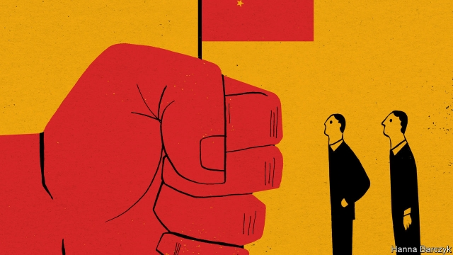

###### Chaguan

# The West is now surer that China is not about to liberalise 

 

> print-edition iconPrint edition | China | Nov 14th 2019 

THERE WERE moments during a recent gathering of Americans, Chinese and Europeans, invited to Stockholm to discuss China’s rise and the new world order, when Chaguan wondered whether anyone would say anything cheerful. At last, halfway through two days of doomy talk about trade wars and some scratchy exchanges about whether Westerners have a right to criticise China’s leaders, a Chinese participant sounded an optimistic note. Brexit is an opportunity for China, he enthused—once out of the European Union, Britain will need all the friends it can get. 

That was as upbeat as discussions got at the Stockholm China Forum, a semi-annual meeting for politicians, officials, ambassadors, business bosses, scholars and journalists hosted by Sweden’s foreign ministry and the German Marshall Fund, a think-tank. The forum was founded to bridge transatlantic differences over China policy after a crisis in 2004, when France enraged America by proposing to lift an EU arms embargo on China imposed after the crushing of the Tiananmen Square protests in 1989. Chaguan has joined the meetings since 2008 and has seen them turn testy before, despite endless supplies of good coffee and Swedish cinnamon buns. At a forum in 2018 Americans and Europeans sparred over President Donald Trump’s foreign policy. This time was different. A shared fatalism marked panel discussions and offstage conversations. There was a common conviction that China is not about to change its model of authoritarian state capitalism. 

A consensus has been building for a while in the West that China is determined to rise on its own disruptive terms. Yet now this gloomy view seems entrenched. It is testing longstanding beliefs about globalisation and the benefits of openness. Interdependence used to be seen as a way to avoid conflict, but now it is clear that it can make our countries vulnerable, a European lamented. Much talk in Stockholm was of Mr Trump’s tariff war, and speculation that it might end with China buying its way to a truce, perhaps by purchasing shiploads of soyabeans from farm states vital to Mr Trump’s re-election. There was cynicism about what that would mean. Some feared that it would allow China to get away with ignoring American demands for structural changes to China’s economy. Americans and Europeans share many concerns about China’s version of state capitalism, which requires foreign firms to buy access to Chinese markets by handing over technology to local rivals and sensitive data to the government, and—as American basketballers just learned—to adopt China’s line on Hong Kong, Taiwan and other nationalist shibboleths. 

Interviewed on the forum’s sidelines, a senior Trump administration official insisted that trade negotiators were still focused on making China mend its ways. But the official argued that failure to achieve that would prove America’s point about the limits of engagement with China’s leadership: “Assuming that China digs its heels in and refuses to do any structural reforms, the entire world will be more aware of China’s strategy and behaviour.” 

Chinese participants insisted that their country was also seeking a negotiated end to the trade conflict, but also that it had grown to depend too much on American markets, technology and even education. “Decoupling is the intention of both countries,” said one. Another urged Europeans to remember their countries’ ambitions for strategic autonomy and to reflect on their disagreements with America, a country gripped by a “cold-war mindset”. 

Europeans shrugged off that unsubtle attempt to sow divisions. Still, participants saw differences between America, which dreads China’s growing power—including its military and political clout—and Europe, which mostly worries about China’s economic impact. Trump officials would like American firms and allies to do less: notably meaning less trade with China in sensitive technologies. Europeans hope to manage relations by doing more. That means at once more trade with China—on November 11th British ministers cheered a decision by a Chinese firm to buy British Steel, an ailing industrial concern—but at the same time more business with other markets, as a form of hedging against China-related risks. Europeans also want to do more to keep important industries alive at home. In January this year the German Federation of Industry warned against “excessive dependence” on the Chinese market. That reflects alarm among corporate chieftains at the political price of doing business in and with China, and at how much that cost might rise. European countries are more willing than before to screen Chinese investments or academic exchanges for national-security risks. That is true even of free-trade champions like Sweden, which used to worry that calls for reciprocity with China were code for protectionism. 

Grizzled veterans in Stockholm were realistic about the limits of Western unity and bravery in the face of China. At least the West should avoid self-harming policies, they agreed. Americans and Europeans warned against pouring public funds into domestic firms to match the subsidies that China’s companies enjoy. China would win that race, they said. It would be better to enforce rules against market-distorting subsidies for any firms, foreign or domestic. If Western governments must choose sectors to favour, they should help by investing in research, education or infrastructure, and by welcoming skilled immigrants. 

Long ago at these gatherings Western speakers urged China, too, to be smart. They would craft clever ways to explain why liberal economic and even political reforms would be in China’s own interests. Not this time. A reform-minded Chinese speaker said his country was “too big, too old and too conservative” to adopt a different model. Some of the Westerners dared to suggest that autocratic statism might harm China in the long term. Chinese counterparts scolded them for “cultural arrogance”. Talking is better than fighting, but it can still feel pretty bleak. ■ 

