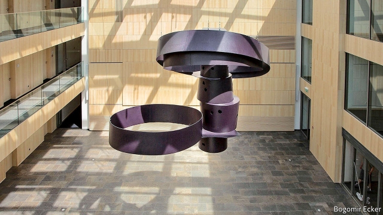

###### Are the black zero’s days numbered?

# Why Germany sticks to strict budget rules despite a slowdown 

 

> print-edition iconPrint edition | Europe | Nov 14th 2019 

 RARELY DO GERMANS celebrate such measly growth. But the country had spent so long fearing a slide into recession that even its third-quarter expansion of 0.1%, announced on November 14th, felt like a success. After the economy shrank by 0.2% in the second quarter, strong domestic demand and a surprisingly good export performance were enough to avoid Germany’s first technical recession since 2013. Still, the country’s long boom, in which well over 4m jobs have been created in ten years, is plainly over. 

The fear of looming recession has revived a familiar debate in Germany: should the government spend more to ward off danger? Under the so-called schwarze Null (“black zero”) policy, Germany’s budget has been in surplus since 2014. Last year, aided by booming employment and low debt-service costs, it ran to a whopping 1.9% of GDP. In some quarters the black zero has acquired an almost fetishistic quality. Visitors to a wing of the finance ministry in the state of Hesse can marvel at “Null” (2016), an installation of interlocking black aluminium circles suspended from the ceiling. 

But as Germany’s infrastructure needs have grown, as its borrowing costs have plummeted (the yield on Bunds out to ten years is negative) and as the economy has slowed, mulish adherence to a balanced-budget policy has become harder to defend. “Coffers full, country broken!” lamented a recent cover of Stern, a weekly, above a picture of a potholed road. In wealthy states, dilapidated schools have been closed for fear of collapse. The state development bank puts Germany’s municipal investment backlog at €138bn ($152bn). A rotating cast of international institutions passes through Berlin, urging ministers to turn on the spending taps. 

Since March 2018 the finance ministry has been in the hands of Olaf Scholz, a centrist Social Democrat. Yet hopes for a much more expansive fiscal policy have been dashed. The black zero was written into the coalition deal between Angela Merkel’s Christian Democrats (CDU) and Mr Scholz’s SPD. Big government programmes, such as a recent package to reduce Germany’s carbon emissions, are designed to satisfy fiscal rules rather than the other way around. 

Mr Scholz, who is running for the SPD leadership and wants to succeed Mrs Merkel as chancellor, argues that steady fiscal stewardship has left the country well placed to react to a severe downturn. (The yardstick would probably be a marked uptick in unemployment.) The response, say officials, would partly follow the tactics used in the 2008-09 crisis. Automatic stabilisers, such as unemployment benefits, would kick in. Social-security subsidies would make it easier for firms to cut workers’ hours; adjusting tax rules on depreciation would aim to ginger up private investment. Finance-ministry officials say that they will dispense with the black zero if necessary. Mrs Merkel, for all her homilies about the state living within its means, is unlikely to resist. Mr Scholz draws comparisons to 2008-09, when Germany mobilised €50bn. “In a real crisis, we’ll spend money like hell,” says an official. 

One worry is that the slump will not be bad enough to trigger meaningful action. Another, says Jens Südekum, an economics professor at Heinrich-Heine-University Düsseldorf, is that a late, hastily implemented stimulus could cut against Germany’s long-term investment and restructuring needs. For example, subsidies or tax cuts could encourage car companies to keep plugging old technologies. Mr Südekum is among a growing number of economists who want Germany to exploit low borrowing costs to fund a multi-year transformative public investment plan. Yet even were the government to dispense with the black zero it would run into the “debt brake”, a constitutional ban on structural deficits over 0.35% of GDP designed to tie the hands of spendthrift politicians. The finance ministry estimates this headroom would allow for only €6.5bn in fresh spending next year, barely 0.2% of GDP. 

 

Various wheezes have been proposed to get around this, including off-balance-sheet vehicles linked to public bodies like universities or housing associations that can tap markets without violating the debt brake. A more ambitious approach, proposed by the Green Party, would ditch the black zero and complement the debt brake with an investment rule that would exploit less stringent EU regulations. The Greens think this could kick-start public investment worth €35bn a year. But it would require a tricky constitutional change. 

Some Germans have tired of foreign criticism. Public investment grew by 3.8% last year, they point out (although it remains below the euro-zone average, and is too low even to maintain the capital stock). Eckhardt Rehberg, who is leading the CDU in discussions over next year’s budget, says capacity constraints and red tape make it hard to spend more without accelerating costs in construction. Local governments often fail to spend allocated funds as it is. In Germany’s tight labour market, companies cannot meet orders, and a chronically understaffed public-sector workforce struggles to manage them. Critics counter that a long-term targeted investment scheme, rather than the stop-start programmes of recent years, would provide firms with the guarantees they need to expand capacity. 

Such rows will not end soon. Meanwhile the outlook is uncertain. Germany’s export-heavy economy remains exposed to risks like a no-deal Brexit and the uncertainty around America’s trade spat with China. “German business expectations have fallen off a cliff,” according to IHS Markit, a research firm. The European Commission thinks German growth will outpace only Italy’s in 2020. Amid such worries, critics will continue to decry the German government’s tightfistedness. The chances are that it will continue to resist. ■ 

