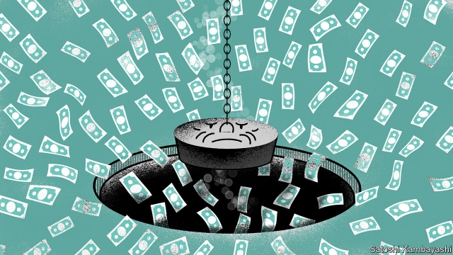
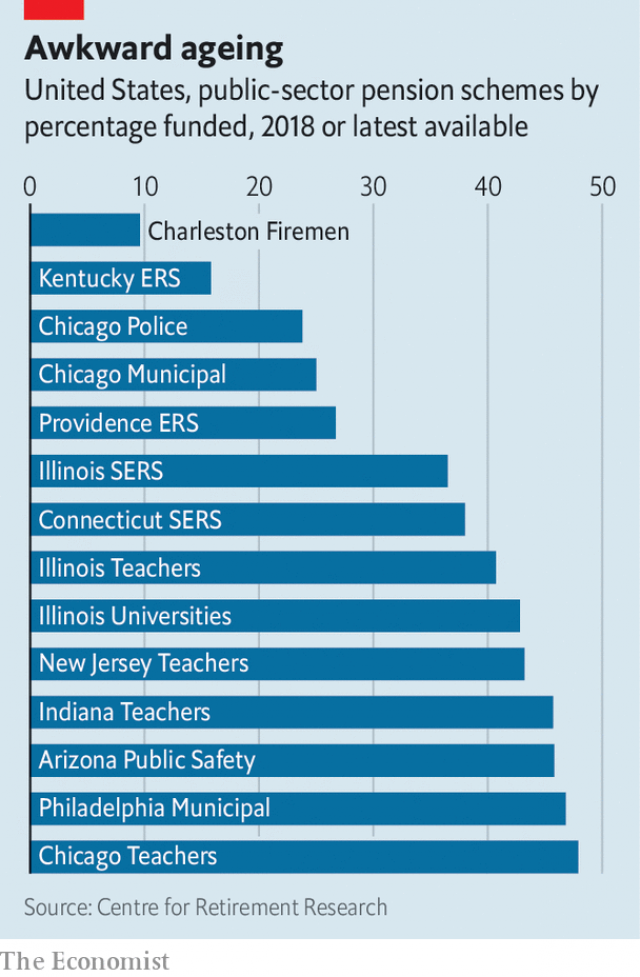
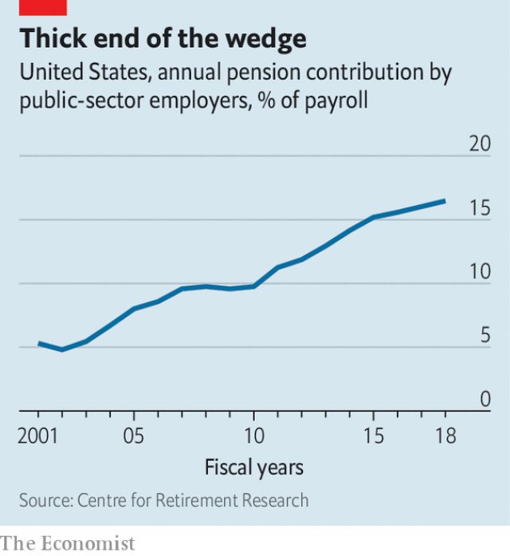

###### State of denial

# America’s public-sector pension schemes are trillions of dollars short 

 

> print-edition iconPrint edition | Finance and economics | Nov 14th 2019 

PERHAPS IT TAKES teachers to give politicians a lesson. Any official who wants to understand the terrible state of American public-sector pensions should read the financial report of the Illinois Teachers Pension Fund. Its funding ratio of 40.7% is one of the worst in America, according to the Centre for Retirement Research (CRR) in Boston (see table). 

Since it was established in 1939, Illinois officials have not once set aside enough money to fund the pension promises made. As a result, three-quarters of the money the state (or rather the taxpayer) now pays in each year merely covers shortfalls from previous years. The situation is getting worse. In 2009 the schemes’ actuaries requested $2.1bn, but only $1.6bn was paid. By 2018 the state paid in $4.2bn, still well short of the $7.1bn the actuaries asked for. The trustees have warned that the plan would be “unable to absorb any financial shocks created by a sustained downturn in the markets”. 

 

Other schemes have attracted similarly stark warnings. Illinois is the class dunce, with six languishing schemes. Chicago Municipal is just 25% funded and the actuaries warn that “the risk of insolvency for the fund has increased”. The actuaries of the Chicago police scheme warn that “this is a severely underfunded plan” with a shortfall of $10bn; the funded ratio is not projected to reach 50% until 2043. 

Offering workers a defined-benefit pension, where an income based on final salary is paid for the rest of their lives, is an expensive proposition, especially as life expectancies lengthen. Pension shortfalls are common across America, with the average public scheme monitored by the CRR just 72.4% funded. That adds up to a collective shortfall of more than $1.6trn. 

When a scheme is underfunded, one of three things can happen. More contributions can be made, by employers or workers or both. Benefits can be cut. Or the scheme can earn a higher return on its investments to make up for the shortfall. 

 

Cities and states are paying more, but still not enough. In 2001 public-sector employers contributed a further 5.3% of their payroll to meet pension promises; now that figure is around 16.5% on average (see chart). Even so, in no year since 2001 has the average employer contributed as much as demanded by actuaries. Last year’s shortfall was just under 1% of payroll. 

This reluctance is understandable. Politicians dislike raising taxes—or cutting services to pay for higher contributions. Workers do not want to see their current pay reduced by higher deductions, or their future benefits cut. And in any case, in some states courts have ruled that pension benefits, once promised, cannot be taken away. Arizona attempted a reform in 2012 that would have increased contributions for anyone with less than 20 years’ service. Workers sued and the courts ruled in their favour in 2016, requiring the scheme to repay $220m. Since the failed reform plan was instituted, employers’ contributions as a share of payroll have almost doubled. 

So states and cities have crossed their fingers and hoped that their investments will bail them out. America’s buoyant stockmarket has done its best to help. Returns on government bonds have also been good for much of the past three decades. Even so, the average public-sector scheme is less well funded now than it was in 2001. 

And the markets are unlikely to keep being so helpful. In 1982 the government sold long-term Treasury bonds with a yield of 14.6%; now such bonds yield just 2.4%. Equity valuations are high by historic standards. That suggests future returns will be lower than normal. 

Kentucky offers a sobering example of how states can spiral towards disaster. In 2001 its retirement system was 120% funded and employers were putting in just 1.9% of payroll. After the dotcom slump, the funding position deteriorated. By 2005 the scheme was less than 75% funded and the required contribution had gone up to 5.3%. But the state fell short of the target every year until 2015, by which point the contribution had leapt to nearly 33% of payroll. In 2018 the actuaries asked for 41%. 

Kentucky’s scheme covering “non-hazardous” workers (those who are not employed by the emergency services) is just 12.8% funded. One of its beneficiaries is Larry Totten, who worked for Kentucky’s park service and retired in 2010 after a 36-year career. When he found out about the scheme’s parlous state, he joined Kentucky Public Retirees, a group that lobbies for pensioners. “There’s enough blame to go around,” he says. Though it was state governors (of various parties) who failed to pay the required amounts into the scheme, it was the state legislature that let them get away with it. 

Such severely underfunded schemes risk entering two vicious circles. The first involves costs. Kentucky’s public pension scheme covers a wide range of state employers and some have to pay 85% of payroll to cover their pension obligations. Employing someone on $50,000 a year requires an extra $42,500 of contributions. They naturally seek to lay off workers to reduce this cost. But that leaves fewer people paying in without changing the number currently receiving retirement benefits. That increases the short-term squeeze. 

The second concerns the accounting treatment of public-sector funds. Many assume nominal returns on their portfolios of 7% or more after fees. This optimism has a big impact. Calculating the cost of a pension promise requires many assumptions—how long people will live, how much wages will rise and so on. Future payouts must be discounted to calculate a cost in current terms, and thus contributions. The higher the discount rate, the lower the current cost and the less employers have to pay in. Public-sector schemes use the assumed rate of investment return as their discount rate—so a high rate lowers the apparent cost. 

But if a scheme becomes severely underfunded, a plunge in the stockmarket could leave it unable to cover current payouts. So it must invest in safer, lower-yielding securities, such as government bonds. That reduces the discount rate and makes the pension hole even bigger. Kentucky’s non-hazardous scheme uses an expected return of 5.25%, much lower than most public-sector schemes. 

These calculations look surreal by comparison with private-sector pension funds. Their accounting rules regard a pension promise as a debt like any other. After all, courts insist pensions have to be paid, whatever the investment returns. The discount rate must therefore be based on the cost of debt—for companies, the yield on AA-rated corporate bonds. Since that yield, now around 3%, is far lower than the return assumed by public-sector funds, private-sector pension liabilities are very expensive. Faced with a $22.4bn shortfall, General Electric recently froze pension benefits for 20,000 employees. 

These different accounting approaches seem to imply that it is cheaper to fund a public-sector pension than a private-sector one. In reality, that cannot be the case. The public-sector pension deficit is therefore much larger than the $1.6trn estimated by the CRR. It is hard to be precise about how much larger, but the accounts of troubled schemes give some indication. 

The Chicago Teachers scheme has a shortfall of $13.4bn, and a funding ratio of 47.9% on the basis of an assumed return of 6.8%. Its financial report reveals that a one-percentage-point fall in the discount rate would increase the deficit by $3bn. The private-sector accounting approach would lower the discount rate by around four percentage points. 

This is a crisis no one wants to solve, at least not quickly. The Chicago Teachers scheme is aiming for 90% funding, but not until 2059—long after many retired members will have died. New Jersey’s teachers’ scheme is not scheduled to be fully funded until 2048. Such promises might as well be dated “the 12th of never”. The bill for taxpayers seems certain to rise substantially. For the states with the biggest pension holes, political conflict is in store. ■ 

