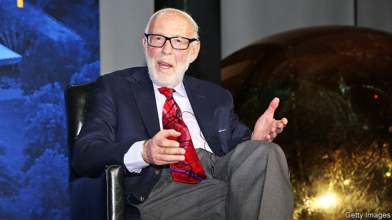

###### A life’s rich tapestry

# How Jim Simons became the most successful investor of all time 

 

> print-edition iconPrint edition | Finance and economics | Nov 14th 2019 

The Man Who Solved The Market. Gregory Zuckerman. Penguin Random House; 359 pages; $30 

THE BEST investors’ strategies often sound simple. “Whether it’s socks or stocks, I like buying quality merchandise when it’s marked down,” says Warren Buffett. Betting big on the fallout from epoch-making events, like the fall of the Berlin Wall, is George Soros’s preferred tactic. Jim Simons, the founder of Renaissance Technologies, a hedge fund, spots patterns. 

Mr Simons is less famous than Mr Soros or Mr Buffett, but no less successful. He founded Renaissance in 1982, aged 44, after a successful career in mathematics and code-breaking. Its flagship Medallion fund has earned $100bn in trading profits since 1988, mostly for its employees. The average annual return of 66% before fees makes Mr Simons one of the most successful investors of all time. He is now worth $21bn. 

A new book, “The Man Who Solved the Market” by Gregory Zuckerman of the Wall Street Journal, asks how he did it. It is a compelling read. Mr Simons started investing in 1978 by looking for patterns in currencies. He had early successes with simple “reversion to the mean” strategies, buying when a currency fell far enough below its recent average. A decade later René Carmona, another mathematician, convinced him that rather than searching for such patterns themselves, they should hand over the job to an algorithm, and trade even when the logic was unclear to its human minders. In the 1990s Robert Mercer and Peter Brown, formerly of IBM, developed a “self-correcting” version of this trading approach that would double down on successful strategies and cut losing ones. These techniques, now called machine learning, have become widespread. 

There were missteps along the way. Early in his career Mr Simons unintentionally almost cornered the market for Maine potatoes, only realising when regulators reprimanded him. For months the team struggled to make money from trading shares, until a young programmer spotted that Mr Mercer had typed a fixed value for the S&P 500 index in one of half a million lines of code, rather than getting the program to use the index’s current value. 

As Mr Zuckerman lucidly explains, such strategies have limitations. One is that their scale is limited. Medallion, which trades on short-term price signals, has never held more than $10bn. The narrower the time frame, the larger the market inefficiencies and the greater the chance that an algorithm’s choice of trade will succeed. But short-termism reduces capacity. Renaissance now has funds, open to outsiders, that trade over longer horizons. But returns have been less impressive. 

Other firms now try to copy Renaissance’s trades. Insiders say it tries to trade a pattern “to capacity”, moving prices so that other firms cannot spot the same signals—rather as if a bargain-hunter, upon learning that a favourite shop was holding a sale, arrived early and bought up the entire stock so that no one else even realised the sale was on. Others on Wall Street often describe Renaissance as a money-printing machine, but Mr Zuckerman shows how it has had to keep adapting its model to stay ahead of the competition. 

The book’s only disappointment is that the man at the centre of it all features relatively little. That is perhaps unsurprising. Mr Simons studiously avoids publicity. After all, keeping its funds’ strategies secret is a big part of Renaissance’s success. Having solved the market, he is hardly about to give away his edge that easily. ■ 

