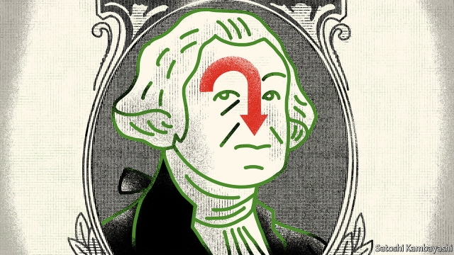
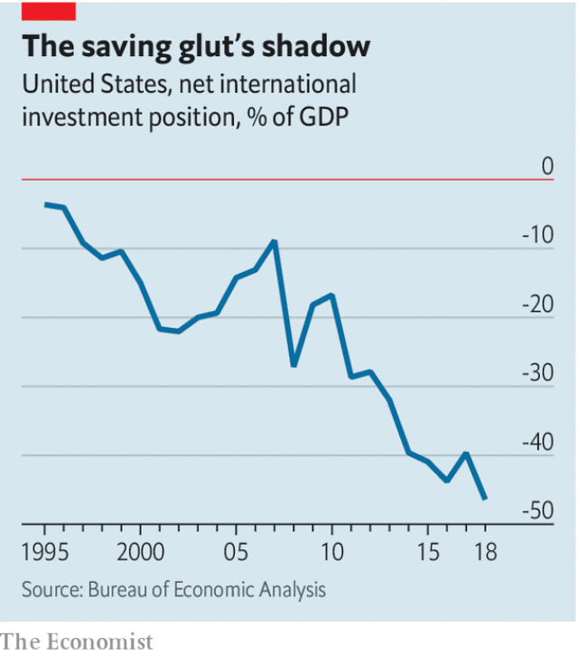

###### Buttonwood

# The case for a falling dollar 

 

> print-edition iconPrint edition | Finance and economics | Nov 14th 2019 

NOBODY WANTS to be called an unthinking optimist. Prospects for the riskier sort of investments are cloudy. The global economy faces numerous threats. Being even mildly bullish can seem a bit unreflective. 

So whisper it, don’t shout it, but the mood has changed recently for the better. Since the start of October, global equity prices are up by around 7%. Bond yields have risen. There has been a move away from the safe or defensive assets that hold up in bad economic times, towards those that do well in an upswing (see article). Hopes for a preliminary trade deal between America and China pushed the yuan briefly below seven to the dollar last week. 

At times like these, thoughts naturally turn to the outlook for the dollar more generally. A weaker dollar would be both a signal and a driver of a broader improvement in risk appetite. The dollar’s fortunes have not yet shifted decisively. But the conditions for it to weaken are starting to fall into place. 

 

To understand why, consider the forces behind the dollar’s ascendancy since 2014. America’s economy, though sluggish by historical standards, has benefited from an ever-reliable engine: the American consumer. The euro-zone, by contrast, responded to its sovereign-debt crisis by saving more. Its surplus savings, together with those generated in Asia, must find a home. America’s high-yielding bonds and modish technology stocks have made it the go-to place for global savers. Capital inflows drove up the price of dollar assets. America’s net investment position—the foreign assets its residents own abroad minus what they owe to foreigners—went deeper into the red (see chart). 

As industry slumped and trade faltered this year, America still looked the best of a bad lot. But the scales are tilting against the dollar. Global manufacturing may have bottomed out. The purchasing managers’ index for industry compiled by the global economics team at JPMorgan Chase rose for a third month in October. Growth in output is barely positive, but an improving trend in new orders alongside falling stocks is a sign of a turn in the manufacturing cycle. The improvement is halting. Jobs-rich service industries are still slowing, so it is too early to expect better GDP growth. But hopes are growing of a pickup in 2020, driven by economies beyond America’s shores. 

This matters for the dollar. Synchronised global GDP growth opens the door for investors to move capital out of America’s expensive dollar assets to where assets are cheaper, says Hans Redeker, a currency strategist at Morgan Stanley. Moreover, interest-rate cuts this year by the Federal Reserve mean that the dollar is now receiving less support from elevated bond yields. Central bankers in other places are disinclined to relax policy further. The European Central Bank’s governing council, for instance, was divided on the decision in September to cut interest rates and restart quantitative easing. 

A shift in global capital away from America would be a particular boon to emerging markets. A fall in the dollar would make it easier to service their foreign-currency debts. It would also ease local credit conditions, thus helping GDP growth. For investors, emerging markets are where the value is. Equity markets are cheaper. Bond yields are higher. Currencies have scope to make up the ground they lost earlier this year and in the slump of 2013-16. 

Apart from such trouble spots as Argentina, Chile and Turkey, emerging-market currencies have started to rally against the dollar. Still, the euro is the gauge by which many people judge the dollar’s vigour, or lack of it. And it has been stubbornly weak. Sentiment is coloured by the travails of Germany, the currency zone’s largest economy, which only narrowly avoided a technical recession (two quarters of declining GDP) in the six months to the end of September. But the euro at least seems to have found a floor. And if the world economy gathers strength the euro will eventually rally. 

That is still a big if. Another breakdown in trade talks between America and China could lead to a renewed slump in global manufacturing and business spending, and kill off any incipient dollar weakness. Other political risks—the protests in Hong Kong; the Democratic primaries in America—are looming larger. And after a longish expansion, the world economy is lacking vigour. But the dollar’s stint at the top of the currency pile is looking tired, too. People are already whispering. The noises may soon get a lot louder. 

